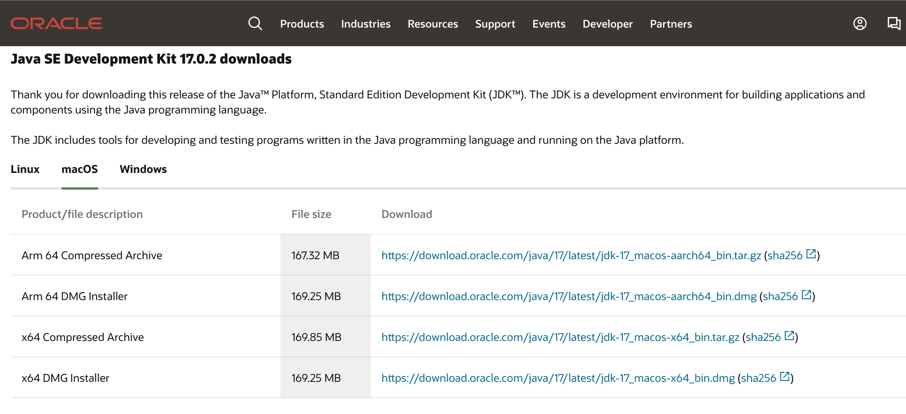
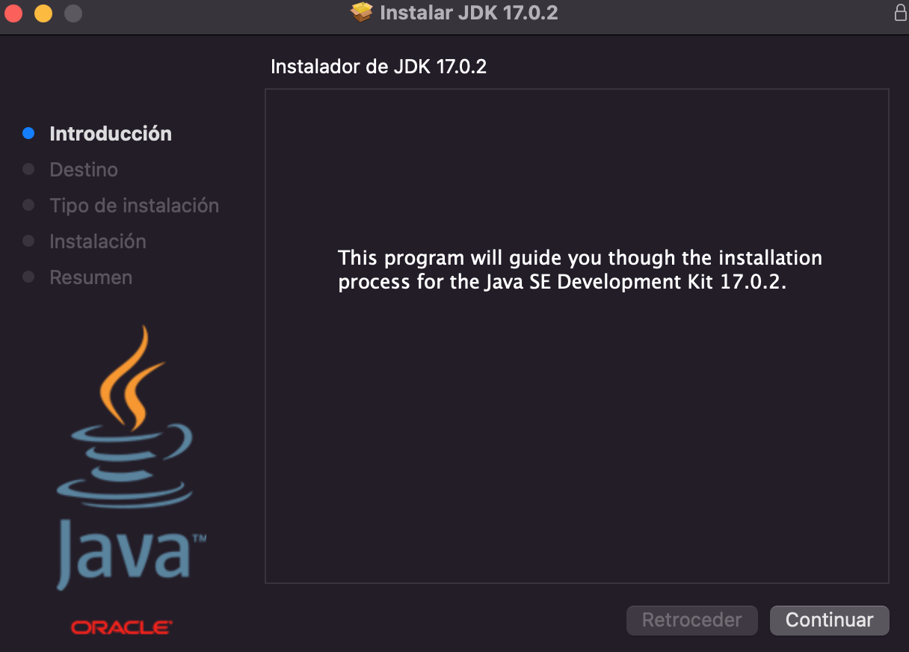
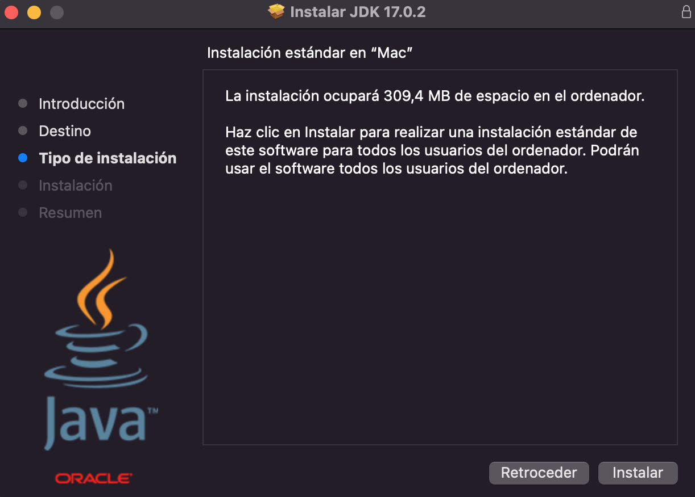
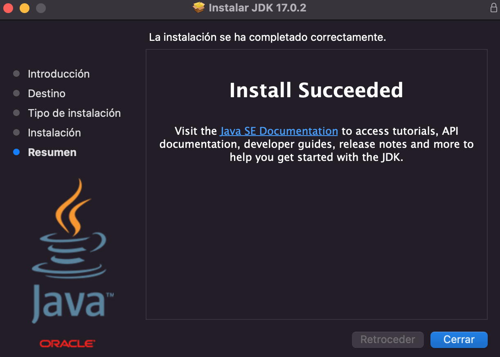
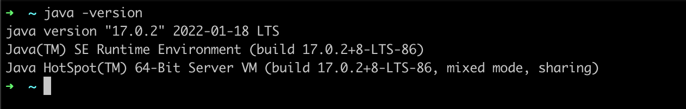

# Ejemplo-01: Instalación de Java Software Development Kit (JDK)

## Objetivo

* Demostrar el proceso de instalacion de Java Software Development Kit (JDK)

## Desarrollo

El JDK (Java Software Development Kit ) es un entorno de desarrollo para crear aplicaciones y componentes utilizando el lenguaje de programación Java que incluye herramientas para desarrollar, probar y ejecutar programas escritos en el lenguaje de programación Java.

Estos son los pasos requeridos para la instalación:

* Validar que no tenga previamente el JDK instalado en su maquina: https://www.java.com/es/download/help/version_manual.html
  
* Si no lo tiene instalado, procederemos a la descarga por el link oficial de descargas de oracle: https://www.oracle.com/java/technologies/downloads/ seleccionando su sistema operativo: Linux, macOS o Windows
  >  
  > 
  > IMPORTANTE: No debes instalar una versión de Java menor a la 8, ya que para utilizar selenium se requiere tener instalada como mínimo la versión Java 8.

* Abrir el ejecutable para iniciar el proceso de instalacion, hacer click en botón de continuar
  > 
* Click en botón de instalar
  > 
* Click en botón de cerrar
  > 

* Para validar que se instalo correctamente, abrir la terminal y ejecutar el siguiente comando: 
  >java -version
* si visualiza en la terminal la version de java instalada, es que se instalo correctamente.
  > 

>**💡 Nota para experto(a)**
> 
> Puede agregarse la configuración de variable de entorno JAVA_HOME: https://www.java.com/es/download/help/path_es.html

