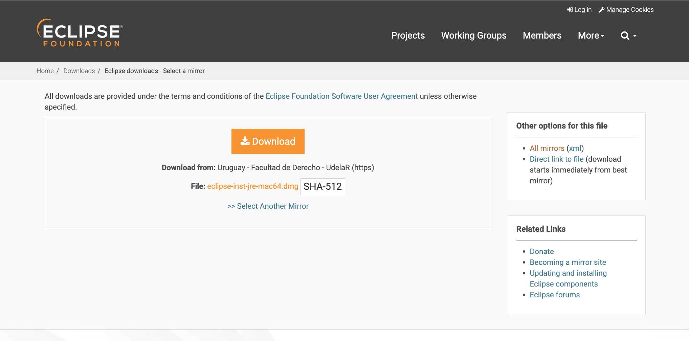
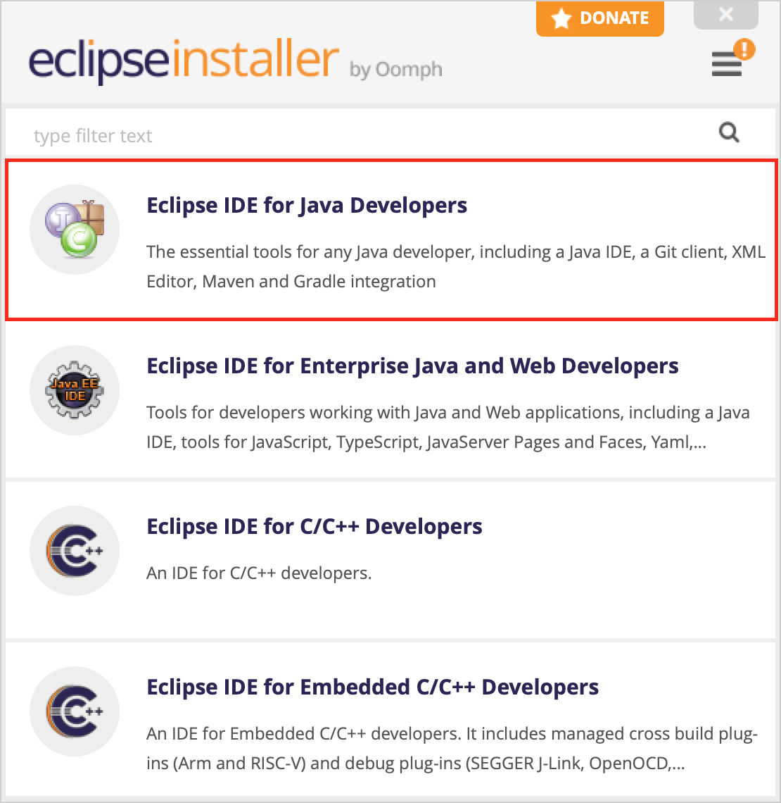
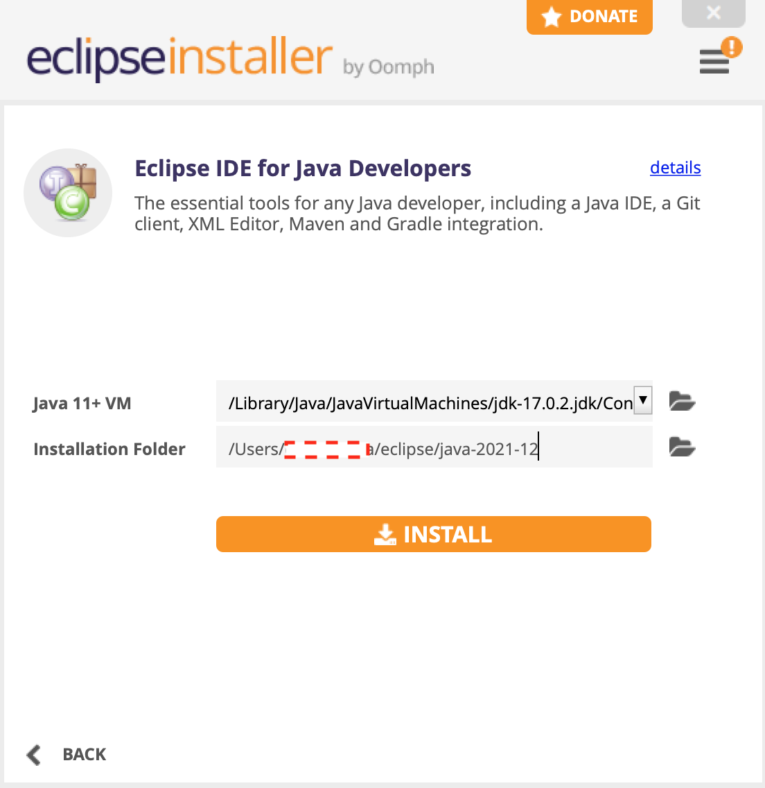
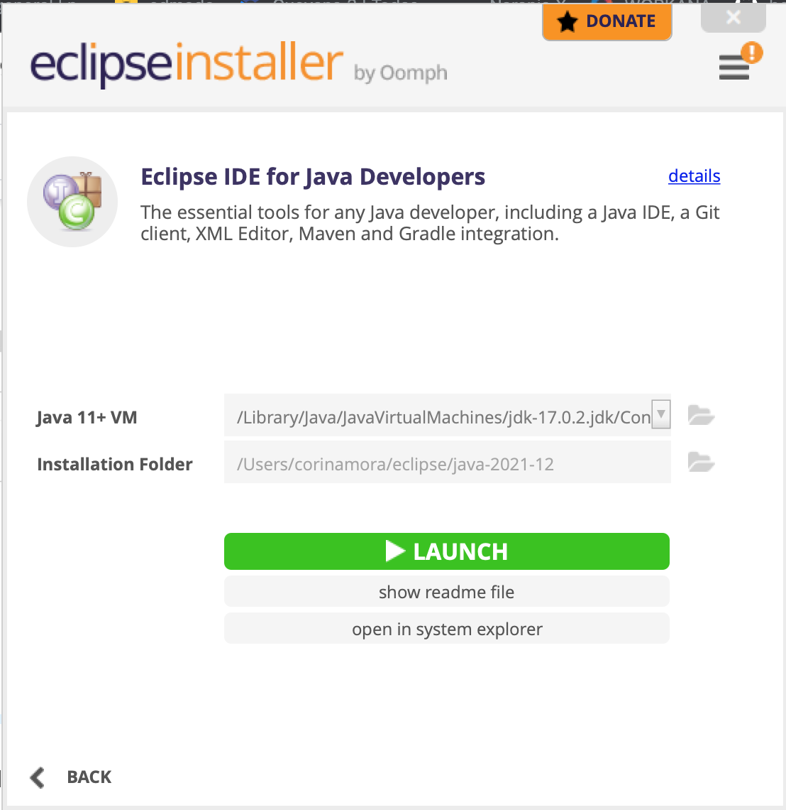
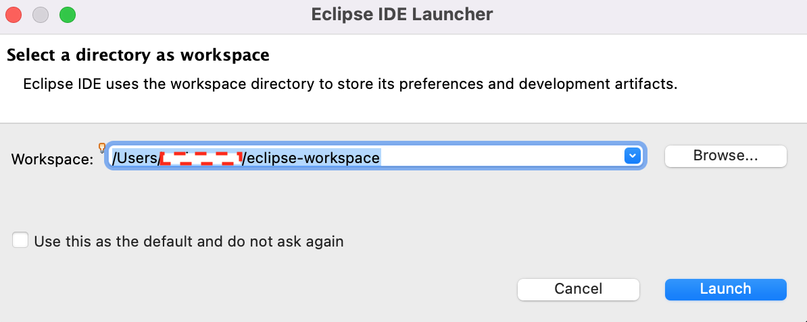
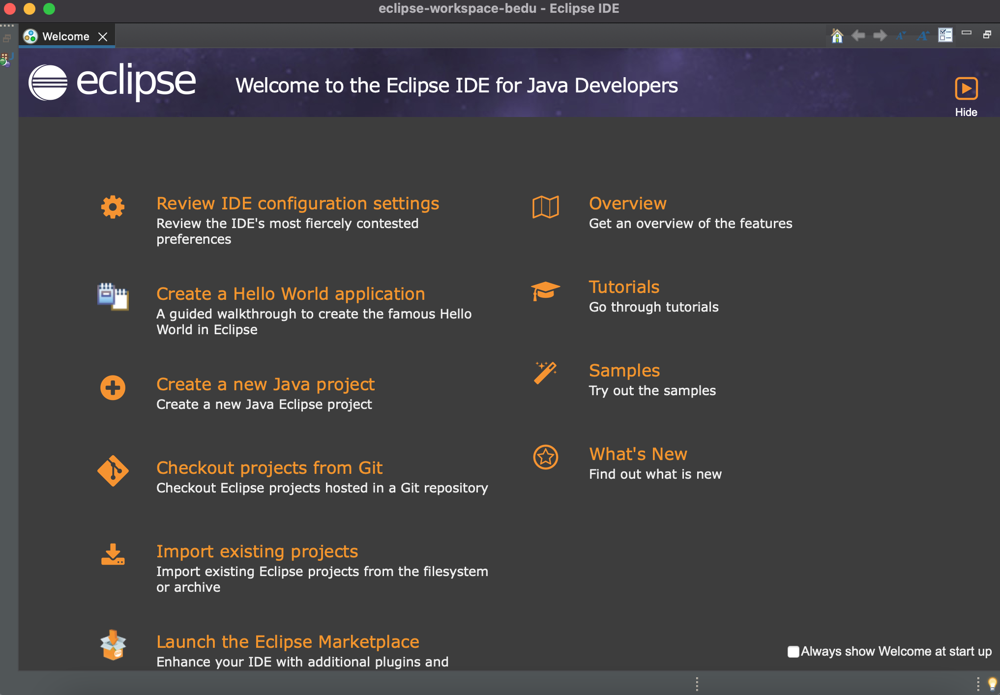

# Ejemplo-02: Instalación de instalación de Eclipse IDE

## Objetivo

* Demostrar el proceso de instalacion de Eclipse IDE

## Desarrollo

¿Qué es Eclipse? 
>Eclipse es un proyecto de código abierto cuyo principal objetivo es proporcionar una plataforma de desarrollo abierta e independiente de los fabricantes de software además de una serie de frameworks para construir software. Se puede considerar que Eclipse es un entorno de desarrollo integrado o IDE sobre el que se pueden montar mediante plugins herramientas de desarrollo para cualquier lenguaje de programación. Esta arquitectura de plugins permite, además de poder trabajar con varios lenguajes de programación en el mismo IDE, utilizar otras herramientas que ayuden en el proceso de desarrollo

Estos son los pasos requeridos para la instalación:
* Descarga de Eclipse IDE desde su pagina oficial: https://www.eclipse.org/downloads/ 
  > 
* Realizar click en el botón "Donwload"
  > 
* Abrir el instalador de eclipse descargado, y hacer click en la opción "Eclipse IDE for Java Developers"
  > 
* Se visualizara la siguiente imagen, si es deseado puede cambiarse la ruta donde sera instalado eclipse (se recomienda dejar la ruta por defecto), hacer click en el botón "Install"
  > 
* Finalizado la instalación se habilitara un botón "Launch" realizar click en el para abrir Eclipse.
  > 
* Al abrir Eclipse tendremos que seleccionar la ruta del workspace, puede dejarse la ruta por defecto, realizar click en "Launch"
  > 
* De esta forma veremos la pagina de inicio de Eclipse IDE
  > 
