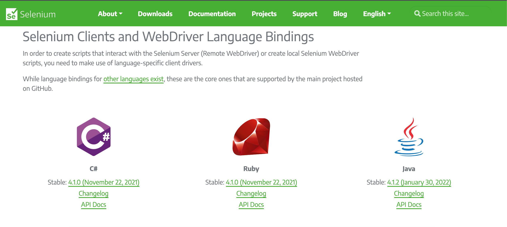
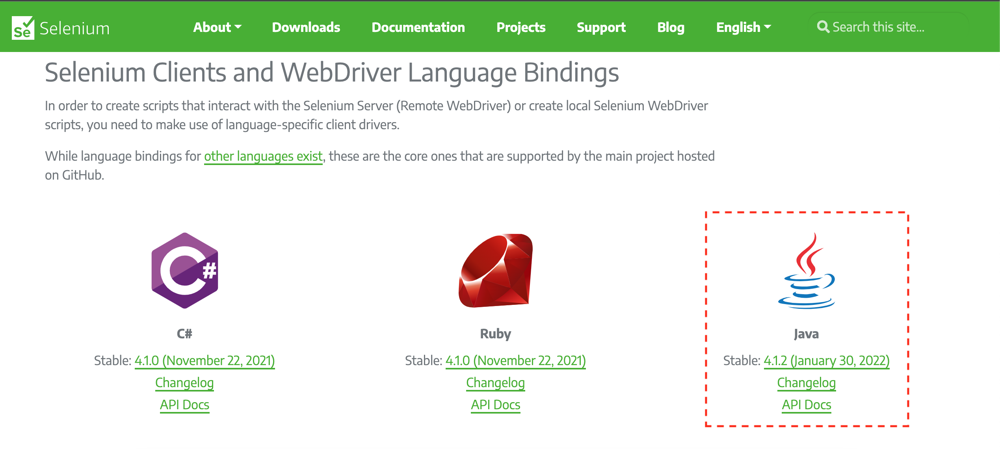
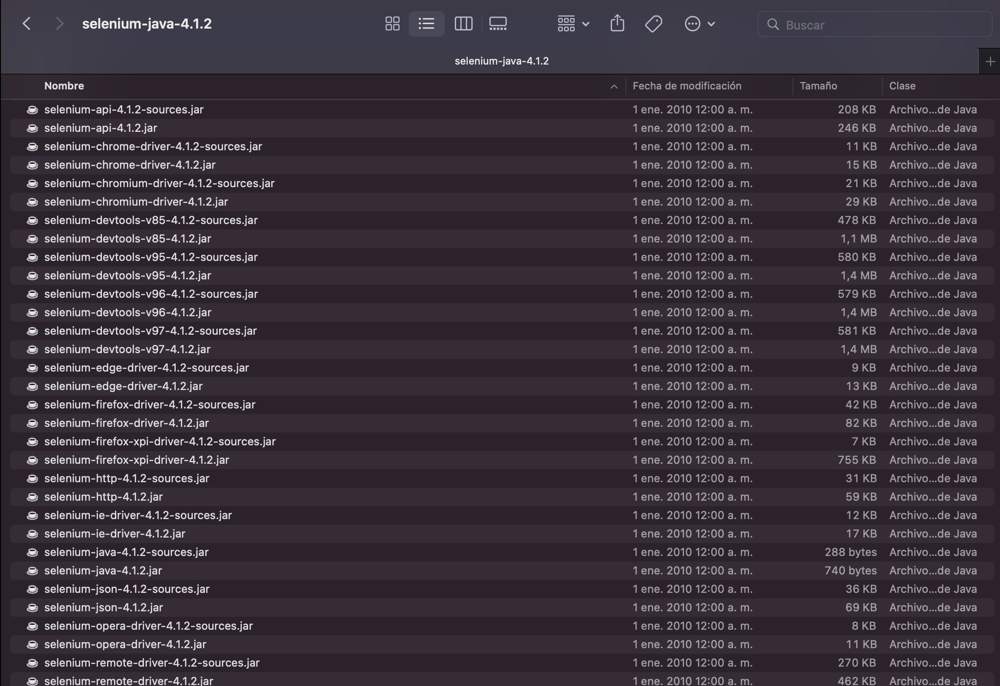
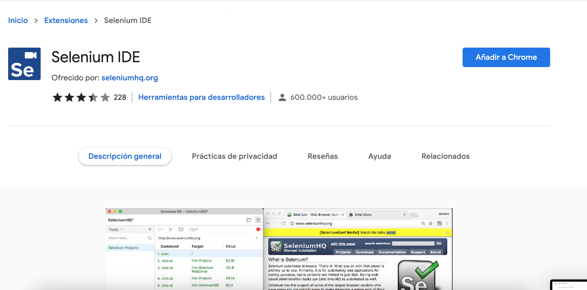
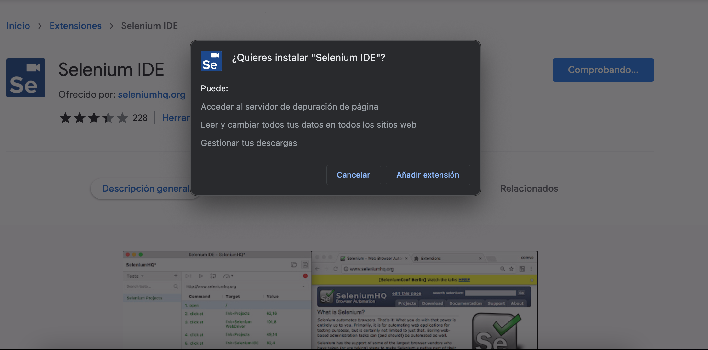
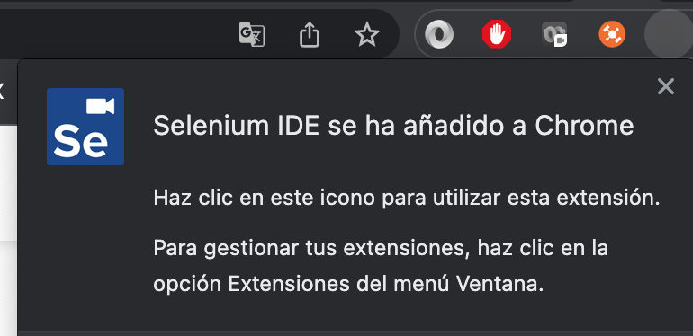
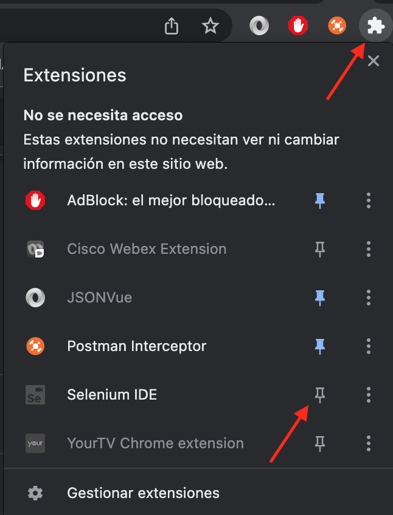
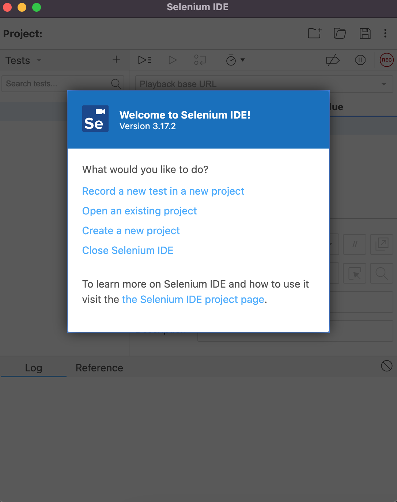

# Ejemplo-03: Configuración de Selenium JAVA Cliente Driver + Webdriver + IDE

## Objetivo

* Demostrar el proceso de instalacion de Selenium Client Driver +  Webdriver + IDE

## Desarrollo

#### Selenium Client Driver + Webdriver
* Para realizar la instalación  requerimos previamente hacer la descargar, con lo cual podemos hacerla desde la pagina oficial de Selenium: https://www.selenium.dev/downloads/ 

* Nos vamos a la sección "Selenium Clients and WebDriver Language Bindings"
  > 

* Seleccionamos la opción de Java, que es el lenguaje con el que trabajaremos. Haciendo click en la ultima versión estable: 4.1.2 (January 30, 2022)
  > 

* Se realizara la descargar de un archivo selenium-java-4.1.2.zip, descomprimir este archivo en la ruta deseada, por simplicidad, extraerla en el mismo directorio de Eclipse IDE. Este archivo contiene todos los archivos JAR que luego importaríamos en Eclipse para la configuración de Selenium.
  > 

#### Selenium IDE 
Selenium IDE está disponible para Google Chrome, Mozilla Firefox y Microsoft Edge. Para este manual usaremos Google Chrome

* Abrir el navegador Google Chrome e ingresar a Chrome Web Store desde el siguiente link: https://chrome.google.com/webstore/detail/selenium-ide/mooikfkahbdckldjjndioackbalphokd
  > 

* Realizar click en el botón "Añadir a Chrome", posteriormente en la ventana emergente hacer click en "Añadir extensión"
  > 

* Veremos que se ha agregado a la barra de herramientas del explorador
  > 

* Si no visualizas la extencion en tu navegdor, haz click en el icono de extension de la barra de tu navegador y fija la extensión de selenium IDE  
  > 

* Al hacer click sobre el icono de Selenium IDE de la barra del navegador se abrira SeleniumIDE, donde posteriormente vamos a explicar su uso.
  > 
