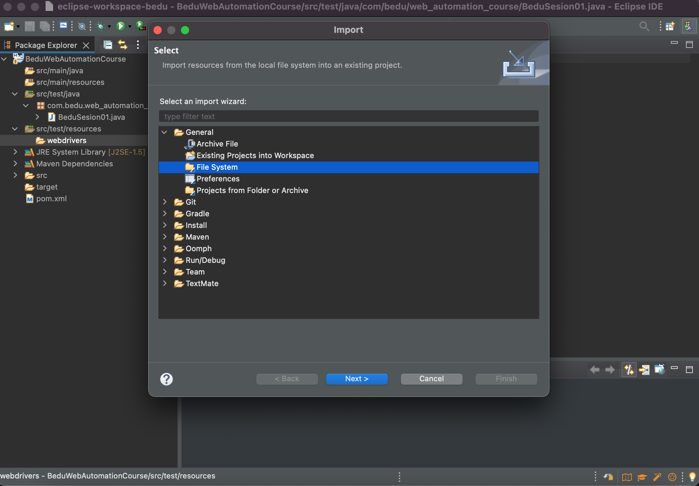

# Ejemplo-05: Instalación y configuración de Selenium Browser Drivers

## Objetivo

* Demostrar el proceso de instalación y configuración de Selenium Browser Drivers

## Desarrollo

#### Descarga de Selenium Browser Drivers :globe_with_meridians:
* Realizar la descarga de los browser drivers con los que vamos a trabajar, momentaneamente solo usaremos firefox y chrome. La descarga se realiza desde la página oficial de selenium: https://www.selenium.dev/documentation/webdriver/getting_started/install_drivers/
  
  > 

  * Para el caso de la descarga de chromedriver, al realizar click en la opcion de descargar veremos una pagina con el directorio de multiples versiones, navegamos en el directorio hasta conseguir la version que corresponde a la versión de chrome que tenemos instalada, ejemplo, si tenemos `chrome version 75.X.X` la version del chromedriver seria la misma.
      > 
      > 

  * Para el caso de la descarga de firefox, nos redirecciona a: https://github.com/mozilla/geckodriver/releases
      > 
      
  * Tanto para Chrome como para Firefox debe descargarse la versión correspondiente a su sistema operativo.
  * Crear una carpeta que se llame "webdriver" y descomprimir los archivos descargados en ella.
  
#### Configuración de Selenium Browser Drivers :globe_with_meridians:

* Creamos una carpeta en en directorio src/test/resource que se llame "webdrivers"
  
  > 

* Hacer click en "Finish"
  
  >

* Ahora sobre la carpeta "webdrivers", hacemos click derecho y seleccionamos la opción de "Importar"
  
  >

* Desplegamos la carpeta General > File System y hacer click en el botón "next"
  
  >

* Buscarmos la carpeta que creamos llamada "webdrivers" e importamos los browser drivers (no los .zip)
  
  >

## Creación de nuestro primer script con Eclipse + Selenium. :nerd_face:

#### Agregamos TestNG para nuestra primera prueba :space_invader:
* Agregamos dependiencia a nuestra libreria pom.xml: https://mvnrepository.com/artifact/org.testng/testng/7.4.0


	```XML 
	<project xmlns="http://maven.apache.org/POM/4.0.0" xmlns:xsi="http://www.w3.org/2001/XMLSchema-instance" xsi:schemaLocation="http://maven.apache.org/POM/4.0.0 https://maven.apache.org/xsd/maven-4.0.0.xsd">
	  <modelVersion>4.0.0</modelVersion>
	  <groupId>com.bedu.web_automation_course</groupId>
	  <artifactId>BeduWebAutomationCourse</artifactId>
	  <version>0.0.1-SNAPSHOT</version>

	  <dependencies>
		<!-- https://mvnrepository.com/artifact/org.seleniumhq.selenium/selenium-java -->
		<dependency>
		    <groupId>org.seleniumhq.selenium</groupId>
		    <artifactId>selenium-java</artifactId>
		    <version>4.1.2</version>
			<scope>test</scope>
		</dependency>

		<!-- https://mvnrepository.com/artifact/org.testng/testng -->
		<dependency>
		    <groupId>org.testng</groupId>
		    <artifactId>testng</artifactId>
		    <version>7.4.0</version>
		    <scope>test</scope>
		</dependency>

	  </dependencies>
	</project>
   ```

* Instalar el pluging de TestNG para Eclipse: Hacer click en ‘Help'  > Eclipse Market Place, buscar TestNG for Eclipse y hacer click en "Install". Luego click en "Confirm", Aceptar los Terminos y Condiciones y hacer click en "Finish"
* En el explorador de paquetes hacer click derecho en la carpeta src/test/java y seleccionar new ->other

* Desplegar la carpeta de TestNG, seleccionar TestNG class y hacer click en "next"
  >
  
* En la siguiente ventana tendremos que seleccionar "source folder", para ello hacer click "browse" y vamos desplegando las carpetas hasta llegar a donde tendremos nuestras clases.
  >
  
* Seleccionamos las anotaciones `@BeforeTest` y `@AfterTest` 
  >


* Vemos que se crea una nueva clase con la siguiente información:

   ```Java
   
	import org.testng.annotations.Test;
	import org.testng.annotations.BeforeTest;
	import org.testng.annotations.AfterTest;

	public class NewTest {
	  @Test
	  public void f() {
	  }
	  @BeforeTest
	  public void beforeTest() {
	  }

	  @AfterTest
	  public void afterTest() {
	  }

	}

   ```

  > NOTA: no te preocupes por ahora en entender las anotaciones de TestNG, el contenido de TestNG sera dado en la siguiente sesión.


#### Creamos un script basico de prueba  :robot:

* Crear el objeto Webdriver con el siguiente comando:  `private WebDriver driver;`. 

* Bajo la anotación de `@Test` modificamos el metodo para que se llame ` public void test() {}` -> no haremos nada con este metodo por ahora.

   ```Java
	import org.testng.annotations.Test;
	import org.testng.annotations.BeforeTest;
	import org.testng.annotations.AfterTest;

	public class NewTest {
	private WebDriver driver;
	  @BeforeTest
	  public void beforeTest() {
	  }

	  @Test
	  public void test() {
	  }

	  @AfterTest
	  public void afterTest() {
	  }

	}
   
   
   ```
   

* Dentro del metodo `public void beforeTest(){}` agregamos los siguientes comandos:
  * Agregar la ubicación del ejecutable de chromedriver con el siguiente comando: 

   ```Java
   System.setProperty("webdriver.chrome.driver", "./src/test/resourses/webdrivers/chromedriver.exe");
   ```
  * Declaramos el objeto driver de tipo chromedriver:
   
   ```Java
   driver = new ChromeDriver();
   ```
   
  * Realizamos algunas acciones basicas con el explorador:
   - Maximizamos la pantalla `driver.manage().window().maximize();` 
   - Ingresamos a una url `driver.get("https://bedu.org/");` 
   - Agregamos un tiempo de espera: `driver.manage().timeouts().implicitlyWait(Duration.ofSeconds(10));`
   - Cerramos el navegador `driver.close();` 

   
   ```Java
	driver.manage().window().maximize();
	driver.get("https://bedu.org/");
	driver.manage().timeouts().implicitlyWait(Duration.ofSeconds(10));
	driver.close();
   
   ```

#### Código de la clase
   ```Java
package com.bedu.web_automation_course;

import org.testng.annotations.Test;
import org.testng.annotations.BeforeTest;
import org.testng.annotations.AfterTest;

import java.time.Duration;

import org.openqa.selenium.WebDriver;
import org.openqa.selenium.chrome.ChromeDriver;


public class NewTest {

	private WebDriver driver;

		  @BeforeTest
		  public void beforeTest() {
				System.setProperty("webdriver.chrome.driver", "src/test/resources/webdrivers/chromedriver");
				driver = new ChromeDriver();

				driver.manage().window().maximize();
				driver.get("https://bedu.org/");
				driver.manage().timeouts().implicitlyWait(Duration.ofSeconds(10));
				driver.close();
		  }

		  @Test
		  public void test() {
		  }

		  @AfterTest
		  public void afterTest() {
		  }

}
   
   ```


#### Ahora ejecutamos el script, para eso solo basta con hacer click en el botón de "run" de eclipse. :rocket:
