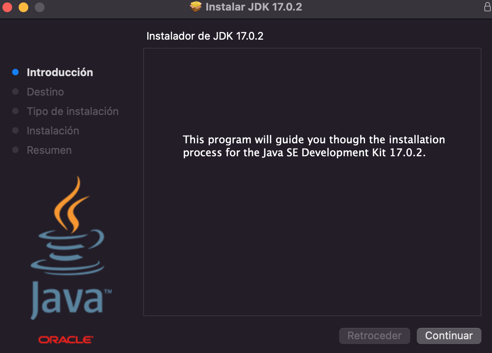
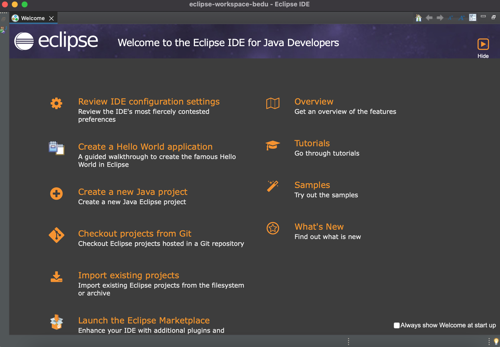
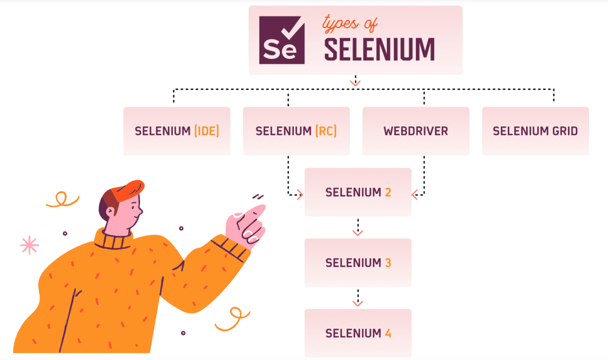
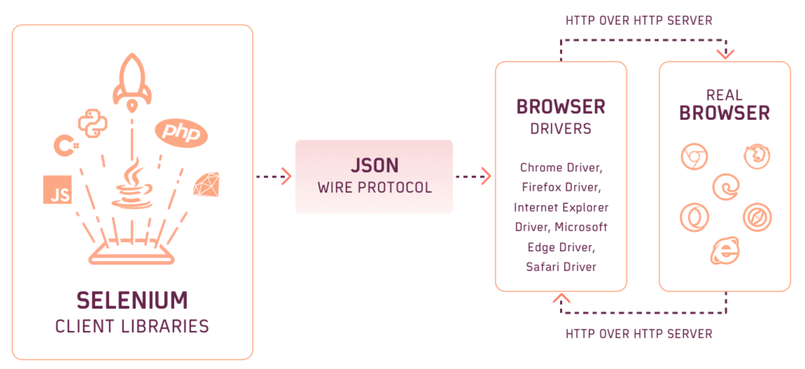
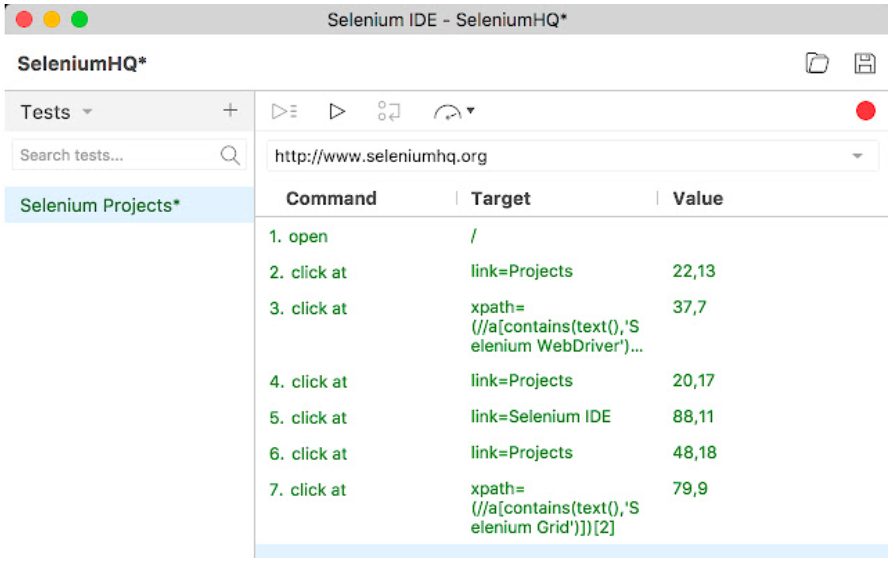

## Sesión 1: Instalación y configuración de Selenium 🤖

### 1. Objetivos :dart: 

- Establecer la instalación y configurar correctamente Selenium

### 2. Contenido :blue_book:
Selenium es un entorno de pruebas que se utiliza para comprobar si el software que se está desarrollando funciona correctamente, cabe acotar que, con selenium solo se pueden probar las aplicaciones web. Esta herramienta permite: grabar, editar y depurar casos de pruebas que se pueden automatizar. Lo interesante de Selenium es que se pueden editar acciones o crearlas desde cero. También ayuda mucho en las pruebas de regresión porque consigue pruebas automatizadas que luego se pueden reutilizar cuando se necesite. 
  
En esta sesión realizaremos todas las instalaciones y configuraciones necesarias para que selenium funcione de forma correcta. 

---

#### <ins>Tema 1: Instalación de Java Software Development Kit (JDK)</ins>

Un software development kit (SDK) es un conjunto de herramientas que ayudan a desarrollar aplicaciones para hardware o software específicos o en un lenguaje de programación concretos. En algunos lenguajes interpretados, el SDK puede ser idéntico al sistema en tiempo de ejecución. Algunos fabricantes utilizan denominaciones alternativas para sus paquetes de software en lugar de SDK.Oracle, por ejemplo, llama JDK (Java (SE) Development Kit) a su paquete para el lenguaje de programación que distribuye, Java.
  >    
En esta tema realizaremos la instalacion del Java (SE) Development Kit

  [`Ejemplo-01` Instalación de Java Software Development Kit (JDK)](./Ejemplo-01)
  
---

#### <ins>Tema 2: Instalación de Eclipse IDE. </ins>
  
Eclipse es un proyecto de código abierto cuyo principal objetivo es proporcionar una plataforma de desarrollo abierta e independiente de los fabricantes de software además de una serie de frameworks para construir software.
   >     
En esta tema realizaremos la instalacion de Eclipse IDE.

  [`Ejemplo-02` Instalación de de Eclipse IDE](./Ejemplo-02)
  
---

#### <ins>Tema 3: Instalación de Selenium JAVA Cliente Driver + Webdriver + IDE</ins>

En esta tema realizaremos la instalacion de Selenium JAVA Cliente Driver + Selenium Webdriver + IDE
  >  

#### ¿Qué es JAVA Cliente Driver?
  > Es un controlador que le permite a los comandos de Java crear secuencias de comandos que interactúen con Selenium Server (Remote WebDriver) o crear secuencias de comandos locales de Selenium WebDriver.
#### ¿Qué es un Selenium Webdriver?
  > Es una herramienta que permite interactuar con los navegadores directamente con la ayuda de scripts de automatización. Admite varias plataformas y la ejecución es más rápida que Selenium Remote Control (Selenium RC, que ahora está en desuso) o IDE. Selenium Webdriver proporciona múltiples librerías de clientes para lenguajes de programación como Java, Python, Ruby, C#, etc. para crear los scripts de automatización de pruebas de Selenium. 
  
  > La comunicación entre estos clientes y el servidor ocurre a través de un protocolo de cable JSON. Por ejemplo: cuando se da un comando para abrir un navegador con una URL específica, toda la información necesaria, como el tipo de navegador, la versión del navegador y las capacidades deseadas, se usará para crear una carga JSON. El cliente enviará esta carga útil que contiene toda la información requerida a través del protocolo JSON al cliente HTTP. Luego, el servidor identificaría el tipo de navegador en el que se debe ejecutar el comando y ejecutaría el comando especificado en ese navegador en particular.
  
  >  
 
  #### ¿Qué es un Selenium IDE?
  > Selenium IDE es una extensión de navegador fácil de usar que registra las acciones de un usuario en el navegador utilizando los comandos existentes de Selenium, con parámetros definidos por el contexto de cada elemento, también proporciona una excelente manera de aprender la sintaxis de Selenium. 
  
  >  

  [`Ejemplo-03` Configuración Selenium JAVA Cliente Driver + Webdriver + IDE](./Ejemplo-03)
  
---

#### <ins>Tema 4: Configuración de Eclipse IDE con Selenium WebDriver</ins>
Eclipse es un entorno de desarrollo sobre el que se pueden montar mediante plugins herramientas de desarrollo para cualquier lenguaje de programación.

Pero para poder integrarse correctamente con Selenium requiere de la importación de sus librerías al proyecto en el que se está trabajando, sin esta integración, el eclipse no será capaz de interpretar los comandos de selenium y generará errores en el proceso de compilación.

En esta tema realizaremos la configuración de Selenium Webdriver en Eclipse IDE.

  [`Ejemplo-04` Configuración de Eclipse IDE con Selenium WebDriver](./Ejemplo-04)
  
---
#### <ins>Tema 5: Instalación y Configuración de Selenium Browser Drivers</ins>
Un browser driver es un componente que necesita tener nuestro proyecto de pruebas automatizadas sobre selenium para ejecutar los scripts en el explorador mientras se ejecuta la prueba. Es necesario tener configurado cada driver dependiendo del explorador en el que queramos ejecutar nuestros scripts.

En esta tema realizaremos la instalación y configuración de Selenium Webdriver.

  [`Ejemplo-05` Configuración Selenium browser Drivers](./Ejemplo-05)

---

### 3. Retos :memo:

Realizar estos retos que te ayudaran a practicar lo que has aprendido del contenido visto en esta sesión: 
  - [`Reto 01:` Dependencias Selenium](./Reto-01)
  - [`Reto 02:` Chromedriver](./Reto-02)
---  
### 4. Postwork :memo:

Este postwork te servira para iniciar con tu proyecto, que poco a poco iremos construyendo en el trasncurso de las sesiones, este es el primer paso:

  [`Postwork`](./Postwork)

 

