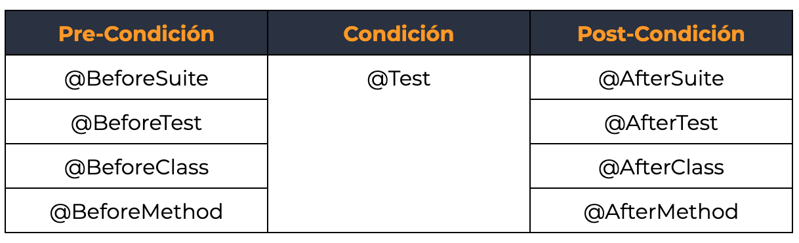
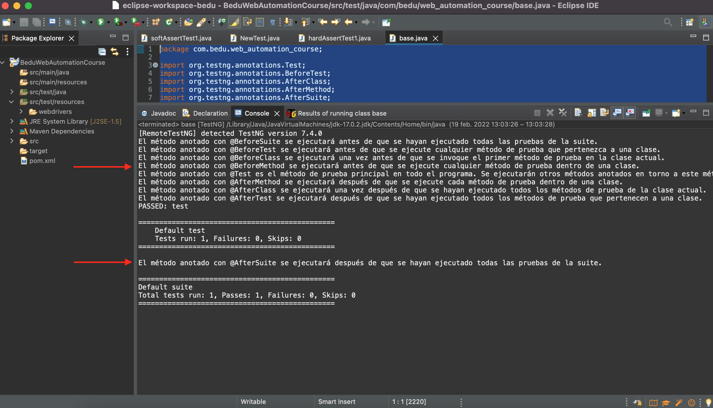

# Ejemplo-01: TestNG

## Objetivo

* Desarrollar scripts de pruebas automatizados con el uso de TesnNG y sus funcionalidades.

## Desarrollo

TestNG proviene de las siglas de `Test Next Generation` y es un framework de automatización de pruebas de código abierto inspirado en JUnit y NUnit que terminó siendo una actualización de esos dos framework, es decir, se fusionaron para obtener un framework mucho más completo, que resolviera los problemas a los que los 2 anteriores no les daba solución.

TestNG facilita el desarrollo de pruebas de software en Java, ya que ejecuta las pruebas en clases, es decir, hace clases para las pruebas correspondientes y luego las procesa. Una novedad es que proporciona una funcionalidad adicional como anotaciones de prueba, agrupación, priorización, parametrización y técnicas de secuenciación en el código que no era posible antes, además de administrar los casos de prueba, incluso los informes detallados de las pruebas se pueden obtener utilizando TestNG.

La siguiente imagen muestra el funcionamiento de TestNG.

 

Características del TestNG:
- Tiene disponibles `anotaciones` para controlar cómo se ejecutan los métodos de la clase.
- Permite la `priorización` del orden de ejecución de pruebas.
- Habilita la `desactivación` de casos de pruebas.
- Es posible ejecutar un fragmento del codigo solo si satisface una condición o solo si un método en particular se ejecuta con éxito
- Introduce el concepto de `agrupamiento`, es decir, asignar un nombre de grupo a varios casos de prueba y luego elegir ejecutar el grupo en lugar del código completo.
- Se pueden usar `afirmaciones` en los métodos de prueba para determinar la condición de aprobación / reprobación de una prueba.
- Por último, pero no menos importante, TestNG disponibiliza los resultados de las pruebas por medio de la `generación de un informe` que puede verse en formato HTML.

#### ¿Qué son las anotaciones TestNG?

TestNG dispone de anotaciones para controlar cómo se ejecutan los métodos de la clase. Es importante tener en cuenta que las anotaciones de prueba se deben definir antes de cada método en el código de prueba. En caso de que algún método no tenga un prefijo con anotaciones, ese método se ignorará y no se ejecutará como parte del código de prueba. Siempre están precedidas por el símbolo @.

Estas son las anotaciones:

 

Las mismas funcionan con un orden de ejecución basado en la lógica: Pre-condición, condición y postcondición de la prueba, siguiente este orden:

1. `BeforeSuite`: El método anotado con @BeforeSuite se ejecutará antes de que se hayan ejecutado todas las pruebas de la suite.
2. `BeforeTest`: El método anotado con @BeforeTest se ejecutará antes de que se ejecute cualquier método de prueba que pertenezca a una clase.
3. `BeforeClass`: El método anotado con @BeforeClass se ejecutará una vez antes de que se invoque el primer método de prueba en la clase actual.
4. `BeforeMethod`: El método anotado con @BeforeMethod se ejecutará antes de que se ejecute cualquier método de prueba dentro de una clase.
5. `Test` El método anotado con @Test es el método de prueba principal en todo el programa. Se ejecutarán otros métodos anotados en torno a este método.
6. `AfterMethod`: El método anotado con @AfterMethod se ejecutará después de que se ejecute cada método de prueba dentro de una clase.
7. `AfterClass`: El método anotado con @AfterClass se ejecutará una vez después de que se hayan ejecutado todos los métodos de prueba de la clase actual.
8. `AfterTest`: El método anotado con @AfterTest se ejecutará después de que se hayan ejecutado todos los métodos de prueba que pertenecen a una clase.
9. `AfterSuite`: El método anotado con @AfterSuite se ejecutará después de que se hayan ejecutado todas las pruebas de la suite.


Aca podemos ver y ejecutar un ejemplo de esta lógica:

```Java
package com.bedu.web_automation_course;

import org.testng.annotations.Test;
import org.testng.annotations.BeforeTest;
import org.testng.annotations.AfterClass;
import org.testng.annotations.AfterMethod;
import org.testng.annotations.AfterSuite;
import org.testng.annotations.AfterTest;
import org.testng.annotations.BeforeClass;
import org.testng.annotations.BeforeMethod;
import org.testng.annotations.BeforeSuite;


public class base {
	
	@BeforeSuite
	public void beforeSuite() {
		System.out.println("El método anotado con @BeforeSuite se ejecutará antes de que se hayan ejecutado todas las pruebas de la suite.");
		}
	
	@BeforeTest
	  public void beforeTest(){
		System.out.println("El método anotado con @BeforeTest se ejecutará antes de que se ejecute cualquier método de prueba que pertenezca a una clase.");
	  }

	@BeforeClass
	  public void beforeClass(){
		System.out.println("El método anotado con @BeforeClass se ejecutará una vez antes de que se invoque el primer método de prueba en la clase actual.");
	  }
	
	@BeforeMethod
	  public void beforeMethod(){
		System.out.println("El método anotado con @BeforeMethod se ejecutará antes de que se ejecute cualquier método de prueba dentro de una clase.");
	  }
	
	@Test
		public void test() {
		System.out.println("El método anotado con @Test es el método de prueba principal en todo el programa. Se ejecutarán otros métodos anotados en torno a este método.");
		  }

	@AfterMethod
	public void afterMethod() {
		System.out.println("El método anotado con @AfterMethod se ejecutará después de que se ejecute cada método de prueba dentro de una clase.");
	  }
	
	@AfterClass
	public void afterClass() {
		System.out.println("El método anotado con @AfterClass se ejecutará una vez después de que se hayan ejecutado todos los métodos de prueba de la clase actual.");
	  }

	@AfterTest
	public void afterTest() {
		System.out.println("El método anotado con @AfterTest se ejecutará después de que se hayan ejecutado todos los métodos de prueba que pertenecen a una clase.");
	}

	@AfterSuite
	public void afterSuite() {
		System.out.println("El método anotado con @AfterSuite se ejecutará después de que se hayan ejecutado todas las pruebas de la suite.");
	}

}
```


 

#### Prioridad de ejecución en las pruebas

TestNG también nos permite priorizar la ejecución de los casos de prueba si le asignamos un número de prioridad. Cuanto menor sea el número, mayor será la prioridad. La prioridad se puede asignar como parámetros al definir los casos de prueba. Pero, si no se asigna ninguna prioridad, los métodos de prueba anotados se ejecutarán según el orden alfabético de las pruebas. Por ejemplo:

```Java
    @Test(Priority=2)
    public static void PrimeraPrueba()
    {
        system.out.println("Este es el SEGUNDO caso de prueba porque la prioridad = 2");
    }
    
    @Test(Priority=1)
    public static void SegundaPrueba()
    {
        system.out.println("Este es el PRIMER caso de prueba porque la prioridad = 1");
    }
    
    @Test
    public static void Prueba()
    {
        system.out.println("Este es el último caso de prueba porque no tiene prioridad");
    }
```


#### Desactivación
El acto de deshabilitar un caso de prueba también se realiza mediante parámetros. Podemos establecer el atributo habilitado en 'falso'. De forma predeterminada, todos los casos de prueba estarán habilitados, por lo que no es necesario definirlos cada vez que escribimos una prueba. 

```Java
    @Test(Priority=2)
    public static void PrimeraPrueba()
    {
        system.out.println("Este es el SEGUNDO caso de prueba porque la prioridad = 2");
    }
    
    @Test(Priority=1,enabled = false)
    public static void SegundaPrueba()
    {
        system.out.println("Este es el PRIMER caso de prueba porque la prioridad = 1 pero esta deshabilitado asi que no se ejecuta");
    }   
```
#### Dependencia de Metodos
En caso de que tenga una situación en la que desee que un fragmento de código se ejecute solo si satisface una condición o solo si un método en particular se ejecuta con éxito, entonces podemos hacerlo mediante el uso de dependsOnMethod(). Esta es básicamente una condición de dependencia del método donde un método se ejecutará dependiendo de otro método.

```Java
    @Test
    public static void prueba()
    {
        system.out.println("Este es el primero que se ejecuta, no tiene dependencia");
    }
    
    @Test(dependsOnMethods = { "prueba" })
    public static void segunda_prueba()
    {
        system.out.println("Este se ejecuta de segundo, depende de la ejecución del metodo `prueba`");
    }
    
    @Test(dependsOnMethods = { "segunda_prueba" })
    public static void primera_prueba()
    {
        system.out.println("Este se ejecuta de segundo, depende de la ejecución del metodo `segunda_prueba`");
    }

```


#### Agrupamiento

Podemos usar el atributo de grupos para agrupar los casos de prueba. Podemos asignar un nombre de grupo a varios casos de prueba y luego elegir ejecutar el grupo en lugar del código completo. 

```Java
    @Test(groups = { "Pruebas_Login" })
    public static void FirstTest()
    {
        system.out.println("pertenece al grupo: Pruebas_Login");
    }
    
    @Test(groups = { "Pruebas_Login" })
    public static void SecondTest()
    {
        system.out.println("pertenece al grupo: Pruebas_Login");
    }
    
    @Test
    public static void ThirdTest()
    {
        system.out.println("no pertenece al grupo: Pruebas_Login");
    }
```

Estas anotaciones estan relacionadas con el agrupamiento:

> - `BeforeGroup`: el método anotado con @BeforeGroup se ejecutará antes de que se ejecute cada grupo.
> - `AfterGroup`: el método anotado con @AfterGroup se ejecutará después de que se ejecute cada grupo.


