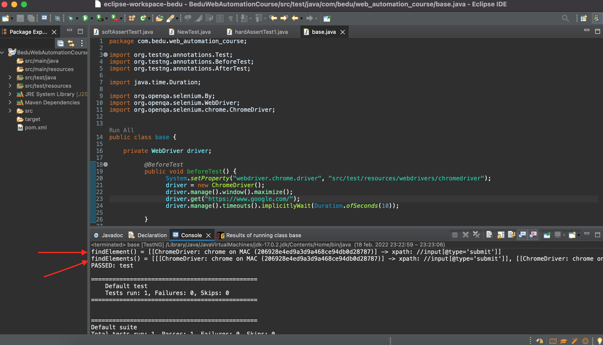

# Ejemplo-03: Métodos Findelement() y Findelements()

## Objetivo

* Identificar las principales diferencia entre los metodos findElement() y findElements()

## Desarrollo

Para que selenium pueda interactuar con la página web requiere que un controlador ubique un elemento web y active un evento de JavaScript como por ejemplo hacer un click, ingresar información a un campo de texto, seleccionar un elemento o tomar el valor de un campo. Por lo general, uno comienza la prueba automatizada de cualquier aplicación web al encontrar elementos web relevantes en la página web.

Selenium webdriver nos proporciona dos métodos para encontrar elementos web en una página web: driver.findElement() y driver.findElements().

Aunque parezcan similares se comportan de forma distinta, primero veamos por definición que hace cada método:

#### findElement(): 
Es un comando que es utilizado para la identificación (de forma única) de un elemento web dentro de la página web. En caso de que el mismo localizador coincida con varios elementos web, el método findElement devuelve el primer elemento web encontrado. Si por el contrario el localizador que es pasado al método findElement() no lleva a ningún elemento en la página web, se lanza <<NoSuchElementException>>. 

```Java
WebElement element = driver.findElement(By locator);
```

#### findElements(): 
Un comando que es utilizado para la identificación de una lista de elementos web dentro de la página web. En caso de coincidencias múltiples, el método findElements devuelve una lista de webElements por lo que para interactuar con un elemento en particular, tenemos que encontrarlo por su índice, por ejemplo elementos.get(0).click(); realizará la operación de click en el primer elemento de la lista de 'elementos'. Si por el contrario el localizador pasado al método findElements() no lleva a ningún elemento, se devuelve una lista de tamaño 0 en lugar de una excepción.

```Java
List <WebElement> elements = driver.findElements(By locator);
```

#### Ejemplo:

```Java
package com.bedu.web_automation_course;

import org.testng.annotations.Test;
import org.testng.annotations.BeforeTest;
import org.testng.annotations.AfterTest;
import org.openqa.selenium.By;
import org.openqa.selenium.WebDriver;
import org.openqa.selenium.chrome.ChromeDriver;


public class base {

	private WebDriver driver;

		  @BeforeTest
		  public void beforeTest() {
				System.setProperty("webdriver.chrome.driver", "src/test/resources/webdrivers/chromedriver");
				driver = new ChromeDriver();
				driver.manage().window().maximize();
				driver.get("https://www.google.com/");
				Thread.sleep(2000);
				
		  }

		  @Test
		  public void test() {

			  System.out.println("findElement() = " + driver.findElement(By.xpath("//input[@type='submit']")));
			  System.out.println("findElements() = " + driver.findElements(By.xpath("//input[@type='submit']")));

		  }

		  @AfterTest
		  public void afterTest() {
			  	driver.close();
		  }

}

```

 

> como podemos ver en los logs, findElement() retorna solo el primer elemento que consigue con el Xpath indicado, en cambio findElements() retorna todos los objetos con consigue con ese Xpath.

**💡 Pro-tip:**
> Debido al hecho de que, en caso de que no se encuentre ningún elemento, driver.findElements() devuelve una lista de tamaño 0 (a diferencia de findElement() que arroja una excepción), generalmente se usa para verificar la presencia de un elemento. Es decir, simplemente podemos verificar el tamaño de la lista devuelta por el método findElements() y, si no es cero, podemos interactuar con el primer elemento de la lista usando el índice 0.

