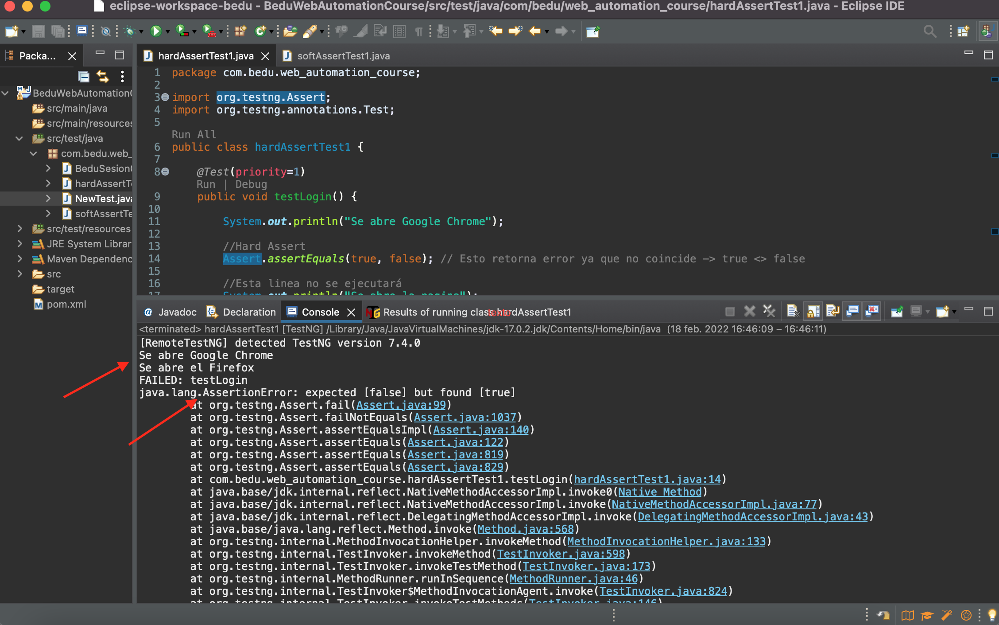
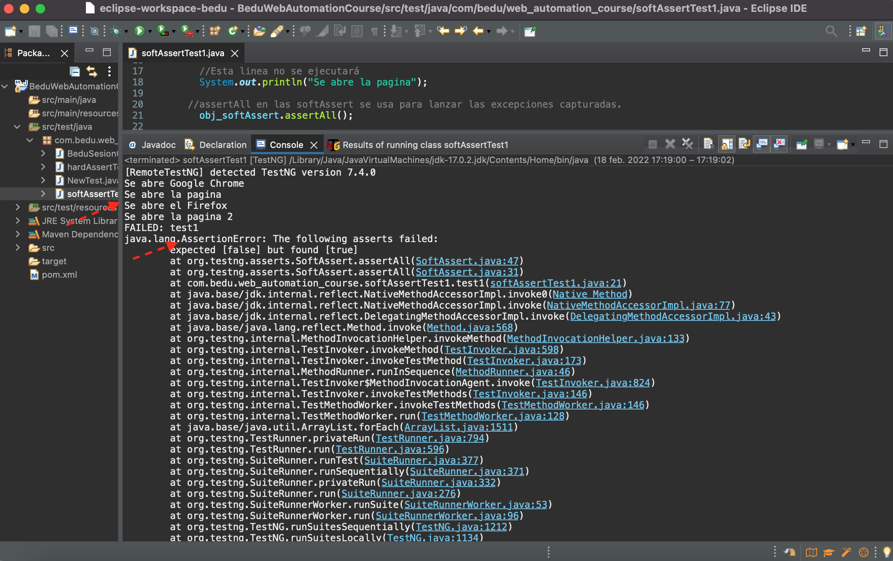
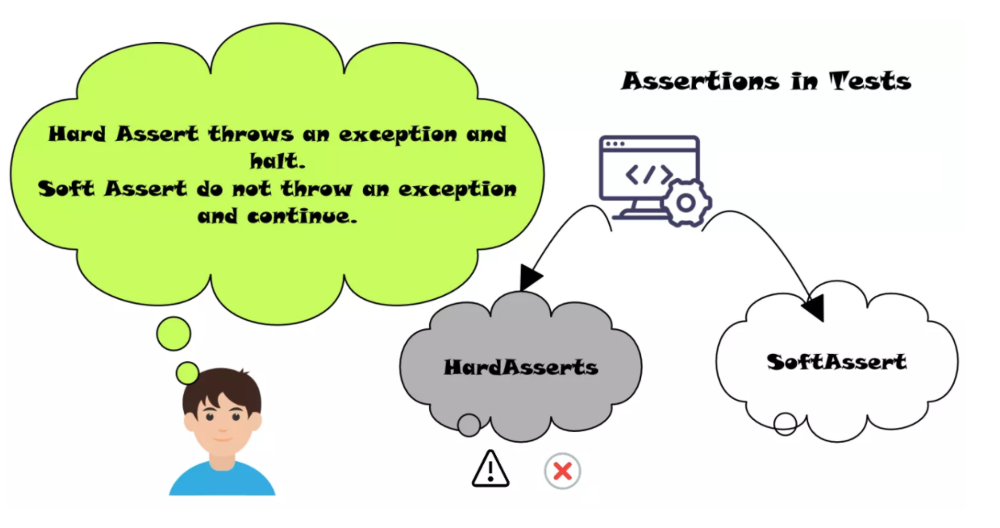
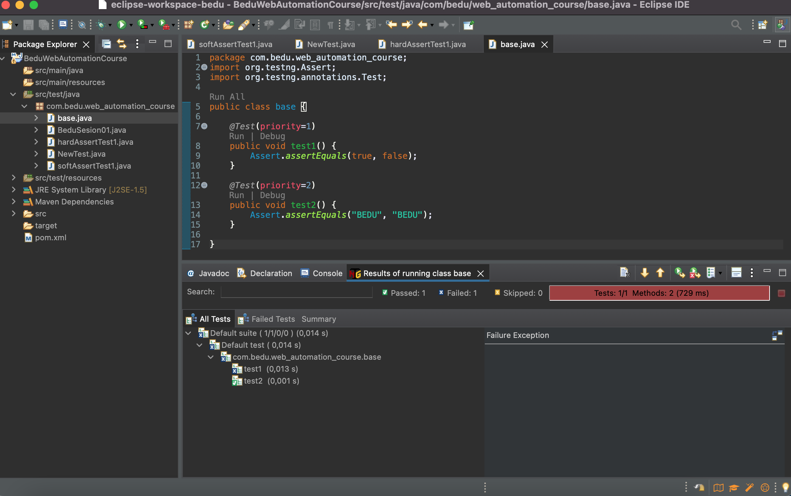
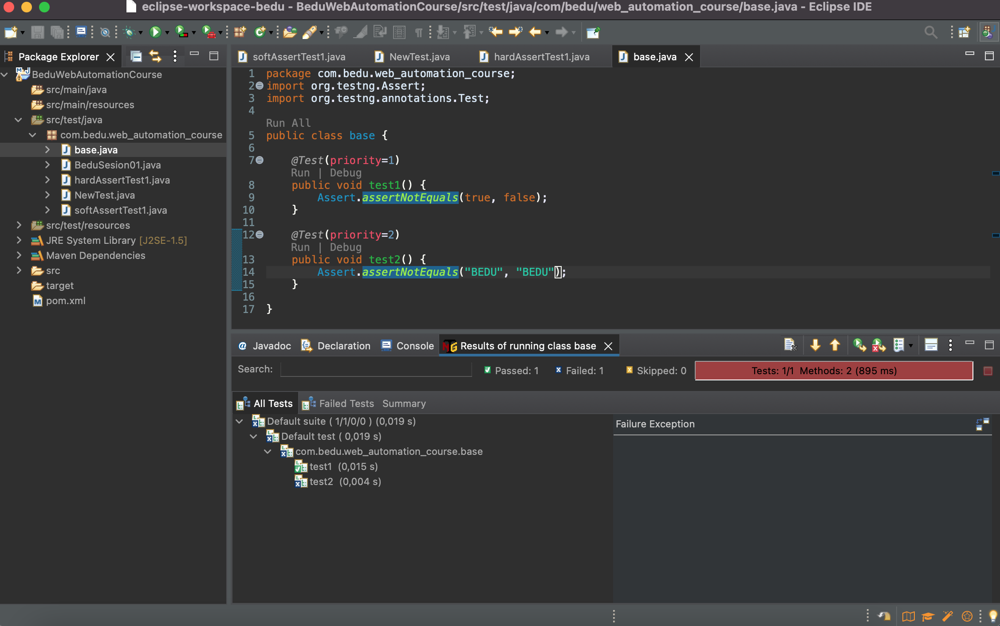
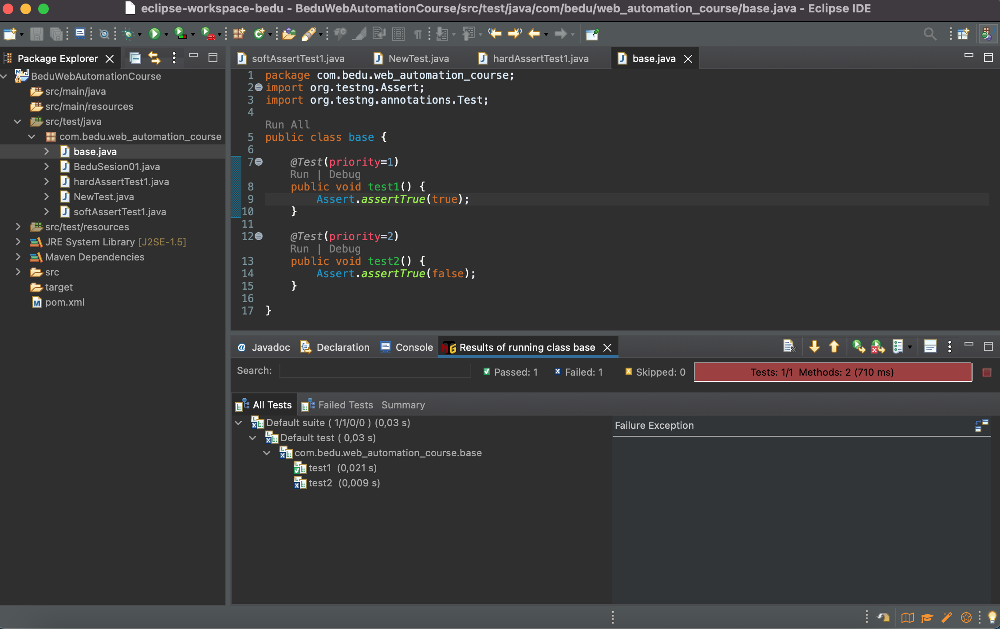
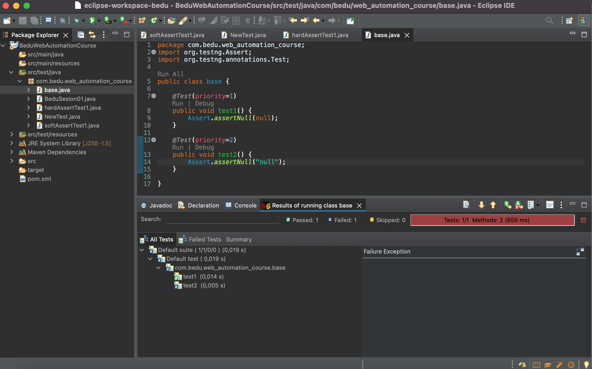
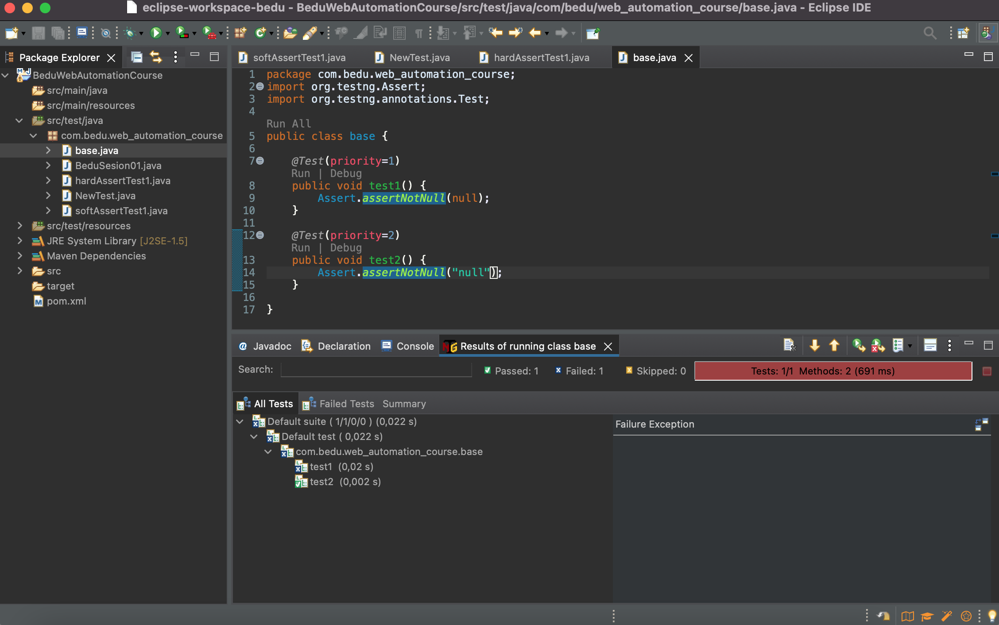

# Ejemplo-06: Validaciones o Aserciones

## Objetivo

* Reconocer los tipos de aserciones.
* Implementar la clase Assert de TestNG en los scripts de pueba.

## Desarrollo

Como último tema de esta sesión veremos lo referente al último paso de nuestras clases de prueba: las validaciones. Sabemos que todo caso de prueba tiene un comportamiento esperado, y que el mismo debe ser validado para saber si nuestro caso de prueba funciona correctamente o según lo esperado.

Para estas validaciones TestNG nos ofrece lo que se llaman “aserciones” que se obtienen de la clase Assert. A continuación se muestra la sintaxis genérica de las afirmaciones de TestNG:


```Java
Assert.methodName(actual, esperado);
```

Donde los parámetros:
- `methodName`: es el nombre del método que se puede usar para implementar aserciones de TestNG.
- `actual`: es el primer parámetro que describe el valor que obtiene el usuario durante la ejecución del script de prueba.
- `esperado`: es el segundo parámetro que describe lo que el usuario debe obtener para validar la funcionalidad del caso de prueba.

#### Existen dos tipos se aserciones:

- **Afirmación dura (Hard Assert):** es un método estático que cuando el caso de prueba falla lanza un `AssertException`. Cuando esto sucede TestNG genera la excepción del mensaje de error, luego detiene la ejecución del script de prueba actual y continúa la implementación con el script de prueba siguiente.

**Veamos el siguiente ejemplo:**


```Java
package com.bedu.web_automation_course;
import org.testng.Assert;
import org.testng.annotations.Test;

public class hardAssertTest1 {
	
	@Test(priority=1)
    public void test1() {
		
        System.out.println("Se abre Google Chrome");
        
        //Hard Assert
        Assert.assertEquals(true, false); // Esto retorna error ya que no coincide -> true <> false

        //Esta linea no se ejecutará
        System.out.println("Se abre la pagina");        
    }
    
    @Test(priority=2)
    public void test2() {
    	
    	System.out.println("Se abre el Firefox");
        
    	// Esto retorna error ya la condicion es un boolean false
        Assert.assertTrue(false, "hard assert");  //Nota: en assertTrue los mensajes solo se imprimen cuando la asercion falla
        
      //Esta linea tampoco ejecutara
        System.out.println("Se abre la pagina 2");      
    }

}
```
 

> Si ejecutamos ese script de prueba ambos casos fallan ya que no se cumple la condicion del tipo de asercion empleada, al ver en la consola vemos 2 cosas, la primera es que se genera el `AssertionError` y la segunda es que solo se imprime la primera linea de cada caso, y no lo que sigue despues de la asercion, esto se debe a que son `Hard Assert`


- **Afirmación suave (Soft Assert):** Es un método no estático que cuando la condición de la aserción no coincide no lanza un `AssertException`. Cuando esto sucede continúa con el siguiente paso del caso de prueba generando un mensaje de error junto con una excepción de aserción, luego continúa con la misma ejecución del script de prueba.

  En esta asercion se debe usar `assertAll()` al final de los scripts de prueba porque siempre recopila todos los seguimientos de registro y se muestra en la consola el `AssertException`.

**Veamos el siguiente ejemplo:**

```Java
package com.bedu.web_automation_course;

import org.testng.annotations.Test;
import org.testng.asserts.SoftAssert;

public class softAssertTest1 {
	//Creación del objecto SoftAssert
    SoftAssert obj_softAssert = new SoftAssert();
    
    @Test(priority=1)
    public void test1() {
        System.out.println("Se abre Google Chrome");
        
        //soft Assert
        obj_softAssert.assertEquals(true, false); // Esto retorna error ya que no coincide -> true <> false
        
        //Esta linea no se ejecutará
        System.out.println("Se abre la pagina");   
        
      //assertAll en las softAssert se usa para lanzar las excepciones capturadas.
        obj_softAssert.assertAll();        
    }
    
    @Test(priority=2)
    public void test2() {
    	System.out.println("Se abre el Firefox");
        
    	// Esto retorna error ya la condicion es un boolean false
    	obj_softAssert.assertTrue(false, "soft assert");  //Nota: en assertTrue los mensajes solo se imprimen cuando la asercion falla
        
      //Esta linea tampoco ejecutara
        System.out.println("Se abre la pagina 2");   
        
        //assertAll en las softAssert se usa para lanzar las excepciones capturadas.
        obj_softAssert.assertAll();  
    }

}
```
 

> Si ejecutamos ese script de prueba ambos casos fallan ya que no se cumple la condicion del tipo de asercion empleada, al ver en la consola vemos 3 cosas, la primera es que se hace debe hacer uso de la clase `SoftAssert` para hacer las validaciones, la segunda es que se genera el `AssertionError` (por el uso sel metodo `assertAll()`) y la segunda se llega a ejecuatar el codigo que esta antes y despues de la asercion, sin importa si este falla o no, esto se debe a que son `Soft Assert`


#### En resumen:
 

Ahora explicaremos como funcionan las aserciones mas usadas en la actualidad:

- assertEquals: este método compara el parámetro “real” con “esperado”. Si son iguales la aserción pasa sin excepción pero si no son los mismos, la afirmación falla con una excepción y la prueba se marca como fallida.

```Java
Assert.assertEquals(real, esperado);
```
 

- assertNotEquals: es lo opuesto a assertEquals, se compara el parámetro “real” con “esperado”. Si NO son iguales la aserción pasa sin excepción pero si son los mismos, la afirmación falla con una excepción y la prueba se marca como fallida.

```Java
Assert.assertNotEquals(real, esperado);
```

 

- assertTrue: comprueba si el valor devuelto es verdadero o no. Siempre que pasa el caso de prueba, aborta el método y da una excepción.

```Java
Assert.assertTrue(condición);
```

 

- assertFalse: comprueba si el valor devuelto es falso o no. Siempre que pasa el caso de prueba, aborta el método y da una excepción.

```Java
Assert.assertFalse(condición);
```

 

- assertNull: esta aserción verifica si el objeto es nulo o no. Anula la prueba si el objeto es nulo y da una excepción.

```Java
Assert.assertNull(objeto);
```

 


- assertNotNull: esta aserción verifica si el objeto es nulo o no. Anula la prueba si el objeto no es nulo, es decir, si el objeto tiene algún valor y da una excepción.

```Java
Assert.assertNotNull(objeto);
```

 

Para mas información: https://www.javadoc.io/doc/org.testng/testng/6.8.17/org/testng/Assert.html