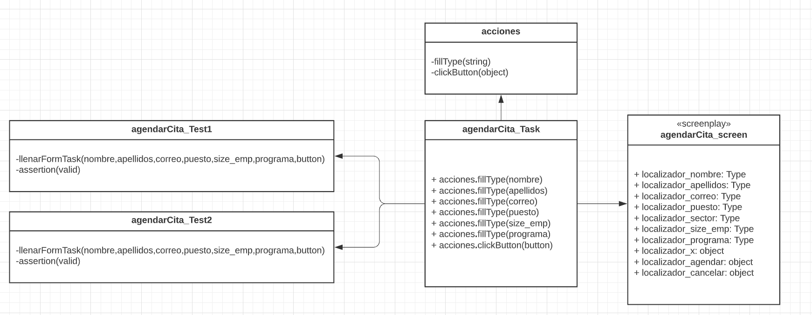
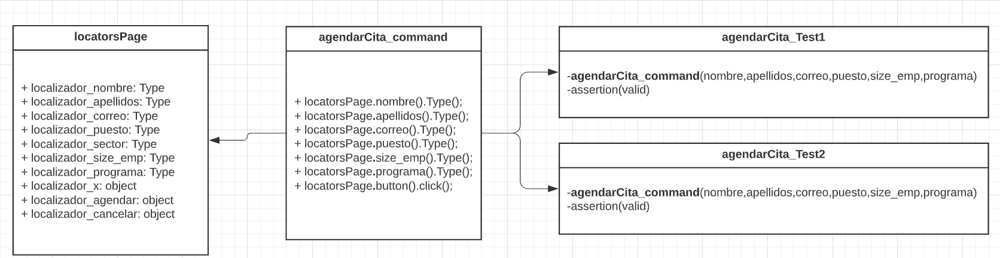

# Ejemplo-01# - Patrones de diseño de automatización

## Objetivo

* Emplear los tipos de patrones de diseño existente y sus usos y beneficios.

## Desarrollo

#### ¿Que es un patrón de diseño?
Un patrón de diseño es un `boceto, base o esqueleto de soluciones a problemas comunes o recurrentes en desarrollo de software`. En otras palabras, es una solución probada que se ajusta a las necesidades de determinado tipo de sistema o aplicación.

#### Objetivos principales de un patrón de diseño:

- Proporcionar un catálogo de elementos reutilizables.
- Evitar la reiteración en la búsqueda de soluciones a problemas ya conocidos y solucionados con anterioridad.
- Estandarizar el modo en el que se realiza el diseño.
- Facilitar el aprendizaje y organización del código para el ingreso de futuros programadores que vengan a revisar el código.

#### Integración de patrones en el mundo del testing automatizado:
 
Para automatización de pruebas, los patrones son considerados una buena práctica para mejorar la mantenibilidad y que nuestra automatización de pruebas de software sean un éxito en cuanto a:

- Adaptación de nuevas personas en el equipo.
- Código legible y entendible.
- Fácil mantenimiento.

#### Tipos de patrones de diseño
Explicaremos los tipos de patrones teniendo en cuenta 4 aspectos fundamentales: `Origen`, `Contexto`, `Solución` y `Resultado`.

#### Patron Screenplay: 
- `Origen:` Al implementar el patrón POM por ejemplo, las clases se hacen muy extensas por lo cual no se cumple con principio SOLID de responsabilidad simple por cada clase. Es por ello que surge la necesidad existente de otro patrón de diseño que cumpla con estos principios.
- `Contexto:` Surge en la mayoría de proyectos de pruebas automatizadas que tienen más de un caso de prueba sobre la misma funcionalidad y de mayor tamaño.
- `Solución:` Crear la clase independiente con los localizadores de objetos y a su vez, crear clases independientes con acciones y otra con tareas.
- `Resultado:` Reducción  del tamaño de las clases de tal manera se estructura el proyecto de manera más organizada.

Observa el siguiente ejemplo del diagrama de clases de la implementación del patrón `ScreenPlay` en la funcionalidad de `Agendar Asesoría` de la pagina web de BEDU (https://bedu.org/):

 
 

> En este ejemplo  se tiene la clase `agendarCita_screen` con únicamente los localizadores. Aparte se tiene la clase `acciones` con las acciones del formulario de agendar la cita. Luego se tiene una clase `agendarCita_Task` que invoca a los localizadores junto con las acciones para definir el paso a paso de la prueba. Finalmente se tiene la clase `agendarCita_Test1 y agendarCita_Test2`, que hace el llamado a `agendarCita_Task` enviando los parámetros del escenario de prueba.

#### Patrón comandos: 
- `Origen:` Existe cierta complejidad en el mantenimiento del proyecto de pruebas automatizadas en proyectos donde se ha aplicado el patrón `ScreenPlay`,o por el contrario,  la presencia de clases muy extensas al implementar el patrón de `PageObject`. Por lo cual tampoco se se cumple con __principio SOLID__ de responsabilidad simple por cada clase.
- `Contexto:` Surge en proyectos de pruebas automatizadas que ya esté usando otros patrones o cualquiera que tenga más de un caso de prueba sobre la misma funcionalidad.
- `Solución:` Crear una clase que contenga un `comando` con el paso a paso de la prueba, adicional a esto, una clase con localizadores de objetos, donde cada clase tendría su responsabilidad independiente.
- `Resultado:` al cambiar un elemento web se actualiza solo en la clase de localizadores y no en todos los tests. Las clases de `comandos` o `tareas` estarían organizadas por funcionalidad dando más sentido de negocio a la estructura del proyecto de pruebas automatizadas.

Observa el siguiente ejemplo del diagrama de clases de la implementación del `patrón comandos` en la funcionalidad de `Agendar Asesoría` de la pagina web de BEDU (https://bedu.org/)::

 
 

> En este ejemplo se tiene la clase `locatorsPage` con únicamente los localizadores. Aparte se tiene la clase `agendarCita_command` con las acciones del formulario de agendar la cita junto con los paso a paso de la prueba. Finalmente se tiene las clases `agendarCita_Test1 y agendarCita_Test2`, que hace el llamado a `agendarCita_command` enviando los parámetros del escenario de prueba. Es similar a `Screenplay`, pero las __acciones y tareas__ se unifican en los comandos.

#### Patrón Page Object: [`Lo veremos en el siguiente tema mas a detalle`](../Ejemplo-02)