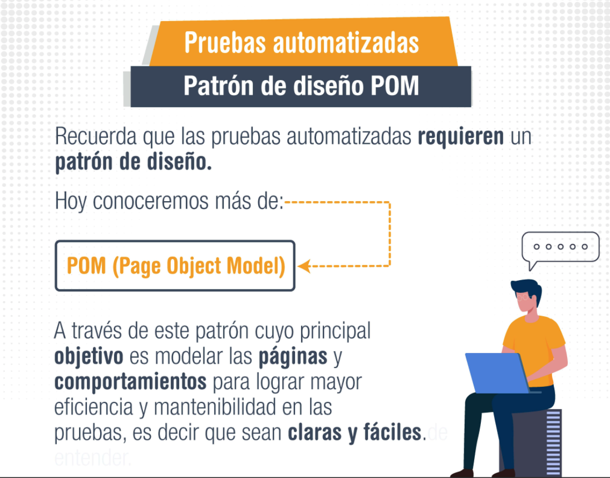
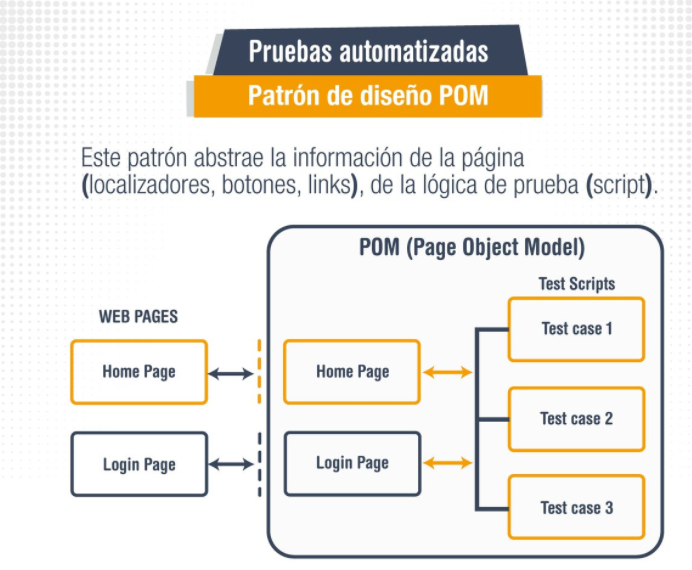
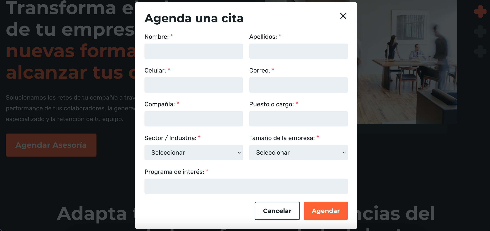
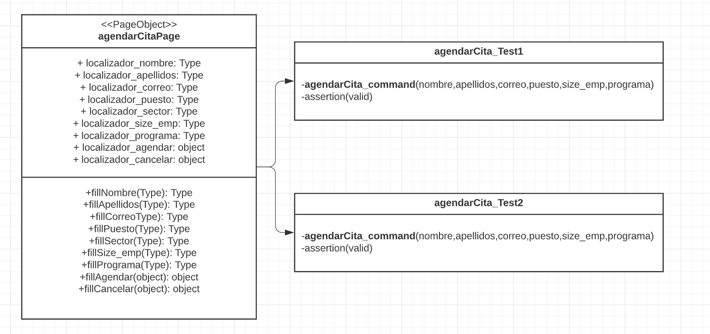
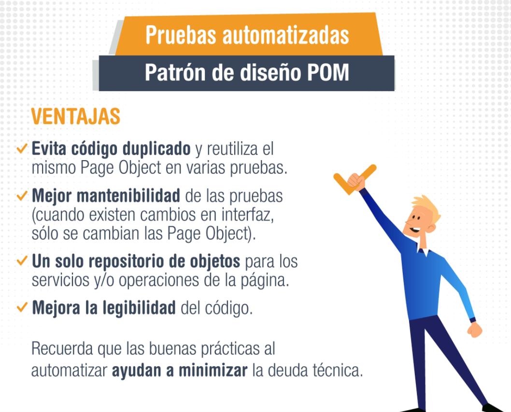
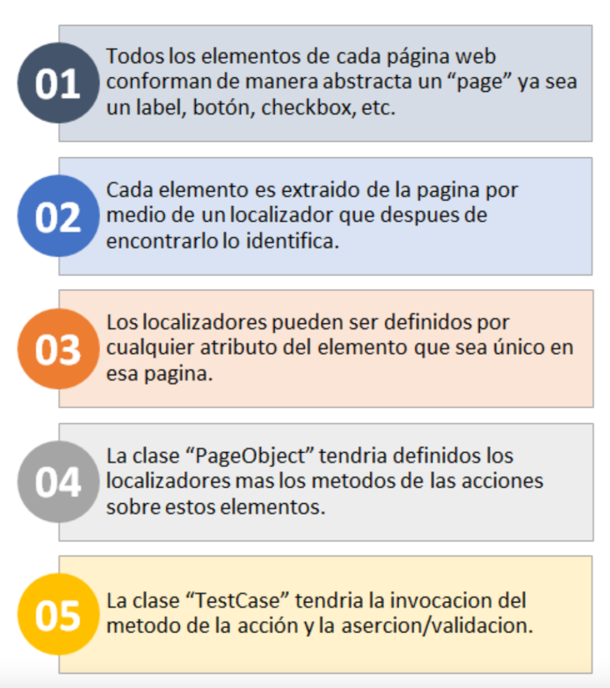

# Ejemplo-02# - Page Object Model (POM)

## Objetivo

* Demostrar los usos y ventajas del patrón `Page Object Model (POM)` como patron de automatización de pruebas.

## Desarrollo

Dentro de la interfaz de usuario de una aplicación web, hay áreas con las que interactúan las pruebas. Un `objeto de página (Object Page)` simplemente los modela como objetos dentro del código de prueba. Esto reduce la cantidad de código duplicado y significa que si la interfaz de usuario cambia, la solución solo debe aplicarse en un lugar.

 
 
`Page Object` es un patrón de diseño que se ha vuelto popular en la automatización de pruebas para mejorar el mantenimiento de las pruebas y reducir la duplicación de código. Un objeto de página (page object) es una clase orientada a objetos que sirve como interfaz para una página, luego, las pruebas usan los métodos de esta clase de objeto de página cada vez que necesitan interactuar con la interfaz de usuario de esa página. El beneficio es que si la interfaz de usuario cambia para la página, las pruebas en sí mismas no necesitan cambiar, solo el código dentro del objeto de la página debe cambiar. Posteriormente, todos los cambios para admitir esa nueva interfaz de usuario se ubican en un solo lugar.
 
 

Al igual que en el tema anterior, explicaremos los tipos de patrones teniendo en cuenta 4 aspectos fundamentales: `Origen`, `Contexto`, `Solución` y `Resultado`.

- `Origen`: Dificultad en mantenimiento de las pruebas automatizadas, esto se debe que al cambiar un elemento de la página web, cambian todas aquellas pruebas que lo usan por ende existe duplicidad de código.
- `Contexto`: Proyecto de pruebas automatizadas que tenga mas de un caso de prueba sobre la misma funcionalidad.
- `Solución`: Crear clase independiente con los localizadores de objetos.
- `Resultado`: al cambiar un elemento web se actualiza solo en la clase de localizadores y no en todos los tests.

Observa el siguiente ejemplo del diagrama de clase de la implementación del patrón `Page Object Model (POM)` en la funcionalidad de `Agendar Asesoría` de la pagina web de BEDU (https://bedu.org/)::

 :
 

> Acá se tiene la clase `agendarCitaPage` con los localizadores y acciones del formulario de agendar la cita. Luego se definen los `test`, los cuales invocan el método de `agendarCitaPage` enviando los parámetros del escenario de prueba.

#### Ventajas Patrón POM

 

Por lo que en resumen de este patrón funciona de tal manera que:

 

