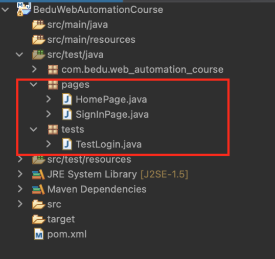
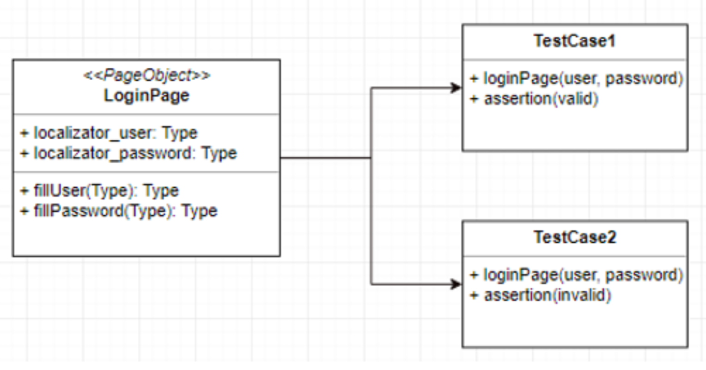

# Sesión 3 - Postwork

## :dart: Objetivos

- Implementar Page Object Model (POM) como patrón de diseño en el proyecto de automatización web.
- Construir mediante un diseño conceptual cómo estarán conectadas las clases page object con la clase de prueba.

## ⚙ Requisitos

- __Software de desarrollo__
    - Java Software Development Kit (JDK)
- __Editor de código__
    - Eclipse IDE
- __Entorno de pruebas de software__
    - Selenium Java Client
    - Selenium Webdriver
    - Selenium IDE
- __Navegador__
    - Google Chrome
- __Selenium browserdriver__
    - Chromium/Chrome


## Desarrollo

- Modificar el proyecto de automatización en el que estás trabajando para adaptarlo al modelo POM, creando las carpetas en el proyecto en pro de organizar las clases según la estructura del patrón page object model (POM). 

     

- Crear el diagrama de clases para documentar cómo estarán conectadas las clases page object con la clase de prueba. `Pro-tip:` ten en cuenta que el diagramas en este módulo no será evaluado, por el contrario se usará como una guía para conocer como funcionara la comunicación entre las clases.

     

- Crear las clases correspondientes al patrón POM por cada página identificada en la funcionalidad a testear, debes como mínimo incluir 3 páginas de la web de mercado libre, puede ser de una misma funcionalidad o varias funcionalidades.
- Crear las clases donde se alojarán los casos de prueba. 
- Intenta crear métodos que realicen varias acciones con los webElements, como que que vimos el el prework:

```Java
public String getMessageText() {
    return driver.findElement(messageBy).getText();
  }
```
> :stop_sign: __Cuidado:__ ten en cuenta las reglas para crear POM al momento de crear las Page Object.
