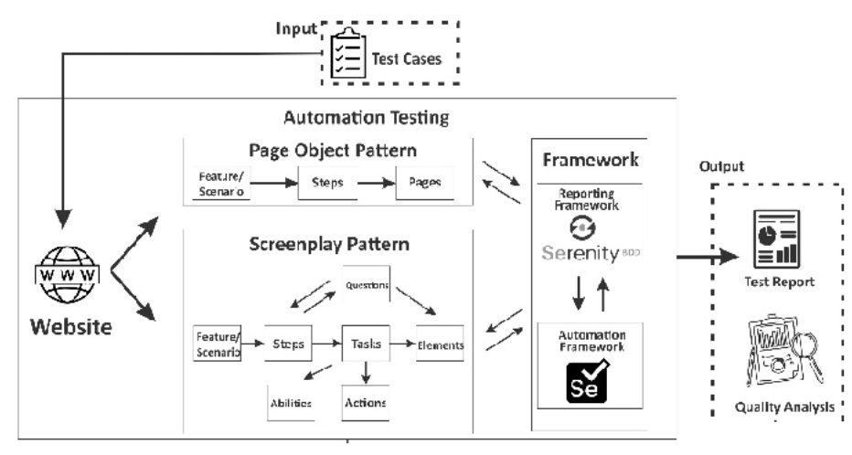
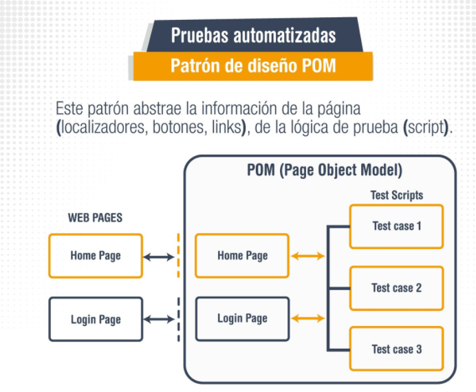

## Sesión 3: Page Object Model (POM) 🤖

### 1. Objetivos :dart: 

- Distinguir los distintos patrones de diseño de automatización que podemos aplicar en nuestros scripts de pruebas.
- Identificar el Page Object Model como un patrón de diseño efectivo para desarrollar pruebas automatizadas.
- Adaptar el patrón page object model (POM) en los scripts de pruebas automatizados.

### 2. Contenido :blue_book:

Hasta ahora hemos visto cómo desarrollar scripts de pruebas automatizados, usando localizadores de selenium para identificar los elementos de la pantalla para realizar acciones sobre ellos, pero si analizamos un poco el código que hemos realizado nos daremos cuenta que si queremos modificar algún localizador en las distintas clases, tendremos que entrar a cada una de ellas y realizar este cambio, esto no solo puede llevar mucho tiempo, sino también un grave factor de desmotivación cuando se trata de implementar pruebas automatizadas desde el principio. Es por ello que surge una pregunta, __¿qué pasaría si pudiéramos realizar el cambio en un solo lugar y hacer que todas las pruebas relevantes lo utilicen?__

En esta sesión analizaremos cómo podemos usar el patrón de diseño `Page Object Model` para escribir scripts de pruebas que se puedan mantener y reutilizar. 

---

#### <ins>Tema 1: Patrones de diseño de automatización</ins> 

Conoceremos sobre que son los patrones de diseño de automatizacion de pruebas y sus tipos, si bien solo nos enfocaremos en este modulo en el patrón de diseño `Page Object Model` es importante conocer que existen otros patrones y cuales son sus usos y ventajas.

 

- [**`EJEMPLO 1 - Patrones de diseño de automatización`**](./Ejemplo-01)

---

#### <ins>Tema 2: Page Object Model (POM)</ins> 

`Page Object Model` es un __patrón de diseño__ que se ha vuelto popular en la automatización de pruebas para mejorar el mantenimiento de las pruebas y __reducir la duplicación de código__. Un `objeto de página (page object)` es una clase orientada a objetos que sirve como interfaz para una página, luego, las pruebas usan los métodos de esta clase de objeto de página cada vez que necesitan interactuar con la interfaz de usuario de esa página. 

El beneficio es que __si la interfaz de usuario cambia para la página, las pruebas en sí mismas no necesitan cambiar__, solo el código dentro del objeto de la página debe cambiar. Posteriormente, todos los cambios para admitir esa nueva interfaz de usuario se ubican en un solo lugar.

 

- [**`EJEMPLO 2 - Page Object Model (POM)`**](./Ejemplo-02)
- [**`RETO 1`**](./Reto-01)
---

#### <ins>Tema 3: Implementación de POM en Selenium</ins>

En este tema abordaremos con ejercicios practicos como implementar `Page Object Model` en nuestros proyectos de automatización de Pruebas.

- [**`EJEMPLO 3 - Implementación de POM en Selenium`**](./Ejemplo-03)
- [**`RETO 2`**](./Reto-02)
---

### 3. Postwork :memo:

Encuentra las indicaciones y consejos para reflejar los avances de tu proyecto de este módulo.

- [**`POSTWORK SESIÓN 3`**](./Postwork/)

 

