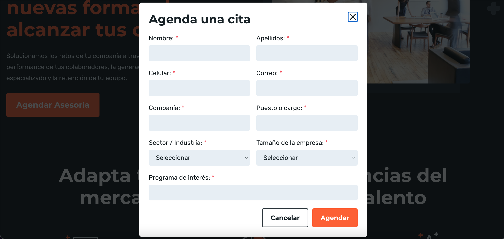

# Reto 2 # - Mejorar clase agendarCitaPage

## Objetivo

* Mejorar la clase agendarCitaPage para agregar mas localizadores y metodos.

## Desarrollo

Agregar mas metodos y localizadores en la clase `agendarCitaPage`, para incluir mas casos de prueba, ten en cuenta que de esta pagina solo se contemplo el botón de "Cancelar".

 


Utilizar este codigo de base:

```Java
package pages;

import java.time.Duration;

import org.openqa.selenium.By;
import org.openqa.selenium.WebDriver;
import org.openqa.selenium.WebElement;
import org.openqa.selenium.support.ui.ExpectedConditions;
import org.openqa.selenium.support.ui.WebDriverWait;

public class agendarCitaPage {
	
	/**
	 * Page Object Model (POM) para página de Agendar cita bedu
	 */
	
	protected WebDriver driver;

	  // Definimos objetos de tipo locator y le asignamos la localización By.
	  private By bnt_cancelar = By.xpath("//button[contains(.,'Cancelar')]");

	  // Creamos el método que recibirá el driver en esta clase
	  public agendarCitaPage(WebDriver driver){
	    this.driver = driver;
	  }

	  /**
	    * Creamos el método de login que cancelara la  asesoria   
	    * y retorna un objeto HomePage
	    */
	  public HomePage cancelarAsesoria() {
	    driver.findElement(bnt_cancelar).click();
	    return new HomePage(driver);
	  }
	  
	  public String btnIsDispayed() {
		    WebElement bnt_cancelar = new WebDriverWait(driver, Duration.ofSeconds(10))
		            .until(ExpectedConditions.elementToBeClickable(By.xpath("//button[contains(.,'Cancelar')]"))); 
		    return bnt_cancelar.getText();
		  }

}

```

<details>
  <summary> Solución </summary>
  
  ```Java
package pages;


import org.openqa.selenium.By;
import org.openqa.selenium.WebDriver;
import org.openqa.selenium.support.ui.Select;


/**
 * Page Object Model (POM) para página de Agendar cita bedu
 */

public class AgendarCitaPage {


	protected WebDriver driver;
	// Método que recibirá el driver en esta clase
	public AgendarCitaPage(WebDriver driver) {
		this.driver = driver;
	}

	
	// Definimos objetos de tipo locator y le asignamos la localización By.
	private By bnt_cancelar = By.xpath("//button[contains(.,'Cancelar')]");
	private By bnt_agendar = By.xpath("//button[contains(.,'Agendar')]");
	private By name = By.id("name");
	private By lastname = By.id("lastname");
	private By phone = By.id("phone");
	private By email = By.id("email");
	private By company = By.id("company");
	private By jobTitle = By.id("jobTitle");
	private By program = By.id("program");
	private By sector = By.name("sector");
	private By companySize = By.name("companySize");
	


	// Método que realizara un click en bnt_cancelar
	public void cancelarAsesoria() {
		driver.findElement(bnt_cancelar).click();
	}
	// Método que realizara un click en bnt_agendar
	public void agendarAsesoria() {
		driver.findElement(bnt_agendar).click();
	}
	public boolean btn_CancelIsDispayed() {
		System.out.println("btn_CancelIsDispayed : " + driver.findElement(bnt_cancelar).isDisplayed());
		return driver.findElement(bnt_cancelar).isDisplayed();
	}

	// Método que realizara recibira un localizador e ingresara un texto
	public void fillText(By locator, String text) {
		driver.findElement(locator).clear();
		driver.findElement(locator).sendKeys(text);
	}

	// Métodos que realizara recibiran un texto a llenar en cada campo
	public void fillName(String text) {
		driver.findElement(name).clear();
		driver.findElement(name).sendKeys(text);
	}

	public void fillLastname(String text) {
		driver.findElement(lastname).clear();
		driver.findElement(lastname).sendKeys(text);
	}

	public void fillPhone(String text) {
		driver.findElement(phone).clear();
		driver.findElement(phone).sendKeys(text);
	}

	public void fillEmail(String text) {
		driver.findElement(email).clear();
		driver.findElement(email).sendKeys(text);
	}

	public void fillCompany(String text) {
		driver.findElement(company).clear();
		driver.findElement(company).sendKeys(text);
	}

	public void fillJobTitle(String text) {
		driver.findElement(jobTitle).clear();
		driver.findElement(jobTitle).sendKeys(text);
	}

	public void fillSector(String text) {
		System.out.println("Seleccionando Sector = "+text+" de la lista desplegable");
		Select l_sector = new Select(driver.findElement(sector));
		l_sector.selectByValue(text);
		l_sector.selectByVisibleText(text);
	}

	public void fillCompanySize(String text) {
		System.out.println("Seleccionando CompanySize = "+text+" de la lista desplegable");
		Select l_companySize = new Select(driver.findElement(companySize));
		l_companySize.selectByValue(text);
		l_companySize.selectByVisibleText(text);
	}

	public void fillProgram(String text) {
		driver.findElement(program).clear();
		driver.findElement(program).sendKeys(text);
	}


}

  ```
</details>

