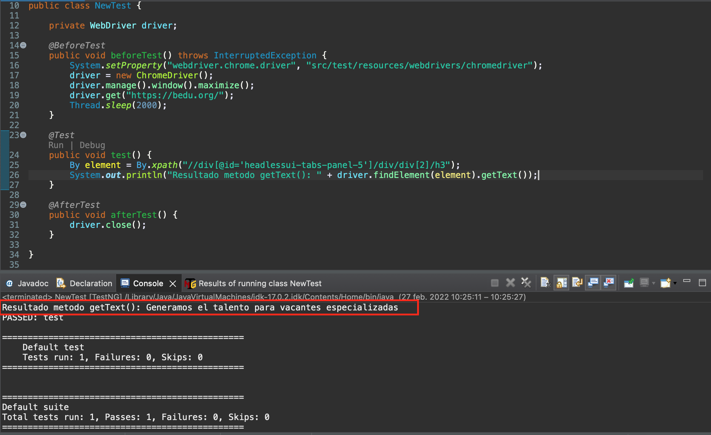
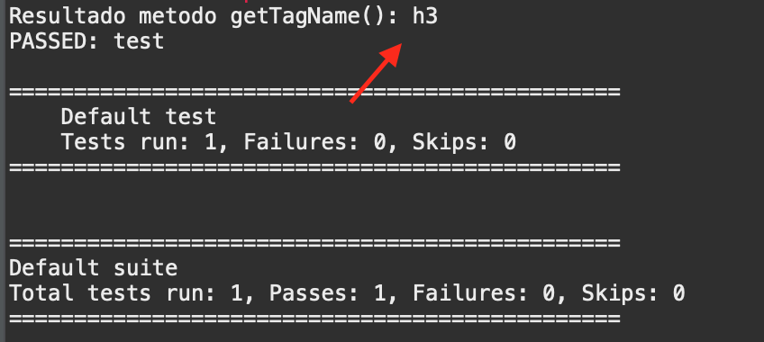
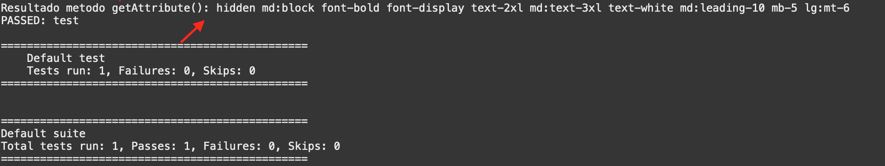
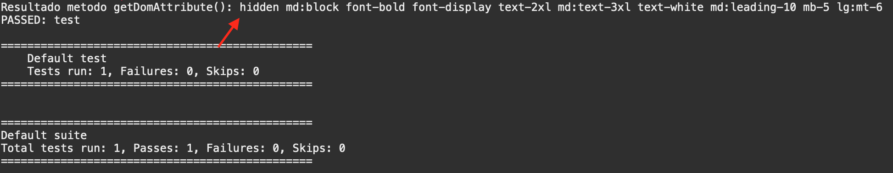
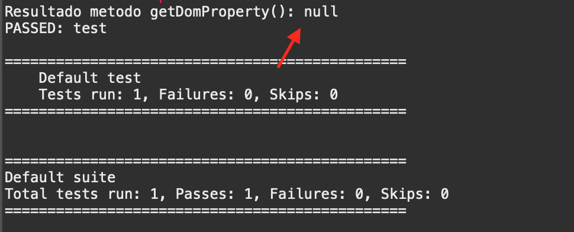
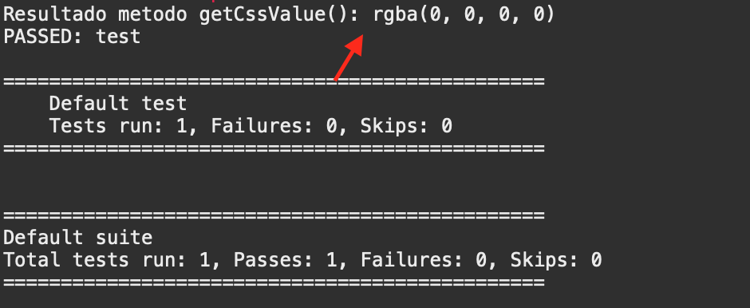
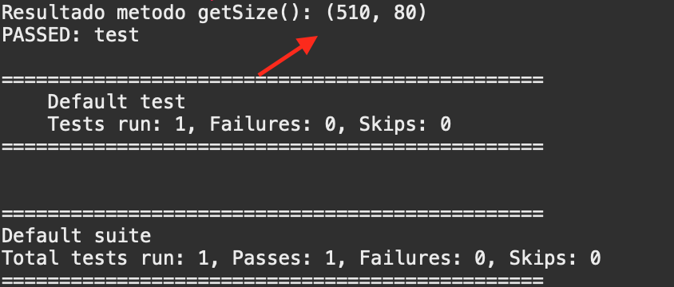
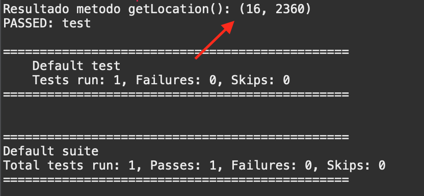

# Ejemplo-01# - Métodos de control de captura de datos de objetos.

## Objetivo

* Identificar el comportamiento de los métodos de control de captura de datos de objetos en los scripts de pruebas automatizados.

## Desarrollo

Los Métodos de control de captura de selenium son aquellos métodos utilizados para obtener información sobre atributos del WebElement, como pueden ser: el tamaño, contenido, clase, localización, css value, entre otros.

 

Estos métodos suelen ser muy útiles para los scripts de pruebas ya que nos sirven como herramienta para sumar aserciones a los casos de pruebas. Los más utilizados son los siguientes:

- `getText()`: Se utiliza para capturar el texto visible del elemento identificado. 
    - __Valor Retornado:__ `String`
    - __Comando:__ `getText() : String`
    - __Ejemplo:__ `element.getText();`

    ```Java
    package com.bedu.web_automation_course;

    import org.testng.annotations.Test;
    import org.testng.annotations.BeforeTest;
    import org.testng.annotations.AfterTest;
    import org.openqa.selenium.By;
    import org.openqa.selenium.WebDriver;
    import org.openqa.selenium.chrome.ChromeDriver;

    public class NewTest {

        private WebDriver driver;

        @BeforeTest
        public void beforeTest() throws InterruptedException {
            System.setProperty("webdriver.chrome.driver", "src/test/resources/webdrivers/chromedriver");
            driver = new ChromeDriver();
            driver.manage().window().maximize();
            driver.get("https://bedu.org/");
            Thread.sleep(2000);
        }

        @Test
        public void test() {
            By element = By.xpath("//div[@id='headlessui-tabs-panel-5']/div/div[2]/h3");
            System.out.println("Resultado metodo getText(): " + driver.findElement(element).getText());
        }

        @AfterTest
        public void afterTest() {
            driver.close();
        }

    }


    ```

     

- `getTagName()`: Se utiliza para capturar el TagName del elemento identificado. 
    - __Valor Retornado:__ `String`
    - __Comando:__ `getTagName() : String`
    - __Ejemplo:__ `element.getTagName();` 

    ```Java
    @Test
	public void test() {
		By element = By.xpath("//div[@id='headlessui-tabs-panel-5']/div/div[2]/h3");
		System.out.println("Resultado metodo getTagName(): " + driver.findElement(element).getTagName());
	}
    ```

     

- `getAttribute()`: Se utiliza para capturar cualquier valor de atributo de back-end del elemento web. 
    - __Valor Retornado:__ `String` 
    - __Comando:__ `getAttribute(String Name) : String` 
    - __Ejemplo:__ `element.getAttribute();` 

    ```Java
    @Test
	public void test() {
		By element = By.xpath("//div[@id='headlessui-tabs-panel-5']/div/div[2]/h3");
		System.out.println("Resultado metodo getAttribute(): " + driver.findElement(element).getAttribute("class"));
	}
    ```
       

- `getDomAttribute()`: Se utiliza para capturar cualquier valor de DOM atributo de back-end del elemento web. 
    - __Valor Retornado:__ `String` 
    - __Comando:__ `getDomAttribute(String Name) : String` 
    - __Ejemplo:__ `element.getDomAttribute();`

    ```Java
	@Test
	public void test() {
		By element = By.xpath("//div[@id='headlessui-tabs-panel-5']/div/div[2]/h3");
		System.out.println("Resultado metodo getDomAttribute(): " + driver.findElement(element).getDomAttribute("class"));
	}
    ``` 
     

- `getDomProperty()`: Se utiliza para capturar el valor de la propiedad del elemento web.
    - __Valor Retornado:__ `String` 
    - __Comando:__ `getDomProperty(String Name) : String` 
    - __Ejemplo:__ `element.getDomProperty();` 

    ```Java
	@Test
	public void test() {
		By element = By.xpath("//div[@id='headlessui-tabs-panel-5']/div/div[2]/h3");
		System.out.println("Resultado metodo getDomProperty(): " + driver.findElement(element).getDomProperty("class"));
	}
    ``` 
     

- `getCssValue()`: Se utiliza para capturar cualquier estilo relacionado atribuido al elemento como color, color de fondo, estilo de fuente, etc.
    - __Valor retornado:__ `String` 
    - __Comando:__ `getCssvalue() : String` 
    - __Ejemplo:__ `element.getCssValue();` 

    ```Java
    @Test
	public void test() {
		By element = By.xpath("//div[@id='headlessui-tabs-panel-5']/div/div[2]/h3");
		System.out.println("Resultado metodo getCssValue(): " + driver.findElement(element).getCssValue("background-color"));
	}
    ``` 
     

- `getSize()`: Se utiliza para capturar la altura y el ancho del elemento web.
    - __Valor retornado:__ `Dimension` 
    - __Comando:__ `getSize() : Dimension`
    - __Ejemplo:__ `element.getSize();` 

    ```Java
    @Test
	public void test() {
		By element = By.xpath("//div[@id='headlessui-tabs-panel-5']/div/div[2]/h3");
		System.out.println("Resultado metodo getSize(): " + driver.findElement(element).getSize());
	}
    ``` 
     

- `getLocation()`: Se utiliza para capturar las coordenadas X e Y de los elementos web.
    - __Valor retornado:__ `Point` 
    - __Comando:__ `getLocation() : Point`
    - __Ejemplo:__ `element.getLocation();` 

    ```Java
    @Test
	public void test() {
		By element = By.xpath("//div[@id='headlessui-tabs-panel-5']/div/div[2]/h3");
		System.out.println("Resultado metodo getLocation(): " + driver.findElement(element).getLocation());
	}
    ``` 
     