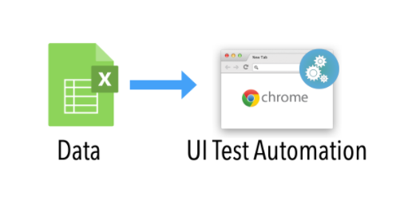
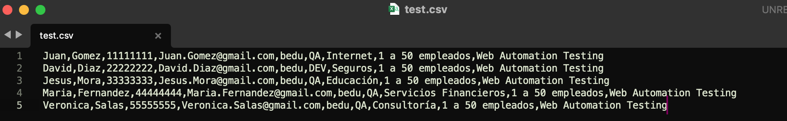

# Ejemplo-02:# - Archivos csv como origen de Datos.

## Objetivo

* Hacer uso de archivos con extensión .csv como fuente de origen de datos para los scripts de pruebas automatizados.

## Desarrollo

La lectura de datos de prueba de archivos con extensiones `.CSV` es una de las formas más comunes en los frameworks híbridos. Es por ello que en este tema vamos a realizar una `Prueba basada en datos utilizando un archivo CSV en Selenium WebDriver`, lo cual  es un requisito importante para cualquier organización el utilizar algún tipo de enfoque basado en datos.

 

#### ¿Qué es un archivo CSV?

Las siglas CSV vienen del inglés `Comma Separated Values` y significan valores separados por comas. Dicho esto, un archivo CSV es cualquier archivo de texto en el cual los caracteres están separados por comas, haciendo una especie de tabla en filas y columnas. Las columnas quedan definidas por cada punto y coma (;), mientras que cada fila se define mediante una línea adicional en el texto.

#### Pasos para configurar la lectura de fuente de datos csv en el proyecto de selenium:

#### Agregar Dependencia POM.xml ->  opencsv
Lo primero que hay que hacer es agregar a nuestro archivo POM.xml la dependencia:

```xml
	<!-- https://mvnrepository.com/artifact/com.opencsv/opencsv -->
	<dependency>
	    <groupId>com.opencsv</groupId>
	    <artifactId>opencsv</artifactId>
	    <version>5.6</version>
	</dependency>
```

Esta dependencia nos permitirá leer el archivo csv que usaremos como insumo en los casos de prueba.

Ejemplo del archivo `pom.xml`: 
```xml
<project xmlns="http://maven.apache.org/POM/4.0.0" xmlns:xsi="http://www.w3.org/2001/XMLSchema-instance" xsi:schemaLocation="http://maven.apache.org/POM/4.0.0 https://maven.apache.org/xsd/maven-4.0.0.xsd">
  <modelVersion>4.0.0</modelVersion>
  <groupId>com.bedu.web_automation_course</groupId>
  <artifactId>BeduWebAutomationCourse</artifactId>
  <version>0.0.1-SNAPSHOT</version>

  <dependencies>
	<!-- https://mvnrepository.com/artifact/org.seleniumhq.selenium/selenium-java -->
	<dependency>
	    <groupId>org.seleniumhq.selenium</groupId>
	    <artifactId>selenium-java</artifactId>
	    <version>4.1.2</version>
 		<scope>test</scope>
	</dependency>
    
	<!-- https://mvnrepository.com/artifact/org.testng/testng -->
	<dependency>
	    <groupId>org.testng</groupId>
	    <artifactId>testng</artifactId>
	    <version>7.4.0</version>
	    <scope>test</scope>
	</dependency>

	<!-- https://mvnrepository.com/artifact/com.opencsv/opencsv -->
	<dependency>
	    <groupId>com.opencsv</groupId>
	    <artifactId>opencsv</artifactId>
	    <version>5.6</version>
	</dependency>
  </dependencies>
</project>
```
#### Generación del archivo CSV

Ahora debemos generar nuestro archivo csv, para esto usamos el programa Sublime Text, colocando en la primera línea el nombre del campo separados por coma “,” y el las filas los valores de los campos, separados igualmente por coma.

 

> __Cuidado:__ El formato de los archivos csv es .csv, sin este formato no reconocerá el archivo.

#### Creación de la clase de prueba:
Este es un ejemplo de una clase con pruebas de ingreso de información para agendar una asesoria en la pagina https://bedu.org/


__CLASE DE PRUEBA__

```Java
package tests;

import java.io.FileReader;
import java.io.IOException;
import org.openqa.selenium.WebDriver;
import org.openqa.selenium.chrome.ChromeDriver;
import org.testng.annotations.AfterTest;
import org.testng.annotations.BeforeTest;
import org.testng.annotations.Test;
import com.opencsv.CSVReader;
import com.opencsv.exceptions.CsvValidationException;
import pages.HomePage;
import pages.AgendarCitaPage;

public class DataDrivenTestingUsingCSVInSelenium {

	private WebDriver driver;
	private HomePage homePage;
	private AgendarCitaPage agendarCitaPage;
	
	// Indicar la ubicación del archivo csv
	String CSV_PATH = "/Users/Shared/test.csv";
	// Declaración de la variable de la clase CSVReader
	private CSVReader csvReader;
	// Declaración de una variable para leer los datos del csv
	String[] csvCell;

	@BeforeTest
	public void beforeTest() throws InterruptedException {
		System.setProperty("webdriver.chrome.driver", "src/test/resources/webdrivers/chromedriver");
		driver = new ChromeDriver();
		driver.manage().window().maximize();
		driver.get("https://bedu.org/");
	}

	@Test
	public void agendarAsesoria() throws IOException, CsvValidationException, InterruptedException {

		
		homePage = new HomePage(driver);
		// Validamos que el boton de agendar asesoria este disponible
		if (homePage.isButtonDisplayed()) {
			// Clck en boton de agendar asesoria
			try {
				homePage.clickButton();
			} catch (InterruptedException e) {
				e.printStackTrace();
			}
		}
		
		
		agendarCitaPage = new AgendarCitaPage(driver);
		
		
		if (agendarCitaPage.btn_CancelIsDispayed()) {
			// Creación del objeto de tipo CSVReader
			csvReader = new CSVReader(new FileReader(CSV_PATH));
			
			// uso de un loop para la lectura de todos los datos del csv
			while ((csvCell = csvReader.readNext()) != null) {
				
				// Se llama a los metodos de agendarCitaPage para llenar los campos del
				// formulario con la información del csv
				agendarCitaPage.fillName(csvCell[0]);
				agendarCitaPage.fillLastname(csvCell[1]);
				agendarCitaPage.fillPhone(csvCell[2]);
				//agendarCitaPage.fillEmail(csvCell[3]);
				agendarCitaPage.fillCompany(csvCell[4]);
				agendarCitaPage.fillJobTitle(csvCell[5]);
				agendarCitaPage.fillSector(csvCell[6]);
				agendarCitaPage.fillCompanySize(csvCell[7]);
				agendarCitaPage.fillProgram(csvCell[8]);
				Thread.sleep(2000);
			}

		}

	}

	@AfterTest
	public void afterTest() {
		driver.close();
	}

}
```


__CLASES POM__

```Java
package pages;

import org.openqa.selenium.By;
import org.openqa.selenium.WebDriver;

/**
 * Page Object Model (POM) para página de HomePage
 */
public class HomePage {
	
  protected WebDriver driver;

  // Definimos objetos de tipo locator y le asignamos la localización By.
  private By bnt_asesoria = By.xpath("//button[contains(.,'Agendar Asesoría')]");
  

	  // Creamos el método que recibirá el driver en esta clase
	  public HomePage(WebDriver driver){
	    this.driver = driver;
	
	    // Recuerdas la clase anterior de manejo de errores? bueno en este código hacemos una validación para asegurarnos que estemos en la homePage, validando que el título de la página sea la de bedu, si no lo es, se lanza una excepción y se devuelve la url de la página actual. 
	    if (!driver.getCurrentUrl().equals("https://bedu.org/")) {
	      throw new IllegalStateException("Error, no se recibió la página Home de Bedu, la página recibida es: " + driver.getCurrentUrl());
	    }
	      
	  }
  
	//Creamos el método validara si el botón esta disponible
	  public boolean isButtonDisplayed() {
		System.out.println("isButtonDisplayed Agendar Asesoria : " + driver.findElement(bnt_asesoria).isDisplayed());
	    return driver.findElement(bnt_asesoria).isDisplayed();
	  }
  
	//Creamos el método que realizara click en el botón
	  public void clickButton() throws InterruptedException {
	     driver.findElement(bnt_asesoria).click();
	     Thread.sleep(1000);
	  }
}
```

```Java
package pages;


import org.openqa.selenium.By;
import org.openqa.selenium.WebDriver;
import org.openqa.selenium.support.ui.Select;


/**
 * Page Object Model (POM) para página de Agendar cita bedu
 */

public class AgendarCitaPage {


	protected WebDriver driver;
	// Método que recibirá el driver en esta clase
	public AgendarCitaPage(WebDriver driver) {
		this.driver = driver;
	}

	
	// Definimos objetos de tipo locator y le asignamos la localización By.
	private By bnt_cancelar = By.xpath("//button[contains(.,'Cancelar')]");
	private By bnt_agendar = By.xpath("//button[contains(.,'Agendar')]");
	private By name = By.id("name");
	private By lastname = By.id("lastname");
	private By phone = By.id("phone");
	private By email = By.id("email");
	private By company = By.id("company");
	private By jobTitle = By.id("jobTitle");
	private By program = By.id("program");
	private By sector = By.name("sector");
	private By companySize = By.name("companySize");
	


	// Método que realizara un click en bnt_cancelar
	public void cancelarAsesoria() {
		driver.findElement(bnt_cancelar).click();
	}
	// Método que realizara un click en bnt_agendar
	public void agendarAsesoria() {
		driver.findElement(bnt_agendar).click();
	}
	public boolean btn_CancelIsDispayed() {
		System.out.println("btn_CancelIsDispayed : " + driver.findElement(bnt_cancelar).isDisplayed());
		return driver.findElement(bnt_cancelar).isDisplayed();
	}

	// Método que realizara recibira un localizador e ingresara un texto
	public void fillText(By locator, String text) {
		driver.findElement(locator).clear();
		driver.findElement(locator).sendKeys(text);
	}

	// Métodos que realizara recibiran un texto a llenar en cada campo
	public void fillName(String text) {
		driver.findElement(name).clear();
		driver.findElement(name).sendKeys(text);
	}

	public void fillLastname(String text) {
		driver.findElement(lastname).clear();
		driver.findElement(lastname).sendKeys(text);
	}

	public void fillPhone(String text) {
		driver.findElement(phone).clear();
		driver.findElement(phone).sendKeys(text);
	}

	public void fillEmail(String text) {
		driver.findElement(email).clear();
		driver.findElement(email).sendKeys(text);
	}

	public void fillCompany(String text) {
		driver.findElement(company).clear();
		driver.findElement(company).sendKeys(text);
	}

	public void fillJobTitle(String text) {
		driver.findElement(jobTitle).clear();
		driver.findElement(jobTitle).sendKeys(text);
	}

	public void fillSector(String text) {
		System.out.println("Seleccionando Sector = "+text+" de la lista desplegable");
		Select l_sector = new Select(driver.findElement(sector));
		l_sector.selectByValue(text);
		l_sector.selectByVisibleText(text);
	}

	public void fillCompanySize(String text) {
		System.out.println("Seleccionando CompanySize = "+text+" de la lista desplegable");
		Select l_companySize = new Select(driver.findElement(companySize));
		l_companySize.selectByValue(text);
		l_companySize.selectByVisibleText(text);
	}

	public void fillProgram(String text) {
		driver.findElement(program).clear();
		driver.findElement(program).sendKeys(text);
	}
}

```


Al ejecutar esta clase obtendremos que los datos del csv fueron tomados correctamente dentro del framework, por lo que con esta integración podremos usar este tipo de archivos en nuestros scripts de pruebas.