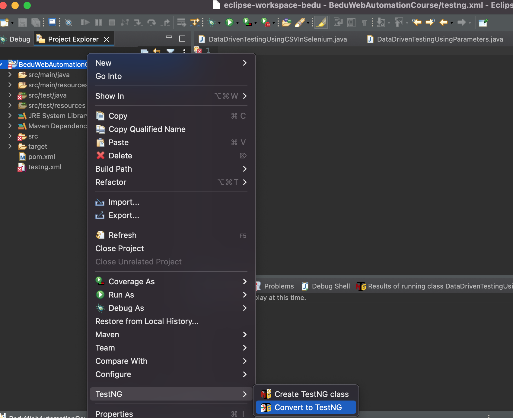
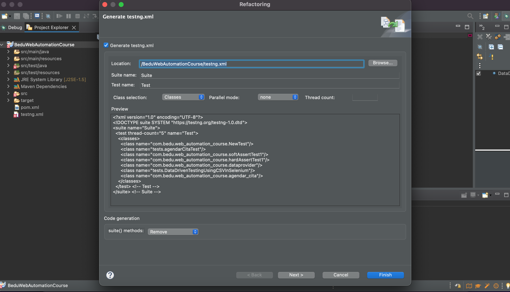
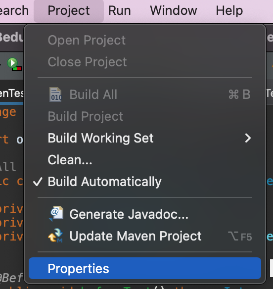
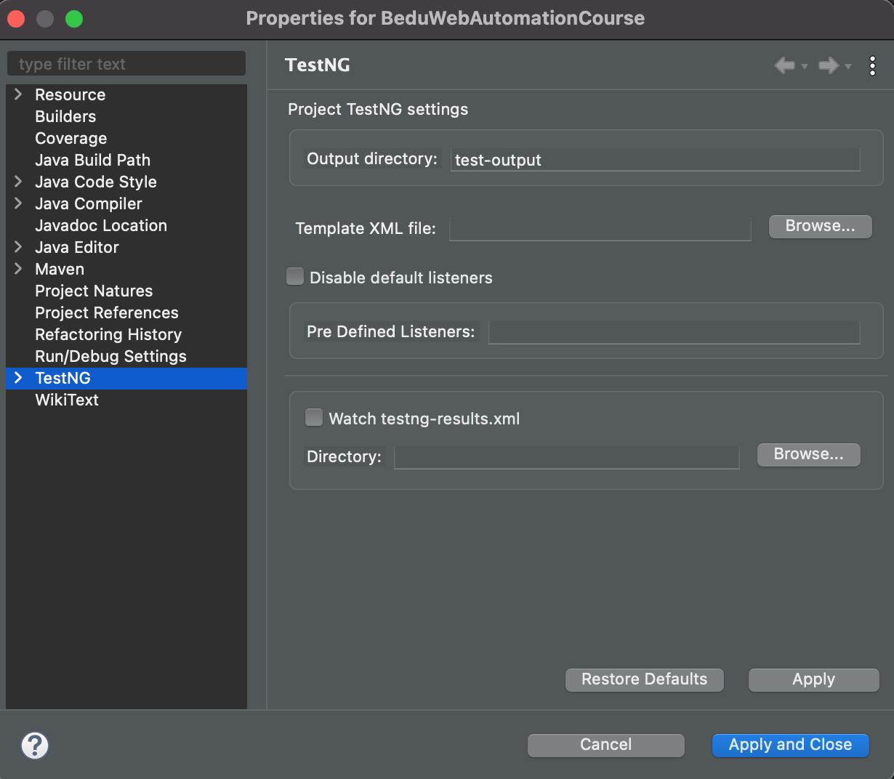
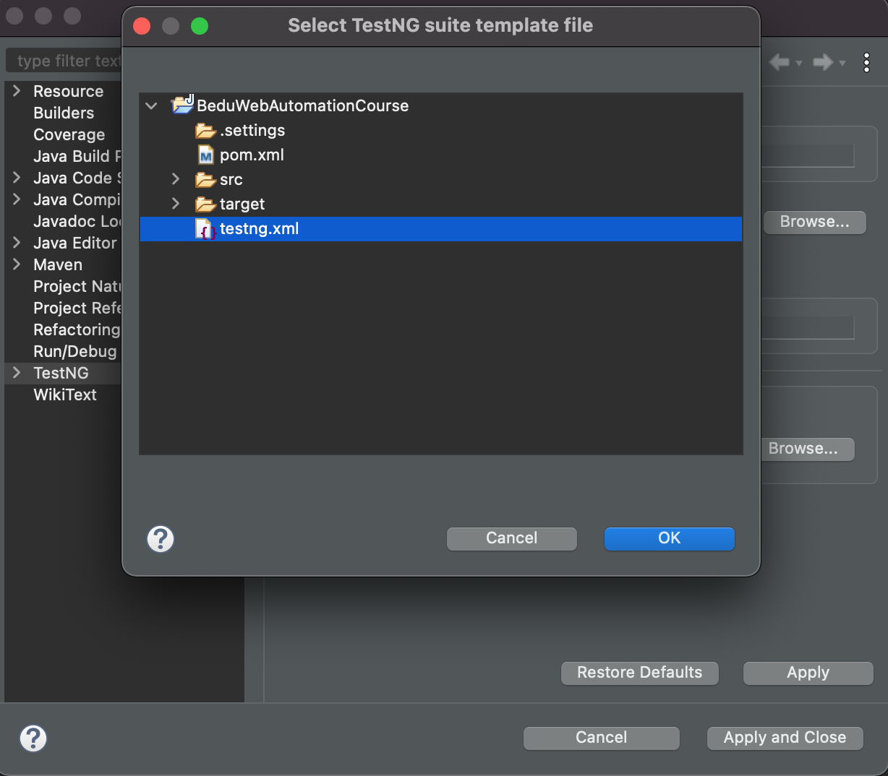
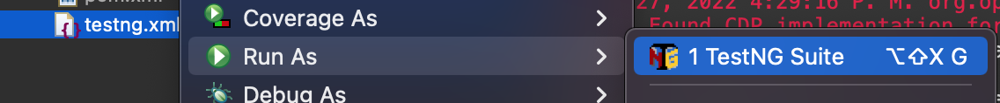

# Ejemplo-03# - Parametrización de Datos: TestNG XML.

## Objetivo

* Hacer uso de la configuración del archivo testng.xml para emplear la anotación @parameters en los scripts de pruebas automatizados.

## Desarrollo

A medida que creamos software, siempre deseamos que funcione de manera diferente con un conjunto diferente de datos. Cuando se trata de probar la misma pieza de software, no podemos ser injustos al probarlo con solo un conjunto de datos. 

Aquí nuevamente, debemos verificar que nuestro sistema esté tomando todo el conjunto de combinaciones que se espera que admita. Para eso, necesitamos parametrizar nuestros scripts de prueba. 

#### Parametrización en Selenium

La parametrización en Selenium es un proceso para parametrizar los scripts de prueba para pasar múltiples datos a la aplicación en tiempo de ejecución. Es una estrategia de ejecución que automáticamente ejecuta casos de prueba varias veces usando diferentes valores. __El concepto que se logra mediante la parametrización de los scripts de prueba se denomina `Data Driven Testing`.__

Para que la parametrización sea más clara, revisaremos las opciones de parametrización en uno de los frameworks más populares para Selenium Webdriver: TestNG.

Hay dos formas en las que podemos lograr la parametrización en TestNG:

1. Con la ayuda de la anotación de parámetros y el archivo XML TestNG.
2. Con la ayuda de la anotación @DataProvider de TestNG: esto lo veremos en el siguiente tema más a detalle. [**`TEMA 4`**](./Ejemplo-04)

En este tema revisaremos cómo funciona  la anotación de parámetros y el archivo XML TestNG.


#### Anotación de parámetros en TestNG 


Los parámetros en TestNG son similares a las anotaciones en TestNG en su declaración y al igual que los parámetros en cualquier otro lenguaje de programación, se declaran para pasar algunos valores a la función. 

Una razón simple para usar parámetros es que nos permiten ejecutar una función muchas veces con diferentes valores o ejecutar diferentes funciones con los mismos valores. Es importante mencionar que los parámetros pasan los valores en el `tiempo de ejecución`. 

Un ejemplo del uso de los parámetros en TestNG puede ser ingresar diferentes valores en un input-box. 

En conclusión, la anotación de parámetros en TestNG es un método utilizado para pasar valores a los métodos de prueba como argumentos utilizando un archivo .xml. 

> `Pro-tip:` Cuando se va a probar con pocos conjuntos de datos, es preferible utilizar esta anotación.

Los parámetros de Testng.xml pueden ser de nivel de `suite` o de `prueba`

Los parámetros dentro de la etiqueta `<suite>` del archivo TestNG XML serán un parámetro de nivel de suite.

```xml

<?xml version="1.0" encoding="UTF-8"?>
<!DOCTYPE suite SYSTEM "http://testng.org/testng-1.0.dtd">
<suite name="TestSuite" thread-count="3" >
	<parameter name="name" value="Juan" />
	<parameter name="lastname" value="Perez" />
	<test name="testBEDU">
		<classes>
			<class name="parameters.ParameterWithTestNGXML"></class>
		</classes>
	</test>
</suite>

```

Los parámetros dentro de la etiqueta `<Test>` del archivo TestNG XML serán un parámetro de nivel de prueba.

```xml

<?xml version="1.0" encoding="UTF-8"?>
<!DOCTYPE suite SYSTEM "http://testng.org/testng-1.0.dtd">
<suite name="TestSuite" thread-count="3" >
	<test name="testBEDU">
		<parameter name="name" value="prueba" />
		<parameter name="lastname" value="prueba2" />
		<classes>
			<class name="parameters.ParameterWithTestNGXML"></class>
		</classes>
	</test>
</suite>

```


> `Pro-tip:` En caso de que el nombre del parámetro sea el mismo en el nivel de la suite y en el nivel de prueba, `el parámetro del nivel de prueba tendrá preferencia sobre el nivel de la suite.` Entonces, en ese caso, todas las clases dentro de ese nivel de prueba compartirán el parámetro anulado, y otras clases que están fuera del nivel de prueba compartirán el parámetro de nivel de suite.

Para esto se requiere que se pasen los valores a los métodos de prueba durante el tiempo de ejecución, es por ello que el método de anotación `@Parameters` se puede utilizar en cualquier método que tenga anotación `@Test`, `@Before` o `@After`.

```Java
@Parameters({"param1","param2"})
```

> __¡Cuidado!__ Los parámetros de TestNG se ejecutan a través del archivo XML de TestNG y no directamente desde los archivos de casos de prueba.


Ahora bien, vamos a casos practicos, retomando nuevamente la funcionalidad de agendar cita de la pagina web de bedu (https://bedu.org/)


Primero Crearemos nuestros datos de entrada (usaremos los mismos datos del archivo `.csv`) y los ingresaremos al un archivo xml que crearemos de la siguiente manera:

1. Seleccionamos click derecho en el proyecto, y seleccionamos la opcion `TestNG`luego `Convert TestNG`

 

2. Veremos una previsualización del XML con las clases cargadas de nuestro proyecto, le damos click en continuar

 

3. Se generara un archivo xml con el nombre `testng.xml` con las clases de tu proyecto, para efecto de esta prueba solo dejaremos la clase `DataDrivenTestingUsingParameters`

```Java

<?xml version="1.0" encoding="UTF-8"?>
<!DOCTYPE suite SYSTEM "https://testng.org/testng-1.0.dtd">
<suite name="Suite">
  <test thread-count="5" name="Test">
    <classes>
      <class name="com.bedu.web_automation_course.DataDrivenTestingUsingParameters"/>
    </classes>
  </test> <!-- Test -->
</suite> <!-- Suite -->

```

> 

5. Debemos configurar en eclipse el template del xml que acabamos de crear, para ellos nos vamos al meni `Project` -> `Properties` -> `TestNG` -> `Template XML File` y seleccionamos el archivo `testng.xml`

 
 
 

6. Configuramos los datos de prueba en el xml. Para este caso usaremos  parametros a nivel de `<Test>`.

```xml
<?xml version="1.0" encoding="UTF-8"?>
<!DOCTYPE suite SYSTEM "https://testng.org/testng-1.0.dtd">
<suite name="Suite">
  <test name="Test">

	<parameter name="name" value="Juan"/>
	<parameter name="lastname" value="Gomez"/>
	<parameter name="phone" value="11111111"/>
	<parameter name="email" value="Juan.Gomez@gmail.com"/>
	<parameter name="company" value="bedu"/>
	<parameter name="jobtitle" value="QA"/>
	<parameter name="sector" value="Internet"/>
	<parameter name="company_size" value="1 a 50 empleados"/>
	<parameter name="program" value="Web Automation Testing"/>

    <classes>
      <class name="com.bedu.web_automation_course.DataDrivenTestingUsingParameters"/>
    </classes>
  </test> <!-- Test -->
</suite> <!-- Suite -->
```

7. Creamos la siguiente clase: `DataDrivenTestingUsingParameters.java` dentro de la carpeta `test` con el siguiente contenido:

```Java
package com.bedu.web_automation_course;

import org.testng.annotations.Test;
import org.openqa.selenium.WebDriver;
import org.openqa.selenium.chrome.ChromeDriver;
import org.testng.annotations.AfterSuite;
import org.testng.annotations.AfterTest;
import org.testng.annotations.BeforeSuite;
import org.testng.annotations.BeforeTest;
import org.testng.annotations.Parameters;
import pages.HomePage;
import pages.AgendarCitaPage;

public class DataDrivenTestingUsingParameters {
	
	private WebDriver driver;
	private HomePage homePage;
	private AgendarCitaPage agendarCitaPage;
	
	@BeforeSuite
	public void beforeSuite() {
		System.out.println("---------------------------------------------------------------------------------");
		System.out.println("--------------------     INICIO DE LA EJECUCIÓN   -------------------------------");
		System.out.println("---------------------------------------------------------------------------------");
		}

	@BeforeTest
	public void beforeTest() throws InterruptedException {
		System.setProperty("webdriver.chrome.driver", "src/test/resources/webdrivers/chromedriver");
		driver = new ChromeDriver();
		driver.manage().window().maximize();
		driver.get("https://bedu.org/");
	}

	@Test
	@Parameters({"name","lastname","phone","email","company","jobtitle","sector","company_size","program"})	
	
	public void agendarAsesoria(String name, String lastname, String phone, String email, String company,String jobtitle, String sector, String company_size, String program) throws InterruptedException{

		
		homePage = new HomePage(driver);
		// Validamos que el boton de agendar asesoria este disponible
		if (homePage.isButtonDisplayed()) {
			// Clck en boton de agendar asesoria
			try {
				homePage.clickButton();
			} catch (InterruptedException e) {
				e.printStackTrace();
			}
		}
		
		
		agendarCitaPage = new AgendarCitaPage(driver);
		
		
		if (agendarCitaPage.btn_CancelIsDispayed()) {
			
			agendarCitaPage.fillName(name);
			agendarCitaPage.fillLastname(lastname);
			agendarCitaPage.fillPhone(phone);
			//agendarCitaPage.fillEmail(email);
			agendarCitaPage.fillCompany(company);
			agendarCitaPage.fillJobTitle(jobtitle);
			agendarCitaPage.fillSector(sector);
			agendarCitaPage.fillCompanySize(company_size);
			agendarCitaPage.fillProgram(program);
			Thread.sleep(2000);
		}

	}

	@AfterTest
	public void afterTest() {
		driver.close();
	}
	
	@AfterSuite
	public void afterSuite() {
		System.out.println("---------------------------------------------------------------------------------");
		System.out.println("--------------------     FIN DE LA EJECUCIÓN     --------------------------------");
		System.out.println("---------------------------------------------------------------------------------");
	}
}

```


8. Para ejecutar la Suite solo hacemos click derecho en el archivo `testng.xml` -> `Run as`-> `TestNG Suite`

 

Ahora bien, como vemos en este ejemplo solo enviamos un valor por cada campo, y surge la siguiente pregunta:

#### ¿Que pasa si quiero  probar varios valores del mismo parámetro?

La respuesta a esta pregunta es simple:  es que esto no se puede hacer! Puede tener diferentes parámetros, pero cada parámetro solo puede tener un valor. Esto ayuda a evitar valores codificados en el script. Esto hace que el código sea reutilizable. Piense en ello como archivos de configuración para un script. Si desea utilizar varios valores para los parámetros es preferible utilizar `DataProviders`.


 > __Ten en cuenta que la anotación `@parameters` solo es ideal cuando se van a realizar pruebas con pocos conjuntos de datos.__