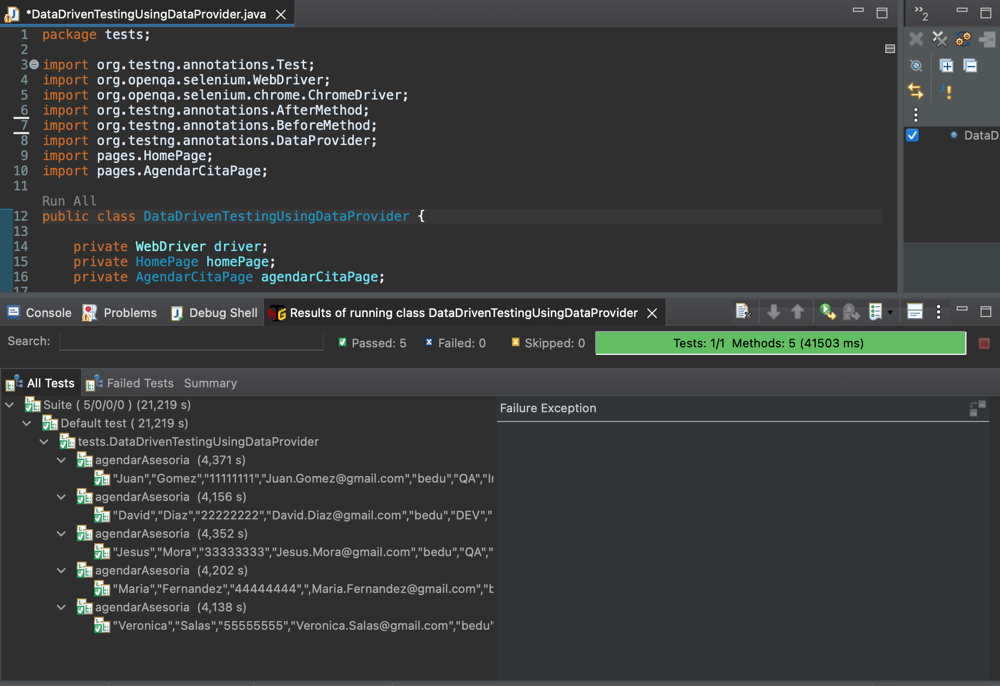
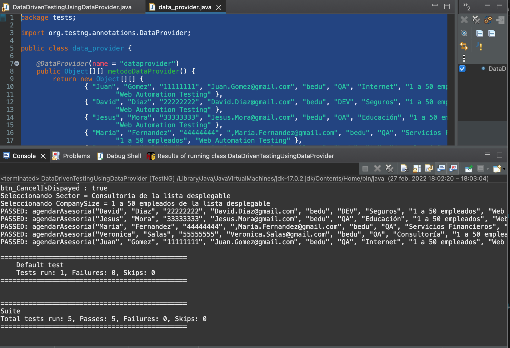

# Ejemplo-04# - TestNG como proveedor de origen de Datos.

## Objetivo

* Implementar la anotación @DataProvider de TestNG como fuente de origen de datos.

## Desarrollo

Como se había mencionado el el tema anterior, hay dos formas en las que podemos lograr la parametrización en TestNG;

1. Con la ayuda de la anotación de parámetros y el archivo XML TestNG: esto fue visto en el - [**`TEMA 3`**](./Ejemplo-03).
2. `Con la ayuda de la anotación @DataProvider de TestNG.`

En este tema revisaremos cómo funciona  la anotación `@DataProvider` de TestNG.


> `Pro-tip:` Cuando se va a probar con múltiples conjuntos de datos, es preferible utilizar esta anotación

El `@DataProvider` pasa diferentes valores al caso de prueba TestNG en una sola ejecución y en forma de anotaciones TestNG. Es parte de las pruebas basadas en datos TestNG incorporadas para las cuales TestNG es bastante popular.

#### Consideraciones de la anotación @DataProvider:
- Contiene un único atributo, que es su nombre. Siempre es un tipo de cadena en la naturaleza. Por ejemplo:

```Java
@DataProvider (name = "nombre_dataprovider")
```
- No se declaran encima de las funciones como los parámetros de TestNG, pero tienen un __método propio__, que en términos habituales se denomina método de proveedor de datos. Por ejemplo :

```Java
@DataProvider (name = "nombre_dataprovider")
public Object[][] metodoDataProvider() {
    return new Object [][] { values}
}
```

- Si no se ha especificado el nombre del proveedor de datos, el nombre del método se convierte en el nombre del proveedor de datos de forma predeterminada.

- `@DataProvider` devuelve una lista 2D de objetos: 

```Java
return new Object [][] {values} 
```

Sigamos con el ejemplo de la funcionalidad de agendar asesorias, de la pagin web de bedu, como en los 2 temas anteriores, utilizaremos los mismos datos de origen para nuestro script de prueba solo que en esta oportunidad lo haremos con la anotación `@DataProvider` de TestNG.

Generaremos la siguiente clase `DataDrivenTestingUsingDataProvider`dentro de la carpeta de `test`

```Java

package tests;

import org.testng.annotations.Test;
import org.openqa.selenium.WebDriver;
import org.openqa.selenium.chrome.ChromeDriver;
import org.testng.annotations.AfterMethod;
import org.testng.annotations.BeforeMethod;
import org.testng.annotations.DataProvider;
import pages.HomePage;
import pages.AgendarCitaPage;

public class DataDrivenTestingUsingDataProvider {

	private WebDriver driver;
	private HomePage homePage;
	private AgendarCitaPage agendarCitaPage;

	@BeforeMethod
	public void beforeTest() throws InterruptedException {
		System.setProperty("webdriver.chrome.driver", "src/test/resources/webdrivers/chromedriver");
		driver = new ChromeDriver();
		driver.manage().window().maximize();
		driver.get("https://bedu.org/");
	}

	@DataProvider(name = "dataprovider")
	public Object[][] metodoDataProvider() {
		return new Object[][] {
				{ "Juan", "Gomez", "11111111", "Juan.Gomez@gmail.com", "bedu", "QA", "Internet", "1 a 50 empleados",
						"Web Automation Testing" },
				{ "David", "Diaz", "22222222", "David.Diaz@gmail.com", "bedu", "DEV", "Seguros", "1 a 50 empleados",
						"Web Automation Testing" },
				{ "Jesus", "Mora", "33333333", "Jesus.Mora@gmail.com", "bedu", "QA", "Educación", "1 a 50 empleados",
						"Web Automation Testing" },
				{ "Maria", "Fernandez", "44444444", ",Maria.Fernandez@gmail.com", "bedu", "QA", "Servicios Financieros",
						"1 a 50 empleados", "Web Automation Testing" },
				{ "Veronica", "Salas", "55555555", "Veronica.Salas@gmail.com", "bedu", "QA", "Consultoría",
						"1 a 50 empleados", "Web Automation Testing" } };
	}

	@Test(dataProvider = "dataprovider")
	public void agendarAsesoria(String name, String lastname, String phone, String email, String company,
			String jobtitle, String sector, String company_size, String program) throws InterruptedException {

		homePage = new HomePage(driver);
		// Validamos que el boton de agendar asesoria este disponible
		if (homePage.isButtonDisplayed()) {
			// Clck en boton de agendar asesoria
			try {
				homePage.clickButton();
			} catch (InterruptedException e) {
				e.printStackTrace();
			}
		}

		agendarCitaPage = new AgendarCitaPage(driver);

		if (agendarCitaPage.btn_CancelIsDispayed()) {

			agendarCitaPage.fillName(name);
			agendarCitaPage.fillLastname(lastname);
			agendarCitaPage.fillPhone(phone);
			// agendarCitaPage.fillEmail(email);
			agendarCitaPage.fillCompany(company);
			agendarCitaPage.fillJobTitle(jobtitle);
			agendarCitaPage.fillSector(sector);
			agendarCitaPage.fillCompanySize(company_size);
			agendarCitaPage.fillProgram(program);
			Thread.sleep(2000);
		}

	}

	@AfterMethod
	public void afterTest() {
		driver.close();
	}

}

```

#### Resultado de la ejecución:

 

La ejecución se hizo tantas veces como parametria de datos contenia el objeto retornado por el metodo `metodoDataProvider`, esto significa que aunque ejecutamos el archivo una vez, el método del caso de prueba se ejecutó varias veces veces con valores diferentes.

> `Pro-tip:` A diferencia de los parámetros en TestNG, los proveedores de datos se pueden ejecutar directamente a través del archivo del caso de prueba.


#### Proveedor de datos heredado en TestNG

DataProvider en TestNG juega un papel esencial en la escritura de códigos para proyectos u objetos complejos. Al escribir casos de prueba, el código tiende a ensuciarse mucho. Siempre se prefiere declarar el caso de prueba en una clase y definir parámetros TestNG como DataProviders en otra clase. 

En otras palabras, `heredamos DataProvider` de otro archivo, y de eso se trata heredar un DataProvider en TestNG. Vamos a crear clases separadas para el método DataProvider y el método de prueba, como se muestra a continuación:

Creamos una nueva clase que se llame `data_provider.java` dentro de la carpeta de recursos, con el siguiente contenido:

```Java
package tests;

import org.testng.annotations.DataProvider;

public class data_provider {
	
	@DataProvider(name = "dataprovider")
	public Object[][] metodoDataProvider() {
		return new Object[][] {
				{ "Juan", "Gomez", "11111111", "Juan.Gomez@gmail.com", "bedu", "QA", "Internet", "1 a 50 empleados",
						"Web Automation Testing" },
				{ "David", "Diaz", "22222222", "David.Diaz@gmail.com", "bedu", "DEV", "Seguros", "1 a 50 empleados",
						"Web Automation Testing" },
				{ "Jesus", "Mora", "33333333", "Jesus.Mora@gmail.com", "bedu", "QA", "Educación", "1 a 50 empleados",
						"Web Automation Testing" },
				{ "Maria", "Fernandez", "44444444", ",Maria.Fernandez@gmail.com", "bedu", "QA", "Servicios Financieros",
						"1 a 50 empleados", "Web Automation Testing" },
				{ "Veronica", "Salas", "55555555", "Veronica.Salas@gmail.com", "bedu", "QA", "Consultoría",
						"1 a 50 empleados", "Web Automation Testing" } };
	}

}

```

Ahora la importamos en la clase `DataDrivenTestingUsingDataProvider` por medio de la anotación `dataProviderClass`:

```Java
@Test(dataProvider = "dataprovider", dataProviderClass = data_provider.class)
```

Quedando el codigo de la clase de prueba de la siguiente manera:

```Java
package tests;

import org.testng.annotations.Test;
import org.openqa.selenium.WebDriver;
import org.openqa.selenium.chrome.ChromeDriver;
import org.testng.annotations.AfterMethod;
import org.testng.annotations.BeforeMethod;
import pages.HomePage;
import pages.AgendarCitaPage;
import tests.data_provider;

public class DataDrivenTestingUsingDataProvider {

	private WebDriver driver;
	private HomePage homePage;
	private AgendarCitaPage agendarCitaPage;

	@BeforeMethod
	public void beforeTest() throws InterruptedException {
		System.setProperty("webdriver.chrome.driver", "src/test/resources/webdrivers/chromedriver");
		driver = new ChromeDriver();
		driver.manage().window().maximize();
		driver.get("https://bedu.org/");
	}


	@Test(dataProvider = "dataprovider", dataProviderClass = data_provider.class)
	public void agendarAsesoria(String name, String lastname, String phone, String email, String company,
			String jobtitle, String sector, String company_size, String program) throws InterruptedException {

		homePage = new HomePage(driver);
		// Validamos que el boton de agendar asesoria este disponible
		if (homePage.isButtonDisplayed()) {
			// Clck en boton de agendar asesoria
			try {
				homePage.clickButton();
			} catch (InterruptedException e) {
				e.printStackTrace();
			}
		}

		agendarCitaPage = new AgendarCitaPage(driver);

		if (agendarCitaPage.btn_CancelIsDispayed()) {

			agendarCitaPage.fillName(name);
			agendarCitaPage.fillLastname(lastname);
			agendarCitaPage.fillPhone(phone);
			// agendarCitaPage.fillEmail(email);
			agendarCitaPage.fillCompany(company);
			agendarCitaPage.fillJobTitle(jobtitle);
			agendarCitaPage.fillSector(sector);
			agendarCitaPage.fillCompanySize(company_size);
			agendarCitaPage.fillProgram(program);
			Thread.sleep(2000);
		}

	}

	@AfterMethod
	public void afterTest() {
		driver.close();
	}

}

```

Como puede ver, al ejecutar la clases con las pruebas se verá el mismo resultados a los que vimos en la ejecución anterior.

 


Para manejar la herencia, todo lo que hicimos fue agregar un atributo al método de prueba que especifica la clase que tiene el método DataProvider, de esta manera podriamos generar multiples metodos que sean dataproviders para distintas pruebas, y solo invocarlas en nuestra clase de pruebas usando los atributos de la anotación `@Test`