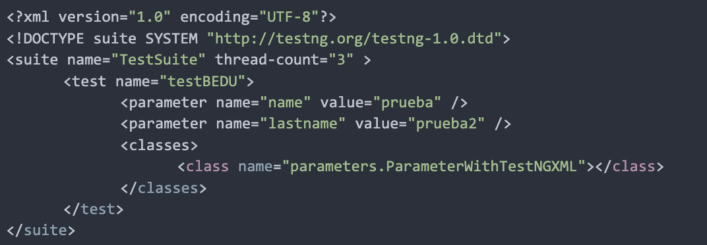
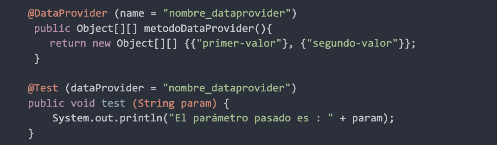

## Sesión 4: Captura de Datos 🤖

### 1. Objetivos :dart: 

- Aplicar Selenium para la captura de atributos de los objetos en aplicaciones WEB. 
- Hacer uso de parametrias de datos  como insumos de entrada de datos para los scripts de pruebas automatizados.  
- Emplear fuentes de datos externas como insumos de entrada de datos para los scripts de pruebas automatizados. 

### 2. Contenido :blue_book:

Ya hemos visto cómo es posible con Selenium generar nuestros scripts de pruebas automatizados con el uso de TestNG, ahora bien, hasta ahora todos los datos de las pruebas están fijos en nuestro código, lo que nos impide que los scripts sean reutilizables, es por ello que en esta sesión vamos a introducirnos en el mundo de la captura de datos de los objetos que tenemos en las pantallas de la página web y captura de datos como origen de datos de pruebas.

---

#### <ins>Tema 1: Métodos de control de captura de datos de objetos.</ins> 

Los Métodos de control de captura de selenium son aquellos métodos utilizados para obtener información sobre atributos del WebElement, como pueden ser: el tamaño, contenido, clase, localización, css value, entre otros.

Estos métodos suelen ser muy útiles para los scripts de pruebas ya que nos sirven como herramienta para sumar aserciones a los casos de pruebas.

 

- [**`EJEMPLO 1 - Métodos de control de captura de datos de objetos.`**](./Ejemplo-01)

---

#### <ins>Tema 2: Archivos csv como origen de Datos.</ins> 

La lectura de datos de prueba de archivos con extensiones `.csv` es una de las formas más comunes en los frameworks híbridos. Es por ello que en este tema vamos a realizar una `Prueba basada en datos utilizando un archivo CSV en Selenium WebDriver`, lo cual  es un requisito importante para cualquier organización el utilizar algún tipo de enfoque basado en datos. 

 

- [**`EJEMPLO 2 - Archivos csv como origen de Datos.`**](./Ejemplo-02)
---

#### <ins>Tema 3: Parametrización de Datos: TestNG XML.</ins> 

La parametrización en Selenium es un proceso para parametrizar los scripts de prueba para pasar múltiples datos a la aplicación en tiempo de ejecución. Es una estrategia de ejecución que automáticamente ejecuta casos de prueba varias veces usando diferentes valores. El concepto que se logra mediante la parametrización de los scripts de prueba se denomina `Data Driven Testing`.

Para que la parametrización sea más clara, revisaremos las opciones de parametrización en uno de los frameworks más populares para Selenium Webdriver: TestNG.

Hay dos formas en las que podemos lograr la parametrización en TestNG

1. `Con la ayuda de la anotación de parámetros y el archivo XML TestNG.`
2. Con la ayuda de la anotación @DataProvider de TestNG.

En este tema veremos 1 primera forma: `Con la ayuda de la anotación de parámetros y el archivo XML TestNG.`

 

- [**`EJEMPLO 3 - Parametrización de Datos: TestNG XML.`**](./Ejemplo-03)
- [**`RETO 1`**](./Reto-01)
---

#### <ins>Tema 4: TestNG como proveedor de origen de Datos.</ins>

Como se había mencionado el el tema anterior, hay dos formas en las que podemos lograr la parametrización en `TestNG`;

1. Con la ayuda de la anotación de parámetros y el archivo XML TestNG: esto fue visto en el [**`EJEMPLO 3 - Parametrización de Datos: TestNG XML.`**](./Ejemplo-03).
2. `Con la ayuda de la anotación @DataProvider de TestNG.`

En este tema revisaremos cómo funciona  la anotación `@DataProvider` de TestNG.

 

- [**`EJEMPLO 4 - TestNG como proveedor de origen de Datos.`**](./Ejemplo-04)
- [**`RETO 2`**](./Reto-02)
---

### 3. Postwork :memo: 

Encuentra las indicaciones y consejos para reflejar los avances de tu proyecto de este módulo.

- [**`POSTWORK SESIÓN 4`**](./Postwork/)

 

