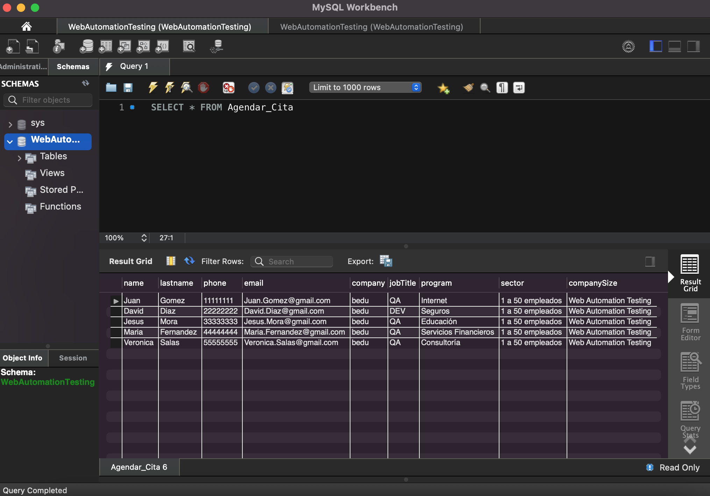
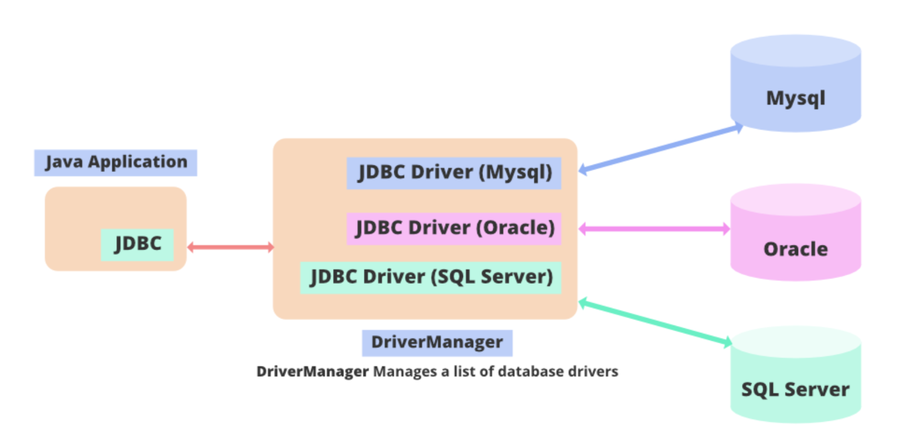

# Ejemplo-01 # - Creación y conexión de Base de Datos

## Objetivo

- Ejecutar las sentencias MySQL requeridas para la creación de: esquemas, bases de datos, tablas y registros de bases de datos.
- Construir la conexión a la base de datos MySQL mediante el uso de la librería JDBC y los scripts de pruebas de Selenium.

## Desarrollo


#### ¿Qué es una base de datos?

Una base de datos es una `recopilación organizada de información o datos estructurados, que normalmente se almacena de forma electrónica en un sistema informático`. Normalmente, una base de datos está controlada por un `sistema de gestión de bases de datos (DBMS)`. En conjunto, los datos y el DBMS, junto con las aplicaciones asociadas a ellos, reciben el nombre de sistema de bases de datos, abreviado normalmente a simplemente `base de datos`.

Los datos de los tipos más comunes de bases de datos en funcionamiento actualmente se suelen utilizar como estructuras de filas y columnas en una serie de tablas para aumentar la eficacia del procesamiento y la consulta de datos. Así, se puede acceder, gestionar, modificar, actualizar, controlar y organizar fácilmente los datos. La mayoría de las bases de datos utilizan un lenguaje de consulta estructurada (SQL) para escribir y consultar datos.


#### ¿Por qué necesitamos la automatización de la base de datos?

Hay múltiples razones para querer utilizar una base de datos como fuente origen de datos en nuestros casos de prueba, e incluso utilizarla como fuente de información para validación de resultados, pero acá mencionamos las 3 razones más importantes para querer utilizarlas en nuestras automatizaciones de pruebas:

- `Datos de prueba`: podemos almacenar los datos en la base de datos en lugar de excel o propiedades, archivos JSON/xml, la recuperación sería más rápida en el caso de la base de datos si estamos tratando de obtener un gran conjunto de datos.

- `Conectividad de front-end y back-end`: a veces tenemos que verificar que los detalles que enviamos/eliminamos/actualizamos en el front-end llegan al back-end para fines de uso futuro. Hay escenarios en los que los detalles pueden fallar durante el análisis; en tales casos, los detalles no llegarán a la base de datos.

- `Pruebas más rápidas`: si estamos probando tareas simples de la base de datos manualmente, puede llevar mucho tiempo y esfuerzo, por lo que para evitar eso, podemos optar por la prueba de automatización de la base de datos.


#### ¿Qué es el lenguaje de consulta estructurada (SQL)?

El `SQL es un lenguaje de programación` que utilizan casi todas las bases de datos relacionales para consultar, manipular y definir los datos, además de para proporcionar control de acceso. El `SQL` se desarrolló por primera vez en IBM en la década de 1970 con Oracle como uno de los principales contribuyentes, lo que dio lugar a la implementación del estándar ANSI SQL. El SQL ha propiciado muchas ampliaciones de empresas como IBM, Oracle y Microsoft. Aunque el SQL se sigue utilizando mucho hoy en día, están empezando a aparecer nuevos lenguajes de programación.

#### ¿Qué es una base de datos MySQL?

`MySQL` es un sistema de gestión de bases de datos relacionales de código abierto basado en SQL. Se diseñó y se optimizó para las aplicaciones web y puede utilizarse en cualquier plataforma. A medida que surgían nuevos y diferentes requisitos con Internet, MySQL se convirtió en la plataforma preferida por los desarrolladores web y las aplicaciones basadas en web. Dado que está diseñado para procesar millones de consultas y miles de transacciones, MySQL es una elección popular para las empresas de comercio electrónico que necesitan gestionar múltiples transferencias de dinero. La flexibilidad on-demand es la principal función de MySQL.

MySQL es el DBMS que se encuentra detrás de algunos de los sitios web y aplicaciones basadas en web más importantes del mundo, como `Airbnb`, `Uber`, `LinkedIn`, `Facebook`, `Twitter` y `YouTube`.


#### Sentencias MySQL para la Creación de base de datos

1.  Creación del Schema  por medio de query con la siguiente Syntax

```SQL
CREATE SCHEMA schema_name;
```
> Para este tema crearemos la siguiente:

```SQL
CREATE SCHEMA WebAutomationTesting;
```

2. Creación de la base de datos por medio de query con la siguiente Syntax

```SQL
CREATE DATABASE databasename;
```
> Para este tema crearemos la siguiente:

```SQL
CREATE DATABASE WebAutomationTesting;
```

#### Sentencias MySQL para la Creación de tablas y registros de tablas en la base de datos
1. Creación de una tabla por medio de query con la siguiente Syntax:

```SQL
CREATE TABLE table_name (
	column1 datatype,
	column2 datatype,
	column3 datatype,
   ....
);
```

> Para este tema crearemos la siguiente:

```SQL
CREATE TABLE Agendar_Cita (
	name varchar(255),
	lastname varchar(255),
	phone varchar(255),
	email varchar(255),
	company varchar(255),
    jobTitle varchar(255),
    program varchar(255),
    sector varchar(255),
    companySize varchar(255)
)
```

2. Creación de registros en la tabla por medio de query con la siguiente Syntax:

```SQL
INSERT INTO table_name (column1, column2, column3, ...)
VALUES (value1, value2, value3, ...);
```

> Insertaremos algunos registros en nuestra base de datos:

```SQL
INSERT INTO Agendar_Cita (name, lastname, phone, email, company,jobTitle,program,sector,companySize)
VALUES 
('Juan', 'Gomez', '11111111', 'Juan.Gomez@gmail.com', 'bedu','QA','Internet','1 a 50 empleados','Web Automation Testing'),
('David', 'Diaz', '22222222', 'David.Diaz@gmail.com', 'bedu','DEV','Seguros','1 a 50 empleados','Web Automation Testing'),
('Jesus', 'Mora', '33333333', 'Jesus.Mora@gmail.com', 'bedu','QA','Educación','1 a 50 empleados','Web Automation Testing'),
('Maria', 'Fernandez', '44444444', 'Maria.Fernandez@gmail.com', 'bedu','QA','Servicios Financieros','1 a 50 empleados','Web Automation Testing'),
('Veronica', 'Salas', '55555555', 'Veronica.Salas@gmail.com', 'bedu','QA','Consultoría','1 a 50 empleados','Web Automation Testing')
```
 


#### Conexión a la base de datos con Selenium

1. Ingresar la dependencia al archivo POM.xml https://mvnrepository.com/artifact/mysql/mysql-connector-java

```XML
<!-- https://mvnrepository.com/artifact/mysql/mysql-connector-java -->
<dependency>
    <groupId>mysql</groupId>
    <artifactId>mysql-connector-java</artifactId>
    <version>8.0.28</version>
</dependency>
```
> La dependencia `mysql-connector-java` funciona como puente entre el servidor MySQL y los programas escritos en diferentes lenguajes de programación como Java, C#, Python, Node JS, etc. Es decir, este conector ofrece una interfaz para ejecutar una consulta MySQL en el servidor.

2. Crea una clase llamada `DataDrivenTestingUsingDataBase`

```Java
package tests;

import java.sql.Connection;
import java.sql.DriverManager;
import java.sql.Statement;
import org.testng.annotations.AfterTest;
import org.testng.annotations.BeforeTest;
import org.testng.annotations.Test;

public class DataDrivenTestingUsingDataBase {
	// Creación del object de conexión
	static Connection con = null;

	// Creación del object Statement
	private static Statement stmt;

	// Creación de Constantes para la conexión a la Base de Datos
	public static String DB_URL = "jdbc:mysql://localhost:3306/WebAutomationTesting";
	public static String DB_USER = "root";
	public static String DB_PASSWORD = "pass_root";

	@BeforeTest
	public void setUp() throws Exception {
		try {
			// Conexión a la Base de Datos
			String dbClass = "com.mysql.cj.jdbc.Driver";
			Class.forName(dbClass);
			Connection con = DriverManager.getConnection(DB_URL, DB_USER, DB_PASSWORD);

			// Statement object para enviar la declaración SQL a la base de datos
			stmt = con.createStatement();

		} catch (Exception e) {
			e.printStackTrace();
		}
	}

	@Test
	public void test() {

	}

	@AfterTest
	public void tearDown() {

	}

}

```

`Pro-tip`: en este ejemplo debes colocar la contraseña de tu usuario root.

En conclusión la conexión a la base de datos se hace mediante la librería JDBC para mysql:

 

Haciendo posible que la clase java se conecte a la base de datos, recupere datos de la base de datos o, de hecho, realice cualquiera de las operaciones `CRUD (Create, Read, Update, Delete)` , manipule los datos resultantes y cierre la conexión. Mediante los siguientes pasos:

1. Conexión a la base de datos utilizando el método `getConnection()`.

```Java
public static String DB_URL = "jdbc:mysql://localhost:3306/db_name";
public static String DB_USER = "root";
public static String DB_PASSWORD = "root_pass";
String dbClass = "com.mysql.cj.jdbc.Driver";
Class.forName(dbClass);
Connection con = DriverManager.getConnection(DB_URL, DB_USER, DB_PASSWORD);
```

Donde:

```Java
String dbClass = "com.mysql.cj.jdbc.Driver";
Class.forName(dbClass);
```
> El rol de `Class.forName()` es requerir que la `Java Virtual Machine` encuentre y cargue la clase especificada.


```Java
public static String DB_URL = "jdbc:mysql://localhost:3306/db_name";
public static String DB_USER = "root";
public static String DB_PASSWORD = "root_pass";
Connection con = DriverManager.getConnection(DB_URL, DB_USER, DB_PASSWORD);
```
> El método de la clase Java DriverManager se encarga de establecer una conexión con la base de datos utilizando la URL de la base de datos dada, usuario y password.

> ¡Cuidado!: DB_PASSWORD debe contener la contraseña del usuario root configurado en la instalación de MySQL.

2. Finalmente la consulta a la base de datos utilizando el objeto de Statement.

```Java
stmt = con.createStatement();
```
> El método `createStatement()` se utiliza para crear un objeto que modela una sentencia SQL. Es un objeto del tipo de una clase que implementa la interfaz `Statement`, y provee la infraestructura para ejecutar sentencias SQL sobre una conexión con una base de datos.