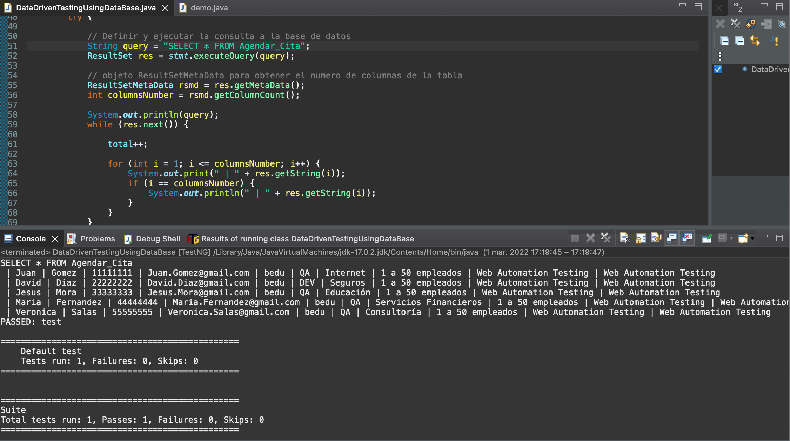

# Ejemplo-03# - Procesamiento de Resultados. 

## Objetivo

- Utilizar los métodos de la clase JDCB para utilizar los datos retornados por la respuesta de la consulta ejecutada.
- Realizar aserciones con la respuesta de la consulta a la base de datos.

## Desarrollo

Los resultados de la consulta ejecutada se almacenan en el objeto ResultSet. 

```Java
String query = "SELECT * FROM Persons";
ResultSet res = stmt.executeQuery(query);
```

Java proporciona muchos métodos avanzados para procesar los resultados, como los siguientes:

- `String getString()`: Se utiliza para extraer un valor  String del conjunto de resultado.

```Java
res.getString(1)
```

- `int getInt()`: Se utiliza para extraer un valor Int del conjunto de resultado.

```Java
res.getInt(1)
```

- `double getDouble()`: Se utiliza para extraer un valor Double del conjunto de resultado.

```Java
res.getDouble(1)
```

- `Date getDate()`: Se utiliza para extraer un valor Date del conjunto de resultado.

```Java
res.getDate(1)
```

- `boolean next()`: Se utiliza para moverse al siguiente registro del conjunto de resultado.

```Java
res.next()
```

- `boolean previous()`: Se utiliza para moverse al registro anterior del conjunto de resultado.

```Java
res.previous()
```

- `boolean first()`: Se utiliza para moverse al primer registro del conjunto de resultado.

```Java
res.first()
```

- `boolean last()`: Se utiliza para moverse al último registro del conjunto de resultado.

```Java
res.last()
```

- `boolean absolute(int rowNumber)`: Se utiliza para moverse a un registro específico del conjunto de resultados.

```Java
res.absolute(1)
```

> Pro-tip: puedes consultar mas metodos de esta clase en este link-> https://docs.oracle.com/javase/7/docs/api/java/sql/ResultSet.html

Veamos un ejemplo con la tabla `Agendar_Cita` desarrollando el siguiente código:

> Obtenemos todos los resultados de la tabla:

```Java
package tests;


import static org.testng.Assert.assertTrue;

import java.sql.Connection;
import java.sql.DriverManager;
import java.sql.ResultSet;
import java.sql.ResultSetMetaData;
import java.sql.Statement;
import org.testng.annotations.AfterTest;
import org.testng.annotations.BeforeTest;
import org.testng.annotations.Test;

public class DataDrivenTestingUsingDataBase {
	int total = 0;
	// Creación del object de conexión
	static Connection con = null;

	// Creación del object Statement
	private static Statement stmt;

	// Creación de Constantes para la conexión a la Base de Datos
	public static String DB_URL = "jdbc:mysql://localhost:3306/WebAutomationTesting";
	public static String DB_USER = "root";
	public static String DB_PASSWORD = "root_password";

	@BeforeTest
	public void setUp() throws Exception {
		try {
			// Conexión a la Base de Datos
			String dbClass = "com.mysql.cj.jdbc.Driver";
			Class.forName(dbClass);
			Connection con = DriverManager.getConnection(DB_URL, DB_USER, DB_PASSWORD);

			// Statement object para enviar la declaración SQL a la base de datos
			stmt = con.createStatement();

		} catch (Exception e) {
			e.printStackTrace();
		}
	}

	@Test
	public void test() {

		try {

			// Definir y ejecutar la consulta a la base de datos
			String query = "SELECT * FROM Agendar_Cita";
			ResultSet res = stmt.executeQuery(query);

			// objeto ResultSetMetaData para obtener el numero de columnas de la tabla
			ResultSetMetaData rsmd = res.getMetaData();
			int columnsNumber = rsmd.getColumnCount();

			System.out.println(query);
			while (res.next()) {

				total++;

				for (int i = 1; i <= columnsNumber; i++) {
					System.out.print(" | " + res.getString(i));
					if (i == columnsNumber) {
						System.out.println(" | " + res.getString(i));
					}
				}
			}
		} catch (Exception e) {
			e.printStackTrace();
		}

		// asersiones
		assertTrue(total >= 1, "No se obtuvieron resultados de la consulta");

	}

	@AfterTest
	public void tearDown() throws Exception {
		if (res != null){
            res.close();
        }
		// Cerrar la conexión a la base de datos
		if (con != null) {
			con.close();
		}	
	}

}

```

 

Como se ve en el código tambien podemos agregar aserciones:

```Java
int total = 0;
while (res.next()) {
    total++;
        for (int i = 1; i <= columnsNumber; i++) {
            System.out.print(" | " + res.getString(i));
            if (i == columnsNumber) {
                System.out.println(" | " + res.getString(i));
            }
        }
    }
assertTrue(total >= 1, "No se obtuvieron resultados de la consulta");
```