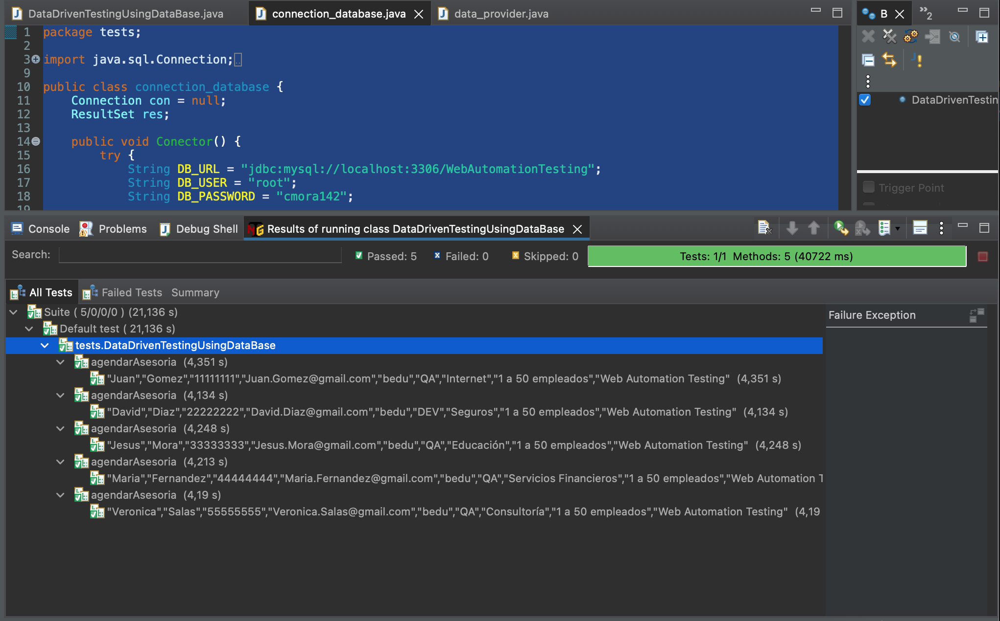

# Ejemplo-04# - Ejemplo de prueba de base de datos con Selenium

## Objetivo

* Adaptar los ejemplos entregados en todos los temas de esta sesión a un caso practico con Selenium y una funcionalidad de BEDU (agendar asesoria)

## Desarrollo

Ahora que sabemos como crear bases de datos y tablas, realizar consultas, conexiones, y obtener los resultados de la ejecución de un query en la base de datos,  veamos un caso práctico en selenium de cómo podemos implementar esto en nuestros scripts de pruebas automatizados:


1. Creamos una clase independiente donde crearemos metodos relacionados a la conexion de base de datos, ejección de querys y mas, denominada `connection_database.java`

```Java
package tests;

import java.sql.Connection;
import java.sql.DriverManager;
import java.sql.ResultSet;
import java.sql.ResultSetMetaData;
import java.sql.SQLException;
import java.sql.Statement;

public class connection_database {
	Connection con = null;
	ResultSet res;

	public void Conector() {
		try {
			String DB_URL = "jdbc:mysql://localhost:3306/WebAutomationTesting";
			String DB_USER = "root";
			String DB_PASSWORD = "root_pass";

			con = DriverManager.getConnection(DB_URL, DB_USER, DB_PASSWORD);
			String dbClass = "com.mysql.cj.jdbc.Driver";
			try {
				Class.forName(dbClass);

			} catch (ClassNotFoundException e) {
				e.printStackTrace();
			}

			if (con != null) {
				System.out.println("Conectado a MySQL");
			}

		} catch (SQLException ex) {
			System.out.println("ERROR: La URL de la conexión no es válida o el usuario y clave de la BD");
			ex.printStackTrace();
		}

	}

	public ResultSet executeQuery(String query) throws SQLException {
		Statement stmt = con.createStatement();
		//System.out.println(query);
		//printResult(stmt.executeQuery(query));
		res = stmt.executeQuery(query);
		return res;

	}

	public void closeConnexion() throws SQLException {
		if (res != null) {
			res.close();
			System.out.println("ResultSet cerrado exitosamente...");
		}

		if (con != null) {
			con.close();
			System.out.println("Conexión cerrada exitosamente...");
		}
	}

	public int getColumnNumber(ResultSet res) throws SQLException {
		ResultSetMetaData rsmd = res.getMetaData();
		return rsmd.getColumnCount();

	}
	
	
	public int getRowsNumber(ResultSet res) throws SQLException {
		int filas = 0;
		while (res.next()){
		   filas++;
		}
		return filas;
	}

	public void printResult(ResultSet res) throws SQLException {
		
		while (res.next()) {

			for (int i = 1; i <= getColumnNumber(res); i++) {
				System.out.print(" | " + res.getString(i));
				if (i == getColumnNumber(res)) {
					System.out.println(" | " + res.getString(i));
				}
			}
		}

	}

}


```

> ¡Cuidado!: Recuerda cambiar el valor de la variable DB_PASSWORD.

2. Anadimos a nuestra clase `data_provider` el método `@DataProvider(name = "MySQL_dataprovider")` a nuestra clase para llenar el `objeto provider [][]`con el resultado de la consulta MySQL

```Java
package tests;

import java.sql.ResultSet;

import org.testng.annotations.DataProvider;

public class data_provider {

	@DataProvider(name = "dataprovider")
	public Object[][] metodoDataProvider() {
		return new Object[][] {
				{ "Juan", "Gomez", "11111111", "Juan.Gomez@gmail.com", "bedu", "QA", "Internet", "1 a 50 empleados",
						"Web Automation Testing" },
				{ "David", "Diaz", "22222222", "David.Diaz@gmail.com", "bedu", "DEV", "Seguros", "1 a 50 empleados",
						"Web Automation Testing" },
				{ "Jesus", "Mora", "33333333", "Jesus.Mora@gmail.com", "bedu", "QA", "Educación", "1 a 50 empleados",
						"Web Automation Testing" },
				{ "Maria", "Fernandez", "44444444", ",Maria.Fernandez@gmail.com", "bedu", "QA", "Servicios Financieros",
						"1 a 50 empleados", "Web Automation Testing" },
				{ "Veronica", "Salas", "55555555", "Veronica.Salas@gmail.com", "bedu", "QA", "Consultoría",
						"1 a 50 empleados", "Web Automation Testing" } };
	}

	@DataProvider(name = "MySQL_dataprovider")
	public String[][] mySQL_Data() {

		int rowCount = 0;
		int columnCount = 0;
		String myData[][] = null;
		connection_database conect = new connection_database();
		ResultSet res;

		try {
			conect.Conector();

			// Ejecutar consulta (query) a la BD
			String query = "SELECT * FROM Agendar_Cita";
			res = conect.executeQuery(query);

			// Obtener nro de filas y columnas
			columnCount = conect.getColumnNumber(res);
			rowCount = conect.getRowsNumber(res);

			System.out.println("Columnas : " + columnCount);
			System.out.println("Filas : " + rowCount);

			// Inicializar la matriz
			myData = new String[rowCount][columnCount];
			res = conect.executeQuery(query);
			
			// Llenar la matriz con el resultado de la consulta MySQL
            for(int row=0; row<rowCount; row++)
            {
                res.next();
               
                for(int col=1; col<=columnCount; col++)
                    myData[row][col-1] = res.getString(col);
            }
			
            //Cerrar la conexión
			conect.closeConnexion();

		}

		catch (Exception e) {
			e.printStackTrace();
		}

		return myData;

	}

}

```

3. Creamos nuestra clase de prueba 

```Java
package tests;

import org.openqa.selenium.WebDriver;
import org.openqa.selenium.chrome.ChromeDriver;
import org.testng.annotations.AfterMethod;
import org.testng.annotations.BeforeMethod;
import org.testng.annotations.Test;
import pages.AgendarCitaPage;
import pages.HomePage;

public class DataDrivenTestingUsingDataBase {

	private WebDriver driver;
	private HomePage homePage;
	private AgendarCitaPage agendarCitaPage;

	@BeforeMethod
	public void beforeTest() throws InterruptedException {
		System.setProperty("webdriver.chrome.driver", "src/test/resources/webdrivers/chromedriver");
		driver = new ChromeDriver();
		driver.manage().window().maximize();
		driver.get("https://bedu.org/");
	}

	@Test(dataProvider = "MySQL_dataprovider", dataProviderClass = data_provider.class)
	public void agendarAsesoria(String name, String lastname, String phone, String email, String company,
			String jobtitle, String sector, String company_size, String program) throws InterruptedException {

		homePage = new HomePage(driver);
		// Validamos que el boton de agendar asesoria este disponible
		if (homePage.isButtonDisplayed()) {
			// Clck en boton de agendar asesoria
			try {
				homePage.clickButton();
			} catch (InterruptedException e) {
				e.printStackTrace();
			}
		}

		agendarCitaPage = new AgendarCitaPage(driver);

		if (agendarCitaPage.btn_CancelIsDispayed()) {

			agendarCitaPage.fillName(name);
			agendarCitaPage.fillLastname(lastname);
			agendarCitaPage.fillPhone(phone);
			// agendarCitaPage.fillEmail(email);
			agendarCitaPage.fillCompany(company);
			agendarCitaPage.fillJobTitle(jobtitle);
			agendarCitaPage.fillSector(sector);
			agendarCitaPage.fillCompanySize(company_size);
			agendarCitaPage.fillProgram(program);
			Thread.sleep(2000);
		}

	}

	@AfterMethod
	public void afterTest() {
		driver.close();
	}

}

```

En este ejemplo vemos que se obtuvieron datos de la base de datos para usarlos para completar la información de la funcionalidad `Agendar Asesoría`de la página: https://bedu.org/

 

De esta manera podemos obtener información de la base de datos y realizar aserciones para validar por ejemplo si la información del registro de un usuario se guardó correctamente a la base de datos, si la actualización de información de una dirección se guardó correctamente, o si se eliminó un usuario correctamente cuando se dio de baja por la página web.


Igualmente podríamos usar la base de datos para obtener información que luego utilizaremos para ingresar el texto en un campo por ejemplo o para tomar variables que no queremos que permanezcan en nuestro código de forma fija.