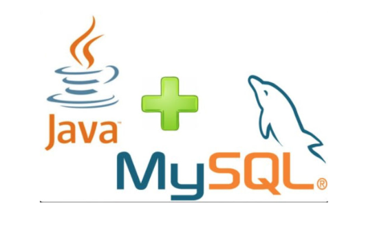
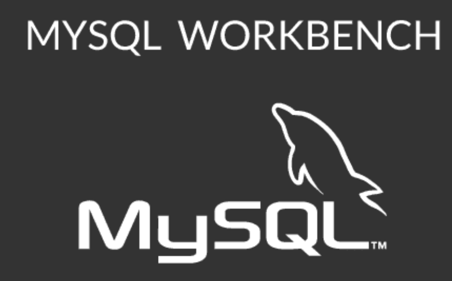
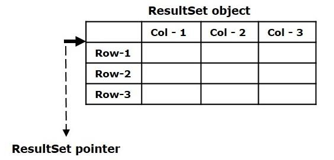
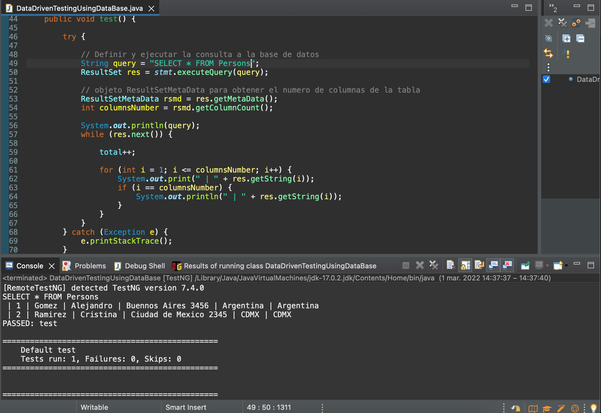

## Sesión 5: Selenium con Bases de Datos 🤖

### 1. Objetivos :dart: 

- Desarrollar los comandos MySQL para la creación de: esquemas, bases de datos, tablas y registros de bases de datos.
- Construir mediante el uso de la librería JDBC para Mysql la conexión entre las bases de datos y los scripts de pruebas de Selenium.
- Demostrar el funcionamiento de los metodos asociados a la clase ResultSet encargada del procesamiento de resultados de las consultas a las bases de datos.
 

### 2. Contenido :blue_book:

Como sabemos, cada aplicación web debe mantener una base de datos como MySQL, Oracle o cualquier otra base de datos para almacenar todos sus datos. Y como Selenium Webdriver se usa para probar aplicaciones web, por lo general necesitaremos realizar muchas operaciones, como enviar información y, en ocasiones, recuperar información y validarlas.

En los scripts de Selenium, cuando es necesario obtener los datos de la base de datos, es posible que tengamos que usar API que ayudan a interactuar con la base de datos como JDBC. Es por ello que en esta sesión nos enfocaremos en la implementación y uso de esta librería para conectarnos a nuestra base de datos en los scripts de pruebas y poder usarla.

 

---
#### <ins>Tema 1: Creación y conexión de Base de Datos</ins>

En este tema veremos que es una base de datos, por qué necesitamos la automatización de la base de datos, qué es el lenguaje de consulta estructurada (SQL), qué es una base de datos MySQL, el proceso de instalación de MySQL y MySQL WorkBench y la creación de bases de datos, tablas y registro de datos.

 

- [**`EJEMPLO 1 - Creación y conexión de Base de Datos`**](./Ejemplo-01)

---
#### <ins>Tema 2: Envío de Querys</ins> 

Una vez creada y conectada la base de datos MySQL, veremos qué es un query o consulta a una base de datos, cuales son los tipos de Consulta a base de datos e implementación de Querys con Selenium.

 

- [**`EJEMPLO 2 - Envío de Querys`**](./Ejemplo-02)
- [**`RETO 1`**](./Reto-01)

---
#### <ins>Tema 3: Procesamiento de Resultados. </ins> 

Luego de creada las consultas en nuestro proyecto, veremos como se procesan los resultados, y los metodos utilizados.

 

- [**`EJEMPLO 3 - Procesamiento de Resultados.`**](./Ejemplo-03)
- [**`RETO 2`**](./Reto-02)

---
#### <ins>Tema 4: Ejemplo de prueba de base de datos con Selenium</ins>

En este tema veremos un ejemplo práctico de pruebas automatizadas utilizando una bases de datos y Selenium.

 

- [**`EJEMPLO 4 - Ejemplo de prueba de base de datos con Selenium`**](./Ejemplo-04)

---
### 3. Postwork :memo:

Encuentra las indicaciones y consejos para reflejar los avances de tu proyecto de este módulo.

- [**`POSTWORK SESIÓN 5`**](./Postwork/)

 

