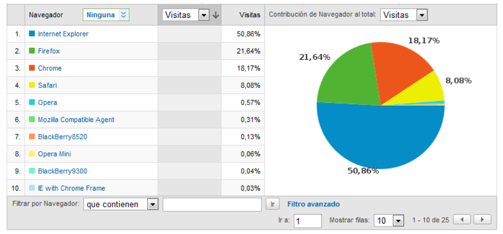
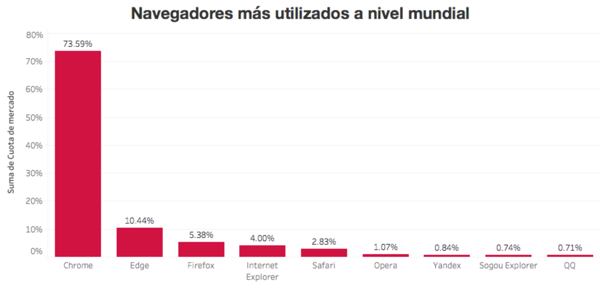
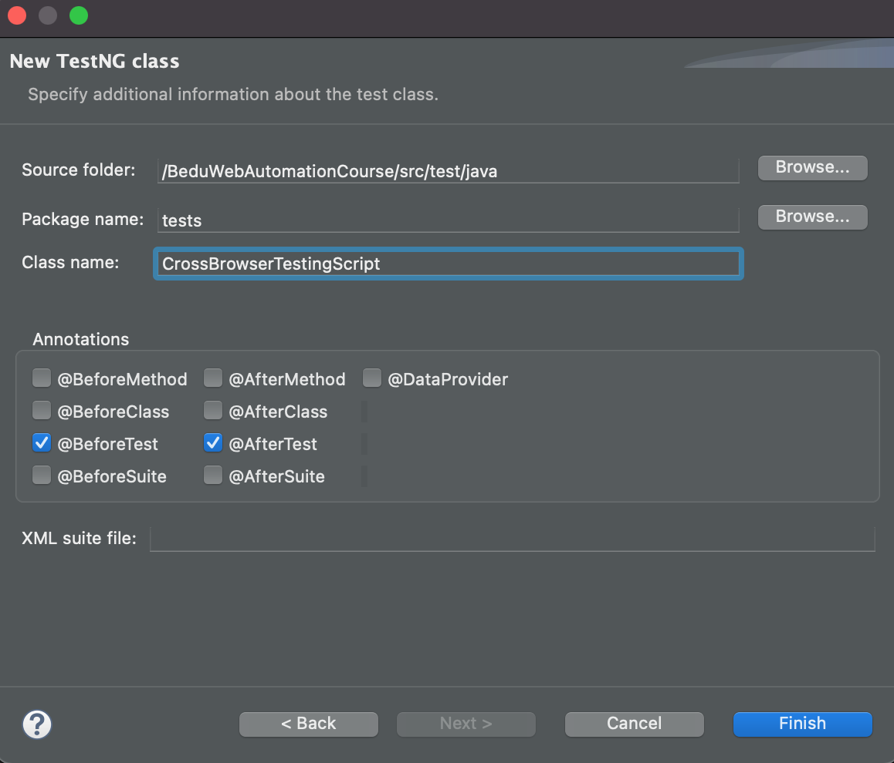
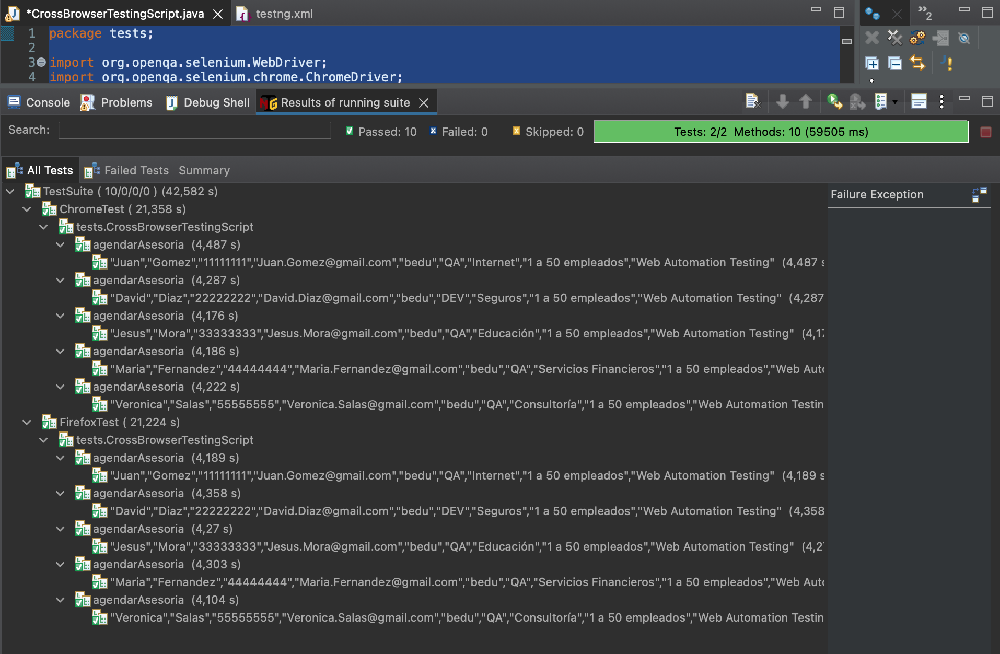

# Ejemplo-01 # - Ejecución de pruebas en Múltiples Navegadores (cross browser testing)

## Objetivo

- Implementar la parametria de los webdrivers en en archivo `testng.xml`.
- Implementar scripts de pruebas automatizados que puedan ser ejecutados en múltiples navegadores como una solución de amplitud de cobertura de pruebas automatizadas

## Desarrollo
<div style="text-align: justify;">

Como ya sabemos, el probar manualmente un sitio web en varios navegadores es excepcionalmente tedioso. Considera una situación en la que 100 casos de prueba deben ejecutarse manualmente. Ahora imagina que las mismas pruebas deben ejecutarse en cinco navegadores diferentes. El tiempo necesario se vuelve exponencialmente más largo. Sin embargo, si estas pruebas se automatizan con Selenium, se pueden ejecutar simultáneamente y en mucho menos tiempo. Es por esto que se introducen los siguientes conceptos:

- `Pruebas de navegadores cruzados (Cross browser testing)`: se refiere a probar un sitio web en múltiples navegadores como IE, Chrome, Firefox, entre otros; para verificar su eficacia en cada uno.

- `Compatibilidad entre navegadores (Cross-browser compatibility)`: es la capacidad del sitio web o la aplicación web para funcionar en diferentes navegadores y sistemas operativos.


#### ¿Por qué hacer pruebas de navegadores cruzados?

Uno de los puntos principales de las pruebas entre navegadores es realizar pruebas en `diferentes navegadores y combinaciones de versiones`. El uso de Selenium para las pruebas entre navegadores ayuda a realizar pruebas rigurosas del código en varios exploradores; ayudando así a lograr una `mejor cobertura` y esto, a su vez, ayuda a mejorar la experiencia del usuario.

La `matriz de compatibilidad de navegadores` puede ser fundamental para priorizar los navegadores web que utiliza el público objetivo, utilizando herramientas como __google analytics__, buscando información sobre sitios similares para conocer cuántas visitas tiene la web y desde cuáles exploradores se hace, podremos definir con cuantos exploradores cubrimos la mayor cantidad de pruebas.



> En este ejemplo si ejecutamos en Chrome, Firefox e Internet explorer, abarcariamos casi el 90% de los usuarios que ingresan.

#### ¿Cómo realizar pruebas de navegador cruzado usando Selenium?

Para realizar las pruebas en múltiples navegadores utilizaremos nuevamente la opción de agregar parametría al archivo `testng.xml` de la siguiente manera:

```xml
<?xml version="1.0" encoding="UTF-8"?>
<!DOCTYPE suite SYSTEM "https://testng.org/testng-1.0.dtd">
<suite name="TestSuite">
	<test name="ChromeTest">
		<parameter name="browser" value="Chrome" />
		<classes>
			<class name="tests.CrossBrowserTestingScript"></class>
		</classes>
	</test>
	<test name="FirefoxTest">
		<parameter name="browser" value="Firefox" />
		<classes>
			<class name="tests.CrossBrowserTestingScript"></class>
		</classes>
	</test>
</suite>
```


> Pro-Tip: puedes incluir más información en este archivo sobre el navegador que necesites posteriormente en la clase de prueba, como por ejemplo: nombre del explorador, versión, la ruta donde se encuentra el driver, etc.


Antes de comenzar veamos esta imagen:



> Articulo sobre los navegadores web mas usados en el 2021: https://www.cristianmonroy.com/2021/07/top-de-navegadores-mas-utilizados-en-ordenadores-y-laptops-a-nivel-mundial.html

Es posible que nos encontremos en la posicion de no tener alguna herramienta que nos permita ver el comportamiento de los usuarios en la web, lo que nos dificultara saber cuáles son los navegadores con los que más se ingresa a la web que deseamos probar. En este caso puedes investigar en internet cuales son los exploradores más utilizados generalmente, eso te ayudará a saber cuáles priorizar.


Actualicemos el ejemplo anterior incorporando mas detalles de las caracteristicas del navegador:

```xml
<?xml version="1.0" encoding="UTF-8"?>
<!DOCTYPE suite SYSTEM "https://testng.org/testng-1.0.dtd">
<suite name="TestSuite">
	<test name="ChromeTest">
		<parameter name="browser" value="Chrome" />
		<parameter name="driver_name" value="webdriver.chrome.driver" />
		<parameter name="driver_path" value="src/test/resources/webdrivers/chromedriver" />
		<classes>
			<class name="tests.CrossBrowserTestingScript"></class>
		</classes>
	</test>
	<test name="FirefoxTest">
		<parameter name="browser" value="Firefox" />
		<parameter name="driver_name" value="webdriver.gecko.driver" />
		<parameter name="driver_path" value="src/test/resources/webdrivers/geckodriver" />
		<classes>
			<class name="tests.CrossBrowserTestingScript"></class>
		</classes>
	</test>
</suite>
```

Ahora cremos la clase `CrossBrowserTestingScript` dentro de la carpeta `tests`:



Veamos por pasos entonces como implementar  scripts de pruebas automatizados que puedan ser ejecutados en múltiples navegadores:

1. Creación del driver:
```Java
private WebDriver driver;
```

2. Realizamos la implementación de la anotación `@Parameters` haciendo la invocación de los `parameter name`configurados.

```Java
@BeforeTest
@Parameters({ "browser", "driver_name", "driver_path" })
public void beforeTest(String browser, String driver_name, String driver_path){
}
```

> __¡Cuidado!:__ Recuerda que hay reglas sobre donde debe estar ubicada la anotación `@Parameters`. En este caso sobre cualquier `método` que ya tenga una anotación `@Test`, `@Before` o `@After`.

> __Buena Practica:__ puedes repasar la documentación oficial de las anotaciones testng: https://testng.org/doc/documentation-main.html#parameters-testng-xml


3. Configuramos la propiedad del sistema mediante el uso del mètodo `setProperty()` de la clase:  `System` enviandoles los parametros `driver_name` y `driver_path`:

```Java
System.setProperty(driver_name, driver_path);
```

> __Buena Practica:__ puedes repasar la documentación oficial de la clase system: https://docs.oracle.com/javase/7/docs/api/java/lang/System.html

4. Ahora solo agregamos un condicional que evalue el nombre del `browser` y segun su nombre se cree el driver que corresponda:

```Java
if (browser.equalsIgnoreCase("Firefox")) {
	driver = new FirefoxDriver();
} else if (browser.equalsIgnoreCase("Chrome")) {
	driver = new ChromeDriver();
} else {
	//lanzamos una exepción
	throw new Exception("Navegador no parametrizado...");
}
```

5. Finalmente el método `@BeforeTest` quedara de la siguiente manera:

```Java
	private WebDriver driver;

	@BeforeTest
	@Parameters({ "browser", "driver_name", "driver_path" })
	public void beforeTest(String browser, String driver_name, String driver_path) throws Exception{

		System.setProperty(driver_name, driver_path);

		if (browser.equalsIgnoreCase("Firefox")) {
			driver = new FirefoxDriver();
		} else if (browser.equalsIgnoreCase("Chrome")) {
			driver = new ChromeDriver();
		} else {
			//lanzamos una exepción
			throw new Exception("Navegador no parametrizado...");
		}
	}
```

Ahora solo tendremos que realizar las pruebas bajo la anotación `@Test` y `@AfterTest` y ejecutarlas. Para este ejemplo reutilizaremos la funcionalidad de agendar asesoria de la web de BEDU, por lo que tendriamos la siguiente clase:

```Java
package tests;

import org.openqa.selenium.WebDriver;
import org.openqa.selenium.chrome.ChromeDriver;
import org.openqa.selenium.firefox.FirefoxDriver;
import org.testng.annotations.AfterSuite;
import org.testng.annotations.AfterTest;
import org.testng.annotations.BeforeMethod;
import org.testng.annotations.BeforeSuite;
import org.testng.annotations.BeforeTest;
import org.testng.annotations.Parameters;
import org.testng.annotations.Test;

import pages.AgendarCitaPage;
import pages.HomePage;

public class CrossBrowserTestingScript {
	private WebDriver driver;
	private HomePage homePage;
	private AgendarCitaPage agendarCitaPage;
	
	@BeforeSuite
	public void beforeSuite() {
		System.out.println("---------------------------------------------------------------------------------");
		System.out.println("-------- INICIO DE LA EJECUCIÓN DE PRUEBAS CON MULTIPLES NAVEGADORES ------------");
		System.out.println("---------------------------------------------------------------------------------");
		}

	@BeforeTest
	@Parameters({ "browser", "driver_name", "driver_path" })
	public void beforeTest(String browser, String driver_name, String driver_path) throws Exception{

		System.setProperty(driver_name, driver_path);

		if (browser.equalsIgnoreCase("Firefox")) {
			driver = new FirefoxDriver();
		} else if (browser.equalsIgnoreCase("Chrome")) {
			driver = new ChromeDriver();
		} else {
			//lanzamos una exepción
			throw new Exception("Navegador no parametrizado...");
		}
	}


	@BeforeMethod
	public void beforeTest() throws InterruptedException {
		driver.manage().window().maximize();
		driver.get("https://bedu.org/");
	}

	@Test(dataProvider = "MySQL_dataprovider", dataProviderClass = data_provider.class)
	public void agendarAsesoria(String name, String lastname, String phone, String email, String company,
			String jobtitle, String sector, String company_size, String program) throws InterruptedException {

		homePage = new HomePage(driver);
		// Validamos que el boton de agendar asesoria este disponible
		if (homePage.isButtonDisplayed()) {
			// Clck en boton de agendar asesoria
			try {
				homePage.clickButton();
			} catch (InterruptedException e) {
				e.printStackTrace();
			}
		}

		agendarCitaPage = new AgendarCitaPage(driver);

		if (agendarCitaPage.btn_CancelIsDispayed()) {

			agendarCitaPage.fillName(name);
			agendarCitaPage.fillLastname(lastname);
			agendarCitaPage.fillPhone(phone);
			// agendarCitaPage.fillEmail(email);
			agendarCitaPage.fillCompany(company);
			agendarCitaPage.fillJobTitle(jobtitle);
			agendarCitaPage.fillSector(sector);
			agendarCitaPage.fillCompanySize(company_size);
			agendarCitaPage.fillProgram(program);
			Thread.sleep(2000);
		}

	}
	

	@AfterTest
	public void afterTest() {
		if (driver != null) {
			driver.quit();
		}	
	}
	
	
	@AfterSuite
	public void afterSuite() {
		System.out.println("---------------------------------------------------------------------------------");
		System.out.println("---------------     FIN DE LA EJECUCIÓN DE LA SUITE     -------------------------");
		System.out.println("---------------------------------------------------------------------------------");
	}

}
```


__¡Cuidado!__: Recuerda que al usar la parametria desde el archivo `testng.xml` la ejecución se hace desde el archivo xml y no desde la clase `CrossBrowserTestingScript`

</div>