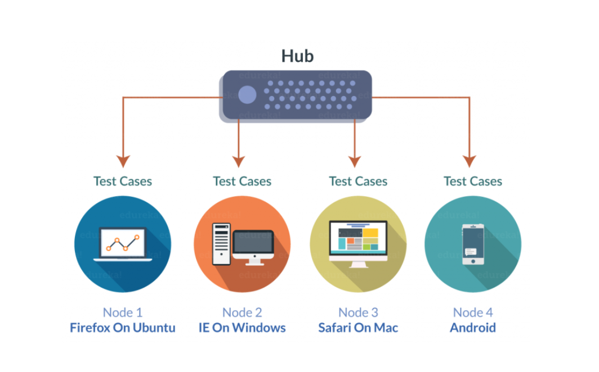
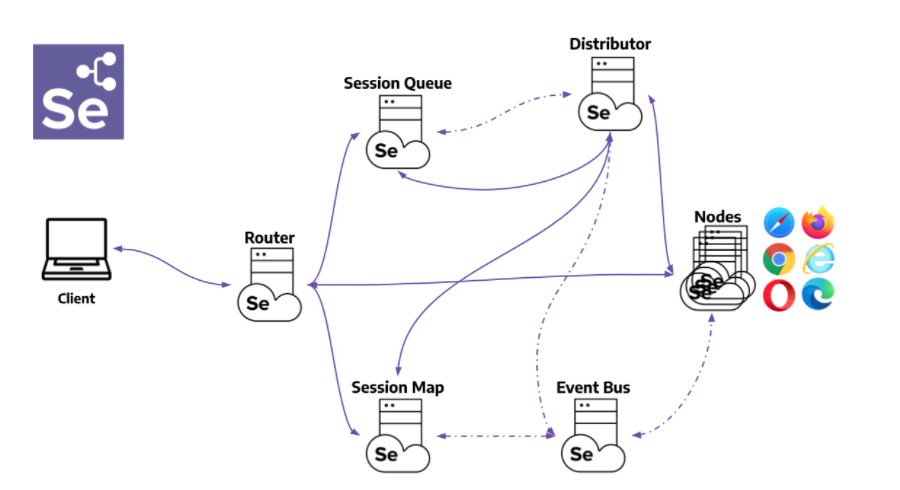

# Ejemplo-02 # Qué es Selenium Grid y su Arquitectura

## Objetivo

* Identificar el uso de Selenium Grid y cuando es requerida su implementación.
* Identificar la arquitectura de Selenium Grid.

## Desarrollo

Selenium Grid es un aherramienta que forma parte de la suite de Selenium, y permite la `ejecución de scripts de WebDriver en máquinas remotas (virtuales o reales)` mediante el `enrutamiento` de comandos enviados por el cliente a `instancias de navegador remotas`. 

Su objetivo es proporcionar una manera fácil de ejecutar `pruebas en paralelo` en varias máquinas.

De igual forma nos permite ejecutar pruebas en paralelo en varias máquinas y administrar `diferentes versiones y configuraciones del navegador de forma centralizada` (en lugar de en cada prueba individual).

#### Propósitos y funcionalidades principales:
- Punto de entrada central para todas las pruebas.
- Gestión y control de los nodos/entorno donde se ejecutan los navegadores.
- Escalada de pruebas..
- Ejecución de pruebas en paralelo.
- Pruebas multiplataforma.
- Balanceo de carga.

#### ¿Cuándo usar Selenium Grid?

En términos generales, hay dos razones por las que podría querer usar Grid.

1. Para ejecutar sus pruebas en `múltiples navegadores, múltiples versiones del navegador y navegadores que se ejecutan en diferentes sistemas operativos`.
2. Para `reducir el tiempo` que tarda el conjunto de pruebas en completar un pase de prueba.

Selenium Grid se utiliza para `acelerar la ejecución de un caso de prueba mediante el uso de varias máquinas` para ejecutar `pruebas en paralelo`. 

> `Por ejemplo:` si tiene un conjunto de 100 pruebas, pero configura Grid para admitir 4 máquinas diferentes (VM o máquinas físicas separadas) para ejecutar esas pruebas, su conjunto de pruebas se completará en (aproximadamente) una cuarta parte del tiempo que tarda si se ejecutan las pruebas secuencialmente en una sola máquina. 

Para conjuntos de pruebas grandes y conjuntos de pruebas de ejecución prolongada, como los que realizan grandes cantidades de validación de datos, esto puede suponer un importante ahorro de tiempo. Algunos conjuntos de pruebas pueden tardar horas en ejecutarse. 

Otra razón para aumentar el tiempo dedicado a ejecutar la suite es `acortar el tiempo de respuesta` de los resultados de las pruebas.

Selenium Grid también se utiliza para admitir la `ejecución de pruebas en varios entornos de tiempo de ejecución`, específicamente, en diferentes navegadores al mismo tiempo. 

> `Por ejemplo:` se puede configurar un "Grid" de máquinas virtuales, cada una de las cuales admite un navegador diferente que debe admitir la aplicación que se va a probar. Entonces:

- __Máquina 1:__ tiene Internet Explorer 8.
- __Máquina 2:__ tiene Internet Explorer 9.
- __Máquina 3:__ tiene el Chrome más reciente.
- __Máquina 4:__ tiene el Firefox más reciente. 

Cuando se ejecuta el conjunto de pruebas, Selenium Grid recibe cada combinación de navegador de prueba y asigna cada prueba para que se ejecute en su navegador requerido.

Una configuración como esta proporciona una ejecución paralela para completar rápidamente el plan de pruebas y soporte para múltiples tipos de navegador y versiones simultáneamente.

#### Arquitectura de Selenium Grid 4

Selenium Grid 2  constaba de dos procesos: `Hub y Nodes`. Pero actualmente la versión de Selenium 4 admite más procesos distintos, aca explicaremos cada uno de ellos:

+ `Enrutador (Router)`: El enrutador se encarga de `reenviar la solicitud` al componente correcto. Es el punto de entrada del Grid, todas las solicitudes externas serán recibidas por él. 

    Se comporta de manera diferente según la solicitud: 

    - Si se trata de una solicitud de sesión nueva, el enrutador la agregará a la `cola de sesión nueva`. 
    - El Distribuidor comprueba regularmente si hay un espacio libre. Si es así, la primera solicitud coincidente se elimina de la `cola de sesión nueva`. recibirá el evento y sondeará la `cola de sesión nueva` para obtener la nueva solicitud de sesión. 
    - Si la solicitud pertenece a una `sesión existente`, el enrutador enviará la identificación de la sesión al `mapa de sesión`, y el mapa de sesión devolverá el nodo donde se está ejecutando la sesión. 
    - Después de esto, el enrutador reenviará la solicitud al nodo.

    El Router tiene como objetivo `equilibrar la carga` en el Grid enviando las solicitudes al componente que puede manejarlas mejor, sin sobrecargar ningún componente que no sea necesario en el proceso.

+ `Distribuidor (Distributor)`: El Distribuidor conoce todos los Nodos y sus capacidades. Su función principal es `recibir una nueva solicitud de sesión y encontrar un Nodo adecuado donde se pueda crear la sesión`. Luego de creada la sesión, el Distribuidor almacena en el Mapa de Sesión la relación entre el id de la sesión y el Nodo donde se está ejecutando la sesión.

+ `Mapa de sesión (Session Mapp)`: es un `almacén de datos` que guarda la información de la identificación de la sesión y el nodo donde se ejecuta la sesión. Sirve como `soporte para el Enrutador` en el proceso de reenvío de una solicitud al Nodo. El enrutador le pedirá al mapa de sesión el nodo asociado a una identificación de sesión.

+ `Nodo (Node)`: Un nodo puede estar presente varias veces en un Grid. Cada Nodo se encarga de `gestionar los slots para los navegadores disponibles` de la máquina donde se está ejecutando. El Nodo se registra en el Distribuidor a través del `Event Bus`, y su configuración se envía como parte del mensaje de registro.

    De forma predeterminada, el Nodo `registra automáticamente todos los controladores` de navegador disponibles en la ruta de la máquina donde se ejecuta. También crea una ranura por CPU disponible para navegadores basados ​​en Chromium y Firefox. Para Safari e Internet Explorer, solo se crea una ranura. 

    > __¡Cuidado!:__ Un Nodo solo ejecuta los comandos recibidos, no evalúa, juzga ni controla nada. Las máquinas en las que se ejecuta el Nodo no necesitan tener el mismo sistema operativo que los demás componentes. Por ejemplo, un nodo de Windows podría tener la capacidad de ofrecer Internet Explorer como una opción de navegador, mientras que esto no sería posible en Linux o Mac.

+ `Bus de eventos (Event Bus)`: sirve como `ruta de comunicación entre los nodos`, el distribuidor, la cola de nueva sesión y el mapa de sesión. Grid realiza la mayor parte de su `comunicación interna a través de mensajes`, evitando costosas llamadas HTTP. Al iniciar Grid en su modo totalmente distribuido, `es el primer componente que debe iniciarse`.

+ `Cola de nueva sesión (Session Queue)`: contiene todas las solicitudes de nueva sesión en un orden `FIFO (First In, First Out = Primero en entrar, primero en salir)`. Tiene parámetros configurables para establecer el `tiempo de espera de la solicitud` y el intervalo de reintento de la solicitud.

    - El enrutador agrega la solicitud de nueva sesión a la cola de nueva sesión y espera la respuesta. 
    - La Cola de Nueva Sesión verifica regularmente si alguna solicitud en la cola ha expirado, si es así, la solicitud es rechazada y eliminada inmediatamente.
    - El Distribuidor verifica regularmente si hay un espacio disponible. Si es así, el distribuidor solicita la cola de nueva sesión para la primera solicitud coincidente. 
    - A continuación, el distribuidor intenta crear una nueva sesión.
    - Una vez que las capacidades solicitadas coinciden con las capacidades de cualquiera de los espacios de Nodo libres, el Distribuidor intenta obtener el espacio disponible. 
        - Si todos los espacios están ocupados, el Distribuidor le pedirá a la cola que agregue la solicitud al frente de la cola. 
        - Si la solicitud se agota mientras se vuelve a intentar o se agrega al principio de la cola, se rechaza.
    - Una vez que se crea una sesión correctamente, el distribuidor envía la información de la sesión a la cola de nueva sesión. 
    - La Cola de Nueva Sesión devuelve la respuesta al cliente.
