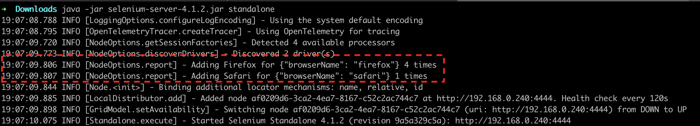
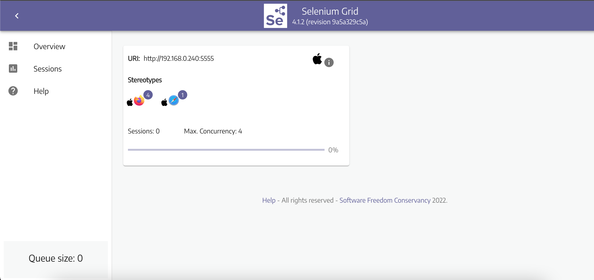
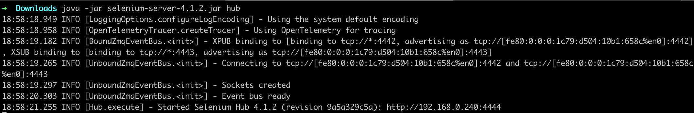
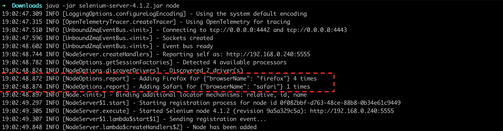
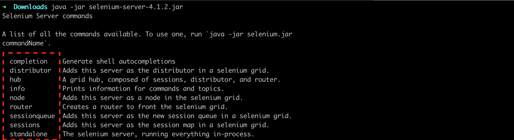

# Ejemplo-03# - Instalación y configuración de Selenium Grid 4

## Objetivo

* Demostrar el proceso de instalación y configuración de Selenium Grid.

## Desarrollo

#### Roles Selenium Grid

Los roles de Selenium Grid depende de las necesidades que se tengan de los componentes que ofrece Selenium Grid, ya que se puede iniciar cada uno de ellos por separado o varios al mismo. Veremos los 3 roles que ofrece Selenium Grid 4:

`STANDALONE` 

Es la unión de todos los componentes y, a los ojos del usuario, se ejecutan como uno solo. Un Grid de uno completamente funcional está disponible después de iniciarlo en el modo `Independiente (independiente)`. De forma predeterminada, el servidor escuchará en http://localhost:4444, y esa es la URL a la que debe apuntar las pruebas de `RemoteWebDriver`. 

Para iniciar el `standalone` se utilizar el siguiente comando en la terminal de la maquina: `java -jar selenium-server-<version>.jar standalone` ejemplo: `java -jar selenium-server-4.1.2.jar standalone`



Al ir a la pagina: http://localhost:4444/ui/index.html#/ veremos lo siguiente:



> `Pro-tip:` Este es el modo más fácil de hacer girar un Selenium Grid. 

`HUB & NODE(s)` 

Habilita la configuración clásica de Hub y Node(s). Estos roles son adecuados para Grids pequeños y medianos. Al igual que el rol de `standalone`, dee forma predeterminada el servidor escuchará en http://localhost:4444, y esa es la URL a la que debe apuntar slasus pruebas de `RemoteWebDriver`.

- Un `Hub` es la unión de los siguientes componentes:
    - Enrutador (Router)
    - Distribuidor
    - Mapa de sesión (Session Map)
    - Cola de nueva sesión (New Session Queue)
    - Autobús de eventos (Event Bus)

Para iniciar el `Hub` se utilizar el siguiente comando en la terminal de la maquina: `java -jar selenium-server-<version>.jar hub` ejemplo: `java -jar selenium-server-4.1.2.jar hub`




- Se pueden iniciar `uno o más Nodos (Node)` en esta configuración, y el servidor detectará los controladores disponibles que puede usar desde la ruta del sistema.

Para iniciar el `Node` se utilizar el siguiente comando en la terminal de la maquina: `java -jar selenium-server-<version>.jar node` ejemplo: `java -jar selenium-server-4.1.2.jar node`



Al ir a la pagina: http://localhost:4444/ui/index.html#/ veremos lo siguiente:


`DISTRIBUTED (Distribuido)` 

En el modo Distribuido, cada componente debe iniciarse por sí solo. Esta configuración es más adecuada para Grids grandes.



Aca estan todos los componentes que deben iniciarse en el rol de distribuido:

- `Autobús de eventos (Event Bus):` utilizar el siguiente comando en la terminal de la maquina: `java -jar selenium-server-<version>.jar event-bus` ejemplo: `java -jar selenium-server-4.1.2.jar event-bus`

- `Mapa de sesión (Session Map):` utilizar el siguiente comando en la terminal de la maquina: `java -jar selenium-server-<version>.jar  sessions` ejemplo: `java -jar selenium-server-4.1.2.jar sessions`

- `Cola de nueva sesión (New Session Queue):` utilizar el siguiente comando en la terminal de la maquina: `java -jar selenium-server-<version>.jar  sessionqueue` ejemplo: `java -jar selenium-server-4.1.2.jar sessionqueue`

- `Distribuidor (Distributor):` utilizar el siguiente comando en la terminal de la maquina: `java -jar selenium-server-<version>.jar distributor --sessions http://localhost:5556 --sessionqueue http://localhost:5559 --bind-bus false` ejemplo: `java -jar selenium-server-4.1.2.jar distributor --sessions http://localhost:5556 --sessionqueue http://localhost:5559 --bind-bus false`

- `Enrutador (Router):` utilizar el siguiente comando en la terminal de la maquina: `java -jar selenium-server-<version>.jar router --sessions http://localhost:5556 --distributor http://localhost:5553 --sessionqueue http://localhost:5559` ejemplo: `java -jar selenium-server-4.1.2jar router --sessions http://localhost:5556 --distributor http://localhost:5553 --sessionqueue http://localhost:5559`

- `Nodo (Node):` utilizar el siguiente comando en la terminal de la maquina: `java -jar selenium-server-<version>.jar node` ejemplo: `java -jar selenium-server-4.1.2.jar node`


> El orden de inicio de los componentes no es importante, siempre que se inicien todos correctamente.


Para efectos de esta sesión utilizaremos el rol de  `STANDALONE`


#### Proceso de Instalación y configuración

1. Descarga de Selenium Grid 4: La descarga de Selenium Grid se realiza desde el siguiente enlace:
https://github.com/SeleniumHQ/selenium/releases/download/selenium-4.1.0/selenium-server-4.1.2.jar

> `Pro-Tip:` crea una nueva carpeta en el escritorio o en una ruta de tu maquina que sea de fácil ubicación, y traslada el archivo selenium-server-4.1.2.jar

> `Pro-tip:` pueden enviar el comando --help al final para obtener información de configuración específica del componente. Ejemplo: `java -jar selenium-server-4.1.2.jar standalone --help`

2. Iniciar Standalone: Para iniciar el `standalone` se utilizar el siguiente comando en la terminal de la maquina: `java -jar selenium-server-<version>.jar standalone` ejemplo: `java -jar selenium-server-4.1.2.jar standalone`


Al ir a la pagina: http://localhost:4444/ui/index.html#/ veremos lo siguiente:


#### Información de nodos

Por defecto Selenium crea una cantidad limitada de navegadores dependiendo del Sistema operativo:


Es posible cambiar esta y otras configuraciones del navegador configurando nodos por medio del envío de parámetros a cada uno de los modificadores del navegador que representan un nodo. Para esto utilizaremos un archivo .JSON para parametrizar cuandos nodos queremos y de que navegadores.

Copia este contenido y guardalo con el siguiente nombre y extensión en la misma ruta donde esta  el selenium-server -> `nodeConfig.json`

```Json
{
  "capabilities":
  [
    {
      "browserName": "chrome",
      "platform": "MAC",
      "maxInstances": 5,
      "seleniumProtocol": "WebDriver",
      "webdriver.chrome.driver": "/Users/eclipse-workspace-bedu/BeduWebAutomationCourse/src/test/resources/webdrivers/chromedriver",
      "binary":"/Applications/chrome.exe"
    },
    {
      "browserName": "firefox",
      "platform": "MAC",
      "maxInstances": 5,
      "seleniumProtocol": "WebDriver",
      "webdriver.gecko.driver": "/Users/eclipse-workspace-bedu/BeduWebAutomationCourse/src/test/resources/webdrivers/geckodriver",
      "binary":"/Applications/firefox.exe"
    }
  ],
  "proxy": "org.openqa.grid.selenium.proxy.DefaultRemoteProxy",
  "maxSession": 5,
  "port": 5555,
  "register": true,
  "registerCycle": 5000,
  "hub": "http://localhost:4444",
  "nodeStatusCheckTimeout": 5000,
  "nodePolling": 5000,
  "role": "node",
  "unregisterIfStillDownAfter": 60000,
  "downPollingLimit": 2,
  "debug": false,
  "servlets" : [],
  "withoutServlets": [],
  "custom": {}
}
```
__¡Cuidado!:__ el campo `webdriver.gecko.driver`debe conetner la ruta donde se encuentra el driver del navegador, y el campo `binary` la ruta donde se encuentra el ejecutable del navegador.

Ahora iniciamos el standalone con el siguiente comando: `java -jar selenium-server-4.1.2.jar standalone --config nodeConfig.json`
