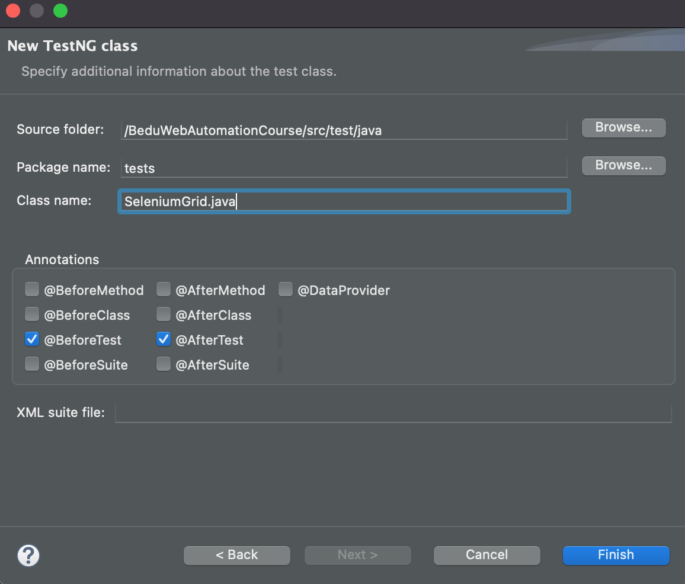
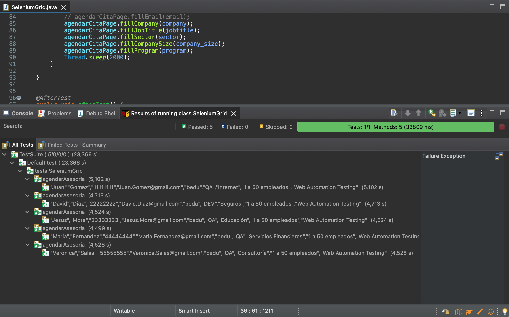
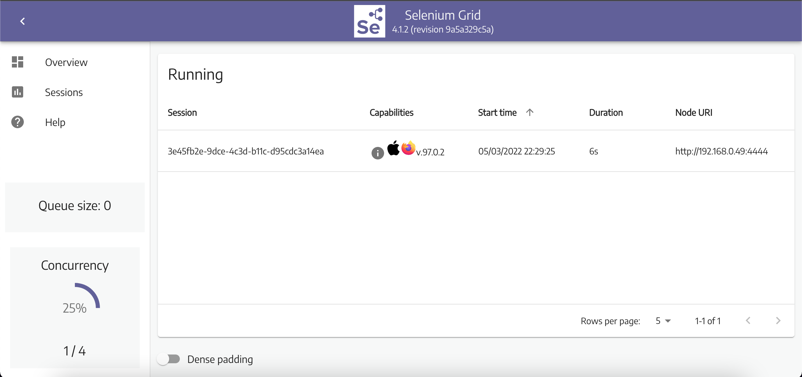
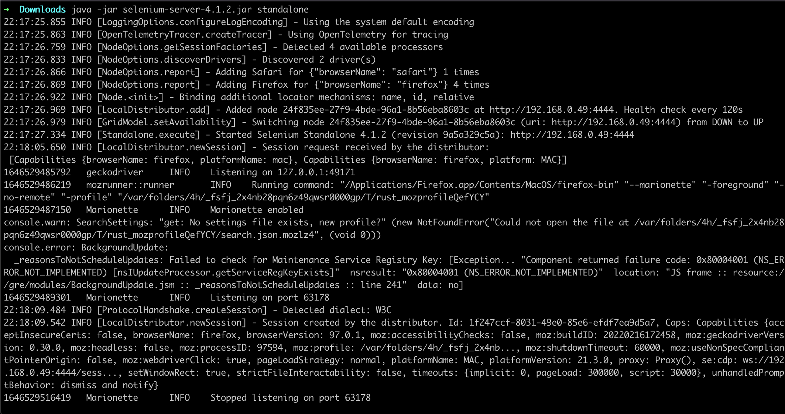

# Ejemplo-04# - Diseño y ejecución de scripts con selenium Grid 4

## Objetivo

* Construir nuevos scripts de pruebas automatizados donde se implemente la ejecución en máquinas remotas con Selenium Grid.

## Desarrollo

Una vez iniciado el `standalone`, para diseñar scripts de prueba que se ejecutarán, necesitamos usar los objetos `DesiredCapabilites` y `RemoteWebDriver`.

- `DesiredCapabilites`: se utiliza para configurar el tipo de navegador y sistema operativo que automatizaremos.

> Documentación Oficial de la clase DesiredCapabilities: https://www.selenium.dev/selenium/docs/api/java/org/openqa/selenium/remote/DesiredCapabilities.html

- `RemoteWebDriver`: se usa para establecer en qué nodo (o máquina) se ejecutará nuestra prueba.
> Documentación Oficial de la clase RemoteWebDriver: https://www.selenium.dev/selenium/docs/api/java/org/openqa/selenium/remote/RemoteWebDriver.html


Vamos a un ejemplo práctico de ejecución en el navegador firefox de forma remota con Selenium Grid en la funcionalidad de agendar asesoria de la web de BEDU


1. Creamos la clase `SeleniumGrid.java`



2. Importamos las librerias necesarias para la implementación de los objetos  `DesiredCapabilities` y `RemoteWebDriver` 

```Java
import org.openqa.selenium.remote.DesiredCapabilities;
import org.openqa.selenium.remote.RemoteWebDriver;
import org.openqa.selenium.Platform;
import org.openqa.selenium.WebDriver;
```

3. Creamos el objeto `WebDriver` y las variables que utilizaremos para indicarle la pàgina que vamos a testear y la URL del nodo donde queremos ejecutar los scripts de pruebas automatizados.

```Java
	// Creamos los objetos
	private WebDriver driver;
	private HomePage homePage;
	private AgendarCitaPage agendarCitaPage;
	
	//Declaramos los string para guardar las url de la web y el servidor donde ejecutaremos las pruebas
	String baseURL = "https://bedu.org/";
	String nodeURL = "http://localhost:4444/";
```
4. Creamos el mètodo `beforeTest()` donde:

```Java
	@BeforeTest
	public void beforeTest() throws MalformedURLException{
		//Seteamos la propiedad del sistema para firefox
		System.setProperty("webdriver.gecko.driver", "src/test/resources/webdrivers/geckodriver");
		//creamos el objeto DesiredCapabilities
		DesiredCapabilities capability = new DesiredCapabilities();
		// le configuramos el navegador y la plataforma
		capability.setBrowserName("firefox");
		capability.setPlatform(Platform.MAC);
		// asignamos el RemoteWebDriver enviadole el objeto capability y la nodeURL
		driver = new RemoteWebDriver(new URL(nodeURL), capability);

	}

```
5. Ahora solo tendremos que realizar las pruebas bajo la anotación `@Test` y `@AfterTest` quedando el còdigo de la siguiente manera: 

```Java
package tests;

import org.testng.annotations.AfterSuite;
import org.testng.annotations.AfterTest;
import org.testng.annotations.BeforeMethod;
import org.testng.annotations.BeforeSuite;
import org.testng.annotations.BeforeTest;
import org.testng.annotations.Test;

import pages.AgendarCitaPage;
import pages.HomePage;

import org.openqa.selenium.remote.DesiredCapabilities;
import org.openqa.selenium.remote.RemoteWebDriver;
import org.openqa.selenium.Platform;
import org.openqa.selenium.WebDriver;

import java.net.MalformedURLException;
import java.net.URL;

public class SeleniumGrid {

	// Creamos los objetos
	private WebDriver driver;
	private HomePage homePage;
	private AgendarCitaPage agendarCitaPage;
	
	//Declaramos los string para guardar las url de la web y el servidor donde ejecutaremos las pruebas
	String baseURL = "https://bedu.org/";
	String nodeURL = "http://localhost:4444/";
	
	@BeforeSuite
	public void beforeSuite() {
		System.out.println("---------------------------------------------------------------------------------");
		System.out.println("-------   INICIO DE LA EJECUCIÓN DE PRUEBAS CON FIREFOX DE FORMA REMOTA ---------");
		System.out.println("---------------------------------------------------------------------------------");
		}
	
	

	@BeforeTest
	public void beforeTest() throws MalformedURLException{

		System.setProperty("webdriver.gecko.driver", "src/test/resources/webdrivers/geckodriver");
		DesiredCapabilities capability = new DesiredCapabilities();
		capability.setBrowserName("firefox");
		capability.setPlatform(Platform.MAC);
		driver = new RemoteWebDriver(new URL(nodeURL), capability);

	}

	@BeforeMethod
	public void beforeMethod() throws InterruptedException {
		driver.manage().window().maximize();
		driver.get(baseURL);
	}


	@Test(dataProvider = "MySQL_dataprovider", dataProviderClass = data_provider.class)
	public void agendarAsesoria(String name, String lastname, String phone, String email, String company,
			String jobtitle, String sector, String company_size, String program) throws InterruptedException {

		homePage = new HomePage(driver);
		// Validamos que el boton de agendar asesoria este disponible
		if (homePage.isButtonDisplayed()) {
			// Clck en boton de agendar asesoria
			try {
				homePage.clickButton();
			} catch (InterruptedException e) {
				e.printStackTrace();
			}
		}

		agendarCitaPage = new AgendarCitaPage(driver);

		if (agendarCitaPage.btn_CancelIsDispayed()) {

			agendarCitaPage.fillName(name);
			agendarCitaPage.fillLastname(lastname);
			agendarCitaPage.fillPhone(phone);
			// agendarCitaPage.fillEmail(email);
			agendarCitaPage.fillCompany(company);
			agendarCitaPage.fillJobTitle(jobtitle);
			agendarCitaPage.fillSector(sector);
			agendarCitaPage.fillCompanySize(company_size);
			agendarCitaPage.fillProgram(program);
			Thread.sleep(2000);
		}

	}
	

	@AfterTest
	public void afterTest() {
		
		//si el driver existe lo cierra
		if (driver != null) {
			driver.quit();
		}	
	}
	
	
	@AfterSuite
	public void afterSuite() {
		System.out.println("---------------------------------------------------------------------------------");
		System.out.println("---------------     FIN DE LA EJECUCIÓN DE LA SUITE     -------------------------");
		System.out.println("---------------------------------------------------------------------------------");
	}

}

```

6. Ejecutamos la clase con las pruebas:


7. Si visualizamos la siguiente url mientras se ejecuta el script: http://localhost:4444/ui/index.html#/sessions podremos ver el estado de la sesion.



8. Si vemos en la terminal podemos visualizar los logs que dejo la ejecución:


