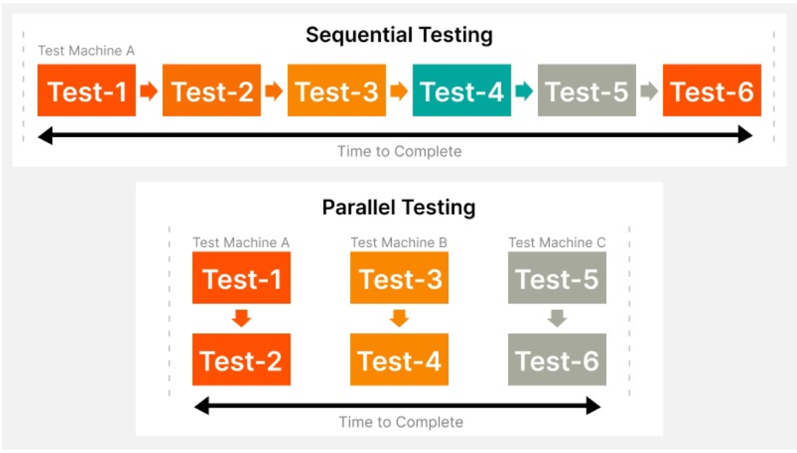
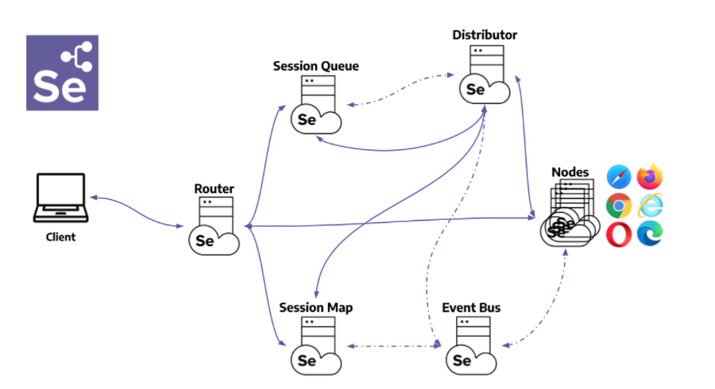
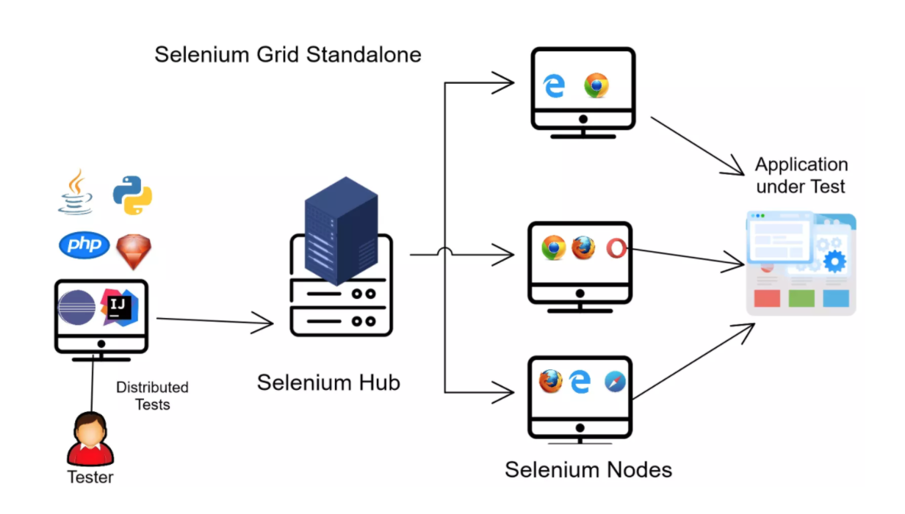

## Sesión 6: Selenium Grid 🤖

### 1. Objetivos :dart: 

- Implementar scripts de pruebas automatizados que puedan ser ejecutados en múltiples navegadores como una solución de amplitud de cobertura de pruebas automatizadas.
- Demostrar el proceso de instalación y configuración de Selenium Grid.
- Hacer uso de scripts de pruebas automatizados donde se implemente la ejecución en máquinas remotas con Selenium Grid 4.

### 2. Contenido :blue_book:

En los tiempos de ahora para nadie es un secreto que la presencia de la tecnología es tal que se consume cada día más, y muchas veces nos percatamos de que se encuentra en un bucle infinito de renovación; en el que hardware y software van de la mano en este cambio. 

Los teléfonos se renuevan prácticamente todos los años, lo mismo pasa con los sistemas operativos, aplicaciones, medios digitales y más. Es por esto que desde el punto de vista de un ingeniero de pruebas, vemos aún con más impacto ese constante este cambio. Surgiendo así la necesidad de actualizarnos día a día para que lo que funcionaba antes siga funcionando.                               			

En esta sesión veremos todo lo relacionado a la `ejecución de pruebas en múltiples navegadores y plataformas con Selenium Grid`, lo que se convertirá en un aliado excelente para mitigar el impacto de estos cambios constantes.

---
#### <ins>Tema 1: Ejecución de pruebas en Múltiples Navegadores (cross browser testing)</ins> 

Como ya sabemos, el probar manualmente un sitio web en varios navegadores es excepcionalmente tedioso. Considera una situación en la que 100 casos de prueba deben ejecutarse manualmente. Ahora imagina que las mismas pruebas deben ejecutarse en cinco navegadores diferentes. El tiempo necesario se vuelve exponencialmente más largo. Sin embargo, si estas pruebas se automatizan con Selenium, se pueden ejecutar simultáneamente y en mucho menos tiempo. 

- [**`EJEMPLO 1 - Ejecución de pruebas en Múltiples Navegadores (cross browser testing)`**](./Ejemplo-01)
- [**`RETO 1`**](./Reto-01)

---
#### <ins>Tema 2: Qué es Selenium Grid y su Arquitectura</ins>

Selenium Grid es un aherramienta que forma parte de la suite de Selenium, y permite la ejecución de scripts de WebDriver en `máquinas remotas (virtuales o reales)` mediante el enrutamiento de comandos enviados por el cliente a instancias de navegador remotas. Su objetivo es proporcionar una manera fácil de ejecutar pruebas en paralelo en varias máquinas.

- [**`EJEMPLO 2 - Qué es Selenium Grid y su Arquitectura`**](./Ejemplo-02)

---
#### <ins>Tema 3: Instalación y configuración de Selenium Grid 4 </ins>  

En este tema veremos el proceso de instalación, configuración y ejecución de `Selenium Grid 4` con el uso del rol `standalone`.

- [**`EJEMPLO 3 - Instalación y configuración de Selenium Grid 4`**](./Ejemplo-03)

---
#### <ins>Tema 4: Diseño y ejecución de scripts con selenium Grid 4</ins> 

Para diseñar scripts de prueba que se ejecutarán, necesitamos usar los objetos `DesiredCapabilites` y `RemoteWebDriver`.

Esto permitira que un script de pruebas automatizados de pruebas que se ha creado en la `Máquina A` ejecutado en la `Máquina B`.

- [**`EJEMPLO 4 - Diseño y ejecución de scripts con selenium Grid 4`**](./Ejemplo-04)
- [**`RETO 2`**](./Reto-02)
---

### 3. Postwork :memo:

Encuentra las indicaciones y consejos para reflejar los avances de tu proyecto de este módulo.

- [**`POSTWORK SESIÓN 6`**](./Postwork/)

 

