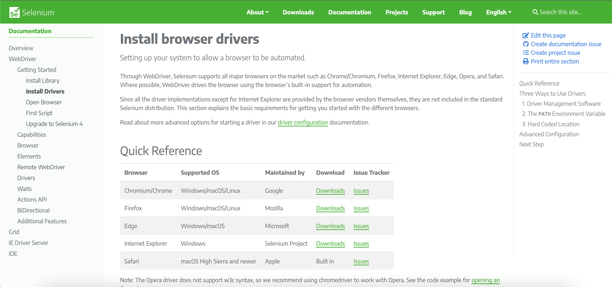

# Reto 1# - Parametría para Pruebas en Múltiples Navegadores.

## Objetivo

* Implementar la parametría de los webdrivers en en archivo `testng.xml`.

## Desarrollo

Incluir en el archivo `testng.xml` una caso de prueba adicional para incorporar otro navegador. Recuerda que en la página oficial de Selenium podras conseguir los links de los drivers para los distintos navegadores web: https://www.selenium.dev/documentation/webdriver/getting_started/install_drivers/

Una vez agregado el otro explorador, ejecuta los casos de prueba desarrollados en el [**`EJEMPLO 1 - Ejecución de pruebas en Múltiples Navegadores (cross browser testing)`**](./Ejemplo-01) y valida que funcionen correctamente en los 3 exploradores.



<details>
  <summary> Solución </summary>

```xml
<?xml version="1.0" encoding="UTF-8"?>
<!DOCTYPE suite SYSTEM "https://testng.org/testng-1.0.dtd">
<suite name="TestSuite">
	<test name="ChromeTest">
		<parameter name="browser" value="Chrome" />
		<parameter name="driver_name" value="webdriver.chrome.driver" />
		<parameter name="driver_path" value="src/test/resources/webdrivers/chromedriver" />
		<classes>
			<class name="tests.CrossBrowserTestingScript"></class>
		</classes>
	</test>
	<test name="FirefoxTest">
		<parameter name="browser" value="Firefox" />
		<parameter name="driver_name" value="webdriver.gecko.driver" />
		<parameter name="driver_path" value="src/test/resources/webdrivers/geckodriver" />
		<classes>
			<class name="tests.CrossBrowserTestingScript"></class>
		</classes>
	</test>
	<test name="EdgeTest">
		<parameter name="browser" value="Edge" />
		<parameter name="driver_name" value="webdriver.edge.driver" />
		<parameter name="driver_path" value="src/test/resources/webdrivers/EdgeDriver" />
		<classes>
			<class name="tests.CrossBrowserTestingScript"></class>
		</classes>
	</test>
</suite>
```
</details> 

