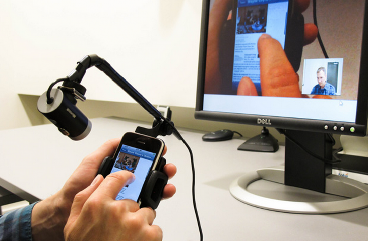
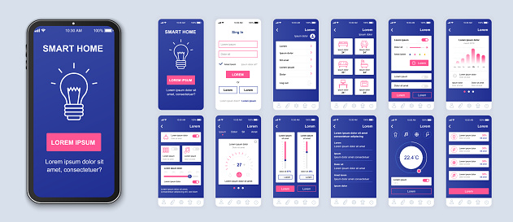
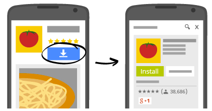
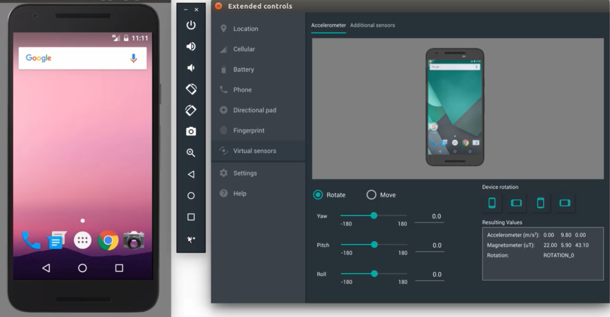

# Ejemplo-01 # - Introducción al Mobile Automation Testing

## Objetivo

- Analizar el concepto de Mobile Automation Testing y como es su implementación en la actualidad.

## Desarrollo

Cada día las personas utilizan más `teléfonos inteligentes de alta gama` basados en sistemas operativos móviles modernos que ofrecen una excelente conectividad y una computación avanzada gracias a sus procesadores, altas resoluciones en sus pantallas táctiles, sus avanzados sensores, GPS, acceso por medio de Wi-Fi, datos de alta velocidad, entre otras características; todo ello se ha visto reflejado en el `aumento del uso de las aplicaciones móviles`. Estas pueden considerarse como `software desarrollado para ser ejecutado en dispositivos como tabletas, teléfonos o relojes inteligentes que poseen un sistema operativo apto para ello`.

En los últimos años, la tecnología de internet móvil ha penetrado todos los mercados de las industrias, lo cual ha ocasionado que la seguridad de las aplicaciones se está volviendo cada vez más importante, por lo tanto, los `testers deben encontrar nuevas formas de revisar y probar los contenidos`, de manera que se puedan depurar las aplicaciones antes de salir al mercado, con el fin de evitar errores. 

Sin embargo, aprender a realizar pruebas a software no es tan simple como parece,a veces, el  éxito de la realización de las pruebas de software obedece a las `habilidades`, `conocimientos`, `intuición` y `experiencia` de las personas que conforman el equipo de pruebas.

Ahora bien, para un probador o ingeniero de pruebas de software siempre existirán unas actividades primordiales y esenciales que no cambiarán, como lo son: 

    - Planear la estrategia, 
    - Diseñar casos de prueba
    - Ejecutar los casos de prueba diseñados, observar y analizar los resultados. 
    
A estas se suman otras actividades: `métodos modernos`, las `pruebas exploratorias`, la `verificación en tiempo de ejecución`, lo cual incluye el conocimiento en temas como la `automatización` y la administración del tiempo de prueba, en la lista de tareas del probador.

Las pruebas en aplicaciones móviles, como cualquier otro tipo de pruebas de software, `se basan en la verificación y validación de las métricas priorizadas de acuerdo con la experiencia del usuario, la población a la cual va dirigida, el tipo de aplicación móvil, el tipo de dispositivo, la plataforma tecnológica empleada para su desarrollo y ejecución`; que el probador establece a través del plan de pruebas y el diseño de casos de prueba, para los cuales debe aplicar técnicas de estimación y diseños (caja negra y caja blanca). 

Para la ejecución, el probador puede utilizar herramientas de automatización, como `Appium`, para lograr mayor cobertura y velocidad de la prueba. Durante esta etapa debe evaluar los resultados, así como reportar las situaciones que no están acordes con lo esperado. Finalmente debe realizar la gestión de su prueba, con el objeto de no incurrir en pérdidas por la no ejecución de casos, la no inclusión de características prioritarias o el desplazamiento de las fechas de entrega por las desviaciones encontradas.

#### :round_pushpin: ¿Por qué son necesarias las pruebas móviles?

Básicamente, se requieren pruebas móviles para garantizar que un sitio web o una aplicación funcionen perfectamente, sin importar las circunstancias. Cuando se trata de dispositivos móviles, estas circunstancias pueden referirse a:

- Amplia gama de diferentes dispositivos móviles con diferentes tamaños de pantalla, resoluciones y - configuraciones de hardware
- Diferentes sistemas operativos móviles como iOS, Android y Windows
- Diferentes versiones de cada sistema operativo como iOS 5.x, iOS 6.x, etc.
- Diferentes operadores de redes móviles, así como niveles de conectividad de red.
- Eventos como llamadas entrantes, mensajes, batería baja, etc.
- Actualizaciones frecuentes del sistema operativo, así como del sitio web o la aplicación en sí. Ambos tienen que ser navegados para que no haya interrupción en la funcionalidad.

#### :round_pushpin: Tipos de pruebas móviles

Al momento de definir la `estrategia` y `plan de pruebas` de aplicaciones para celular, es importante considerar el medio en el que se están ejecutando estas pruebas, la red de telecomunicaciones móviles.

Tanto los dispositivos móviles como la red por donde viajan los datos presentan particularidades en su funcionamiento que pueden afectar la ejecución de la nueva aplicación, por lo cual deben considerarse pruebas especiales para dicho medio.

Aca se presnetan distintos tipos de pruebas de aplicaciones para celular que puedes considerar en tu estrategia de pruebas:

- `Pruebas de usabilidad`: se utilizan para garantizar que el sitio web o la aplicación sean fáciles de usar desde la perspectiva de los usuarios finales en un dispositivo móvil.

     

- `Pruebas de compatibilidad`: se utilizan para garantizar que un sitio web o una aplicación funcionen perfectamente en diferentes dispositivos, navegadores, tamaños de pantalla y versiones del sistema operativo.

     

- `Prueba de interfaz`: se utiliza para garantizar que los elementos de la interfaz (opciones de menú, botones, configuraciones, elementos de navegación) funcionen exactamente como se esperaba

     

- `Pruebas de servicios`: se utiliza para garantizar que el software proporcione todos los servicios necesarios tanto en línea como fuera de línea.

     

- `Prueba de rendimiento`: se utiliza para garantizar que el software funcione bien en diferentes condiciones: baja conectividad, durante llamadas entrantes, batería baja, etc.

     

- `Pruebas de seguridad`: se utiliza para garantizar que el software protege la información del usuario en todas las circunstancias.

     

- `Pruebas de instalación`: esto se aplica principalmente a aplicaciones móviles, no a sitios web. Se utiliza para garantizar que la aplicación se instale correctamente en un dispositivo.

     

#### :round_pushpin: Herramientas de prueba móviles

Las herramientas de prueba móviles que se enumeran a continuación se pueden usar para probar el comportamiento de los sitios web y las aplicaciones móviles.

- `Emuladores o simuladores`: un `emulador` es un software que imita el hardware y el software del dispositivo de destino en la computadora del tester. Un `simulador` es un software que ayuda a una computadora a ejecutar ciertos programas creados para un sistema operativo diferente. En su mayoría, están destinados a dispositivos iPhone y iPad, a diferencia de los dispositivos Android que se pueden emular fácilmente. Sin embargo, los emuladores y simuladores no son adecuados para probar aplicaciones móviles. Solo para enfatizar el punto, aquí hay una lista de cosas que uno puede probar en dispositivos reales pero no en emuladores y simuladores:

    - Batería baja, drenaje de la batería, apagado abrupto
    - Rendimiento de la aplicación durante las interrupciones entrantes, como llamadas o SMS
    - Calentamiento excesivo
    - Conflictos con otras aplicaciones preinstaladas
    - Geolocalización
    - Múltiples redes: Wifi, 3G, 4G, etc.
    - Densidad de la red
    - Características localizadas

     

- `Dispositivos reales`: no importa el sitio web o la aplicación, debe probarse en dispositivos reales. Dado que la fragmentación del dispositivo es una preocupación importante para todos los desarrolladores y testers, no se puede dejar el rendimiento del software al azar. Cada sitio web o aplicación tiene que funcionar a la perfección en múltiples combinaciones de dispositivos, navegadores y sistemas operativos. Con miles de dispositivos que se utilizan para acceder a Internet en todo el mundo, cada sitio web o aplicación debe optimizarse para diferentes configuraciones, ventanas gráficas y resoluciones de pantalla.

    Cuando se trata de pruebas móviles, los `dispositivos reales son insustituibles`. En caso de que los probadores no puedan acceder a un laboratorio interno de dispositivos reales, pueden elegir servicios de prueba basados ​​en la nube que ofrecen dispositivos, navegadores y sistemas operativos reales.

     

#### :round_pushpin: Tipos de aplicaciones móviles

Existen tres tipos de aplicaciones: 

1. `Nativas`: se crean específicamente para plataformas como tabletas y dispositivos móviles. 

    > Ejemplo: whatsapp, esta aplicación esta desarrollada dependiendo del sistema operativo.

2. `Híbridas`: esta es una mezcla de aplicaciones nativas y aplicaciones web. Las aplicaciones híbridas se ejecutan sin conexión o en dispositivos. Por lo general, se escriben con la ayuda de tecnologías CSS y HTML5. 

    > Ejemplo: instagram, esta aplicación funciona con HTML5, la aplicación viene con la capacidad de mantener tanto datos fuera de línea como medios enriquecidos adicionales; el mejor ejemplo son sus videos rápidos característicos.

3. `Web`: son aplicaciones del lado del servidor diseñadas para usarse en dispositivos móviles para permitirle obtener acceso a sitios web con el uso de navegadores como Firefox, Chrome, Explorer, etc. a través de la conexión a una red inalámbrica (como WIFI) o red móvil. 

    > Ejemplo: accesos directos a Safari en iOS o Google Chrome en Android.
    

     

A diferencia de las aplicaciones web (basadas en el navegador), `las aplicaciones nativas e híbridas están instaladas físicamente en el dispositivo` y, por lo tanto, siempre están disponibles para el usuario.

Dependiendo del tipo de aplicación, el tester establece qué tipos de casos debe incorporar. 
> Por ejemplo, para las aplicaciones nativas e híbridas es indispensable adicionar casos para revisar la instalación y desinstalación de la aplicación en el dispositivo.

#### :round_pushpin: Niveles de prueba de aplicaciones móviles

Para producir la más alta calidad, es importante realizar pruebas durante todo el proceso de desarrollo, comenzando con la fase de diseño y continuando con la entrega a la tienda de aplicaciones.

+ `Pruebas de diseño`: se prueba el diseño de la aplicación móvil para asegurarse de que la aplicación tenga la funcionalidad adecuada y la facilidad de uso para mantener a los usuarios interesados. Por ejemplo, el contenido debe responder al tamaño y la orientación del dispositivo para que los usuarios no tengan que desplazarse, y la aplicación debe responder adecuadamente a los controles táctiles. 

+ `Pruebas unitarias`: Los desarrolladores realizan pruebas unitarias en unidades individuales de código, antes de fusionar el nuevo código en la aplicación. El fundamento de las pruebas unitarias es reducir el costo de encontrar y corregir defectos, un costo que aumenta cuanto más tarde en el proceso de desarrollo se identifica un defecto. 

+ `Pruebas de integración`: en las pruebas de integración verifican que el nuevo código funcione correctamente cuando se integra en una aplicación. 

+ `Pruebas de aceptación`: Las pruebas de aceptación verifican que una aplicación móvil proporciona la funcionalidad, la facilidad de uso y el rendimiento para satisfacer las necesidades del usuario y que ofrezca una experiencia de usuario (UX) uniforme en todas las plataformas. Una parte importante de las pruebas de aceptación son las pruebas beta en dispositivos reales realizadas por usuarios finales reales. El Programa para desarrolladores de Apple ofrece la herramienta gratuita TestFlight para administrar las pruebas beta. Asimismo, Google Play Store cuenta con una consola para desarrolladores para pruebas beta con distribución a los probadores a través de Grupos de Google o comunidades de Google+. 

#### :round_pushpin: Casos propios de la tecnología móvil

Debido a las características de la `tecnología móvil`, se deben contemplar otras situaciones que pueden afectar el comportamiento funcional o transaccional de la aplicación. El tester, de acuerdo con la estrategia de prueba diseñada, puede evaluar las siguientes características para una aplicación:

- El proceso de instalación y desinstalación
- El control de errores que posee
- Cambios de red
- El comportamiento en escenarios multitarea
- Las visualizaciones en modo horizontal y vertical
- Pruebas en diferentes tipos de resoluciones y tamaños de pantalla
- Si se presenta integración con servidor, tener presente los diferentes escenarios de intercambio de información
- Comprobar si la aplicación afecta o es afectada por otras aplicaciones
- El comportamiento frente al uso de los controles propios del dispositivo
- Adicionar escenarios asociados a características propias de estos dispositivos como girar, agitar, realizar diferentes tipos de gestos táctiles sobre la pantalla
- Pruebas de interrupciones por mensajes, llamadas, conexión y desconexión de cables
- Comportamiento frente a los diferentes métodos de entrada incluyendo los sensores
- Pruebas de consumo de energía.

Estas son algunas de las situaciones que pueden ser contempladas desde el punto de vista del comportamiento móvil de la aplicación y que pueden afectar el funcionamiento de la misma en el dispositivo móvil.
