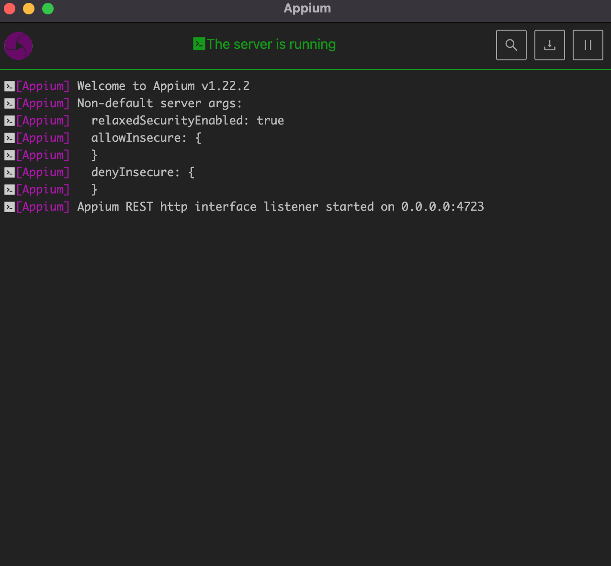

# Ejemplo-02 # - Appium

## Objetivo

- Hacer uso de los conceptos básicos de la herramienta para automatización mobile Appium y su arquitectura.

## Desarrollo

`Appium` es una herramienta de código abierto para automatizar aplicaciones nativas, web móviles e híbridas en plataformas móviles iOS, móviles Android y de escritorio Windows. 

 

Es importante destacar que Appium es `"multiplataforma"`, es decir, permite escribir pruebas contra múltiples plataformas (iOS, Android, Windows), utilizando la misma API. Esto permite la reutilización de código entre conjuntos de pruebas de iOS, Android y Windows.

#### :round_pushpin: Filosofía de Appium

Appium fue diseñado para satisfacer las necesidades de automatización móvil de acuerdo con una filosofía descrita por los siguientes cuatro principios:

1. No debería tener que volver a compilar su aplicación o modificarla de ninguna manera para automatizarla.
2. No debe estar encerrado en un idioma o marco específico para escribir y ejecutar sus pruebas.
3. Un marco de automatización móvil no debe reinventar la rueda cuando se trata de API de automatización.
4. Un marco de automatización móvil debe ser de código abierto, tanto en espíritu como en práctica, así como de nombre.


Pero ¿como se cumple con esta filosofia? miremos el diseño de appium para saberlo.

#### :round_pushpin: Diseño de Appium

1. `Cumplimos con el requisito n. ° 1:` mediante el uso de `marcos de automatización` proporcionados por el proveedor. De esta forma, no necesitamos compilar en su aplicación ningún código o framework específico o de terceros de Appium. Esto significa que estás probando la misma aplicación que estás enviando . Los marcos proporcionados por el proveedor que utilizamos son:

+ iOS 9.3 y superior: `XCUITest` de Apple
+ iOS 9.3 y versiones anteriores: `UIAutomation` de Apple
+ Android 4.2+: `UiAutomator / UiAutomator2` de Google
+ Android 2.3+: `Instrumentación de Google` . (El soporte de instrumentación se proporciona agrupando un proyecto por separado, Selendroid )
+ Windows: `WinAppDriver` de Microsoft

2. `Cumplimos con el requisito n. ° 2:` ajustando los marcos proporcionados por el proveedor en una API, la API de `WebDriver`. WebDriver (también conocido como `“Selenium WebDriver”`) especifica un protocolo cliente-servidor (conocido como el protocolo `JSON Wire Protocol`). Dada esta arquitectura cliente-servidor, un cliente escrito en cualquier idioma puede usarse para enviar las solicitudes HTTP apropiadas al servidor. Ya hay clientes escritos en todos los lenguajes de programación populares. Esto también significa que puede utilizar el corrector de prueba y el marco de prueba que desee; las bibliotecas cliente son simplemente clientes HTTP y se pueden mezclar en su código de la forma que desee. En otras palabras, los clientes de Appium & WebDriver no son técnicamente `“frameworks de prueba”`, son `“bibliotecas de automatización”`.

3. `Cumplimos con el requisito n. ° 3:` de la misma manera: `WebDriver` se ha convertido en el estándar de facto para la automatización de navegadores web, y es un borrador de trabajo del `W3C` . `¿Por qué hacer algo totalmente diferente para dispositivos móviles?` En cambio, hemos extendido el protocolo con métodos adicionales de API útiles para la automatización móvil.

4. `Cumplimos con el requisito n. ° 4:`porque Appium es de código abierto.


#### :round_pushpin: Conceptos de Appium

Appium es, en esencia, un `servidor web` que expone una API REST. Recibe conexiones de un cliente, escucha comandos, ejecuta estos comandos en un dispositivo móvil y responde con una respuesta HTTP que representa el resultado de la ejecución del comando.

+ `Sesión`: la automatización siempre se realiza en el contexto de una sesión. Los clientes inician una sesión con un servidor de formas específicas para cada biblioteca, pero todos terminan enviando una solicitud POST/sesión al servidor, con un objeto JSON llamado objeto de `"capacidades deseadas" (desired capabilities)`. En este punto, el servidor iniciará la sesión de automatización y responderá con una ID de sesión que se utiliza para enviar más comandos.

+ `Capacidades Deseadas (desired capabilities)`: son un conjunto de claves y valores (es decir, un mapa o hash) que se envían al servidor de Appium para indicarle qué tipo de sesión de automatización nos interesa iniciar. También hay varias capacidades que pueden modificar el comportamiento del servidor durante la automatización. Por ejemplo, podríamos establecer la capacidad de platformName en iOS para decirle a Appium que queremos una sesión de iOS, en lugar de una de Android o Windows. O podríamos establecer la capacidad safariAllowPopups en verdadero para garantizar que, durante una sesión de automatización de Safari, podamos usar JavaScript para abrir nuevas ventanas. 

     

+ `Servidor Appium`: es un servidor escrito en Node.js.

     

+ `Clientes de Appium`: Hay bibliotecas cliente (en Java, Ruby, Python, PHP, JavaScript y C# ) que admiten las extensiones de Appium para el protocolo WebDriver. 

+ `Escritorio Appium`: Hay un wrapper de GUI alrededor del servidor de Appium que se puede descargar para cualquier plataforma. Viene incluido con todo lo necesario para ejecutar el servidor Appium, por lo que no necesita preocuparse por Node. También viene con un Inspector, que le permite verificar la jerarquía de su aplicación. Esto puede ser útil al escribir pruebas.

     

#### :round_pushpin: Funcionamiento de Appium en Android

Para dispositivos Android, Appium utiliza la API de `UI Automator` para interactuar con los componentes de UI de la aplicación a probar.

 

1. Las bibliotecas de cliente convierten los comandos escritos por el usuario en solicitudes de `API REST`.
2. Estas solicitudes se envían al servidor de `Appium` mediante el `protocolo de conexión móvil JSON`.
3. El servidor de Appium reenvía estas solicitudes al `dispositivo/emulador` Android de destino.
4. Estos comandos son interpretados por `bootstrap.jar`, que los convierte en un formato `UIAutomator` comprensible para dispositivos móviles.
5. Los comandos de `UIAutomator` ahora se ejecutan en el `dispositivo/emulador`.
6. El `dispositivo/emulador` luego revierte el resultado del comando ejecutado al servidor de Appium a través de `bootstrap.jar`.
7. El servidor de Appium reenvía esta respuesta al cliente.

#### :round_pushpin: Funcionamiento de Appium en iOS

Para dispositivos iOS, Appium utiliza la `API XCUITest` nativa de Apple para interactuar con los componentes de la interfaz de usuario de la aplicación a probar. `XCUITest` es un marco de prueba de interfaz de usuario construido sobre el marco de prueba de unidad de Apple, `XCTest`.

 

1. Las bibliotecas de cliente convierten los comandos escritos por el usuario en solicitudes de `API REST`.
2. Estas solicitudes se envían al servidor de `Appium` mediante el `protocolo de conexión móvil JSON`.
3. El servidor de Appium reenvía estas solicitudes al `dispositivo/simulador` iOS de destino.
4. Estos comandos son interpretados por `WebDriverAgent.app`, que los convierte en un formato comprensible para dispositivos móviles llamando a la `API XCUITest` de Apple.
5. Los comandos ahora se ejecutan en el `dispositivo/simulador`.
6. El `dispositivo/simulador` luego revierte el resultado del comando ejecutado al servidor de Appium a través de `WebDriverAgent.app`.
7. El servidor de Appium reenvía esta respuesta al cliente.


#### :round_pushpin: Protocolo JSON

__¿Qué es el protocolo JSON Wire?__ 

La comunicación entre el cliente y el servidor a través de la API REST tiene lugar en forma de intercambio de JSON (notaciones de objetos de JavaScript). JSON es un formato de intercambio de datos ligero e independiente del idioma.

Ejemplo de JSON básico:

```JSON
{
"Student":{
"FirstName":"Appium",
"LastName":"Selenium",
"IdNumber":"12345",
"City" : "New Delhi",
"EmailID" : "email@gmail.com" }
}
```

`JSON Wire Protocol` es un conjunto predefinido de especificaciones que asigna acciones como hacer clic, escribir, desplazarse, etc. con la solicitud/respuesta HTTP. En términos simples, `son un conjunto de reglas que definen qué datos deben enviarse, en qué orden y en qué formato entre el cliente y el servidor`.

`Appium` utiliza `Mobile JSON Wire Protocol`, que amplía el `JSON Wire Protoco`l. Permite que Appium Server gestione la comunicación con dispositivos móviles.

__Flujo de comunicación entre Cliente y Servidor__

    1. Un cliente quiere realizar una acción en el dispositivo. Entonces convierte la acción, como objeto, en objeto JSON y lo envía al servidor. 
    2. El servidor analiza el objeto JSON y lo convierte en objeto. 
    4. Ahora el servidor procesa este objeto y convierte el objeto de respuesta en un objeto JSON y lo envía de vuelta al cliente. 
    5. Luego, el cliente convierte el objeto JSON en el objeto.


#### :round_pushpin: ¿Qué es Bootstrap.jar?

El servidor de Appium interactúa con los dispositivos Android a través de `bootstrap.jar`. 

    1. Cuando el servidor inicia una sesión de controlador de Android, envía el archivo bootstrap.jar al dispositivo. 
    2. El dispositivo ejecuta este archivo usando el comando `uiautomator` integrado del dispositivo. 
    3. Cuando el dispositivo ejecuta `bootstrap.jar`, inicia un servidor que escucha en el puerto `4724`. Este servidor escucha las solicitudes que provienen del servidor Appium.
    4. Al recibir el comando, los convierte en comandos de `UIAutomator`, entendibles por Android API 17 o superior. 
    5. Este `UIAutomator` luego realiza la acción deseada en el dispositivo.


#### :round_pushpin: ¿Qué es WebDriverAgent.app?

`WebDriverAgent` es una implementación de servidor WebDriver para iOS que se puede usar para controlar dispositivos iOS de forma remota. Permite realizar acciones como iniciar y cerrar aplicaciones, tocar, desplazar vistas, etc. 

Funciona vinculando `XCUITest.framework` y llamando a la API de Apple para ejecutar comandos directamente en un dispositivo/simulador. 

`WebDriverAgent` es desarrollado y utilizado en Facebook para pruebas `end-to-end` y se ha adoptado e integrado con éxito con Appium para el marco XCUITest respaldado por iOS.

Cuando Appium interactúa por primera vez con un `dispositivo/simulador` iOS, busca `WebDriverAgent.app`. Si la aplicación no está presente en el dispositivo, instala `WebDriverAgent.app` como paso principal.