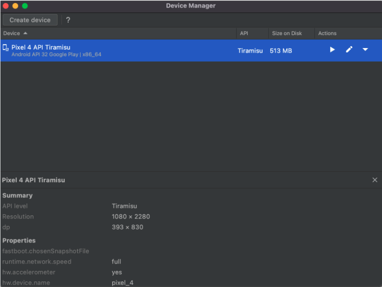

# Ejemplo-03 # - Instalación de Appium & Emuladores.

## Objetivo

- Realizar el proceso de instalación de Appium paras las pruebas en plataformas móviles.

## Desarrollo

#### :round_pushpin: Requisitos para usar APPIUM

Para utilizar Appium requerimos una serie de herramientas, muchas de ellas son con las que venimos trabando hasta el momento como:

- JDK (kit de desarrollo de Java)
- Eclipse
- TestNG
- Selenium Server

y otras explicaremos como instalarlas en este tema:

- ANDROID SDK (Studio)
- Appium Inspector / Appium Desktop
- .APK a testear

#### :round_pushpin: DISPOSITIVO VIRTUAL ANDROID (AVD)

Un `dispositivo virtual de Android (AVD)` es una configuración que define las características de un teléfono o una tablet Android, o de un dispositivo Wear OS, Android TV o Automotive OS, que deseas simular en Android Emulator. 

El Administrador de dispositivos es una interfaz que puedes iniciar desde `Android Studio` y te permite crear y administrar los AVD.

Un AVD contiene un perfil de hardware, una imagen del sistema, un área de almacenamiento y una máscara, entre otras propiedades.

Para crear un dispositivo virtual se debe realizar lo siguiente:

1. Descargar android studio https://developer.android.com/studio
2. Sigue el proceso de instalación

     

3. Selecciona la opción "custom"

     

4. En esta pantalla copia el path de la locación de la SDK de android, ya que lo requerirá para configurar la variable de ambiente de `ANDROID_HOME` más adelante.

     

5. Una vez finalizada en instalación, en la pantalla principal de android seleccionar la opción `“Virtual Device Manager”`

     

6. Realizar click en `"Create un virtual device"`

     

7. Selecciona el dispositivo que quieras emular de la lista (se recomienda los que tienen el simbolo de play store)

     

8. Descarga el la versión de android que quieras tener instalada en el dispositivo virtual

     
9. Al finalizar la instalación veremos la siguiente pantalla

     

10. Al clickear en el botón de play se abrirá el AVD creado

     

#### :round_pushpin: Android Debug Bridge (adb)

`Android Debug Bridge (adb)` es una herramienta de línea de comandos versátil que te permite comunicarte con un dispositivo. El comando adb permite realizar una variedad de acciones en el dispositivo, como instalar y depurar apps, y proporciona acceso a un shell de Unix que puedes usar para ejecutar distintos comandos en un dispositivo. Es un programa cliente-servidor que incluye tres componentes:

- `Un cliente`, que envía comandos. El cliente se ejecuta en tu máquina de desarrollo. Puedes invocar un cliente desde un terminal de línea de comandos emitiendo un comando adb.
- `Un daemon (adbd)`, que ejecuta comandos en un dispositivo. El daemon se ejecuta como un proceso en segundo plano en cada dispositivo.
- `Un servidor`, que administra la comunicación entre el cliente y el daemon. El servidor se ejecuta en tu máquina de desarrollo como un proceso en segundo plano.

`adb` está incluido en el paquete de herramientas de la plataforma de Android SDK. Para su uso debes abrir la terminal, posicionarte en la ruta de ANDROID_HOME e ingresar `adb devices`

 

> para mas información visitar: https://developer.android.com/studio/command-line/adb?hl=es-419

#### :round_pushpin: VARIABLES DE ENTORNO (`JAVA_HOME` y `ANDROID_HOME`)

__¿Que son variables de entorno?__

Una variable de entorno es `un valor dinámico` que el sistema operativo y otros programas pueden utilizar para determinar la información específica de su ordenador.

En otras palabras, una variable de entorno es algo que representa otra cosa, como una ubicación en el equipo, un número de versión, una lista de objetos, etc.

Las variables de entorno están rodeadas por el signo de porcentaje (%), como en %temp%, para distinguirlas del texto normal.

Existen dos tipos de variables de entorno, variables de entorno del usuario y variables de entorno del sistema:

- `Variables de entorno de usuario`:son variables de entorno específicas para cada cuenta de usuario. Esto significa que el valor de una variable de entorno cuando se inicia sesión como un usuario puede ser diferente al valor de la misma variable de entorno cuando se inicia sesión como un usuario diferente en el mismo equipo.

- `Variables de entorno del sistema`: Las variables de entorno del sistema se extienden más allá de un solo usuario, aplicándose a cualquier usuario que pueda existir o que se cree en el futuro. La mayoría de las variables de entorno del sistema apuntan a ubicaciones importantes como la carpeta Windows.

Algunas de las variables de entorno más comunes en los sistemas Windows incluyen `%path%`, `%programfiles%`, `%temp%`, y `%systemroot%`, aunque hay muchas otras.

`Appium` necesitará consumir las `variables de entorno JAVA_HOME y ANDROID_HOME` por lo que siguiendo estos pasos podrás configurarlas:

- `JAVA_HOME`: dirige al directorio donde está instalado Java Runtime Environment o Java Development Kit en el sistema. Por ejemplo: `JAVA_HOME=/Library/Java/JavaVirtualMachines/jdk-12.0.1.jdk/Contents/Home/bin`

- `ANDROID_HOME`: el valor va a ser la ruta donde fue instalado nuestras versiones de Android, se puede visualizar en el “Android SDK Manager” (Para abrir SDK Manager desde Android Studio, haz clic en Tools > SDK Manager) . Por Ejemplo: `ANDROID_HOME=/Users/Library/Android/sdk`

> La ubicacion variara dependiendo de la ruta seleccionada al momento de instalar android y java.

__¿Como configurar las variables de entorno?__
 
 `WINDOWS`
1. Ir al menú Inicio y escriba Configuración avanzada del sistema.
2. Haga clic en Ver la configuración avanzada del sistema de la lista para abrir Propiedades del sistema.
3. Vaya a la pestaña Avanzado y haga clic en el botón Variable de entornos.

     

4. En la ventana Variable de entorno, haga clic en el botón Nuevo debajo de la variable Sistema.
5. En la variable de sistema Editar , indique el nombre de la variable como JAVA_HOME y el valor de la variable como la ruta al directorio JDK.

     

6. Haga clic en OK 
7. Ahora vuelva a la ventana Variable de entorno y seleccione Ruta en la variable Sistema.

     

8. Haga clic en el botón Editar para abrir la ventana Editar variable de entorno.

     

9. Haga clic en el botón Nuevo y escriba `%JAVA_HOME%\bin`

     

10. Haga clic en Aceptar para aplicar los cambios.
11. Para probar la configuración, abra Símbolo del sistema escriba `echo %JAVA_HOME%` y presione Enter. Esto debería imprimir el directorio del JDK al que apunta el JAVA_HOME. En cambio, si ve un espacio, significa que ha fallado en la configuración de la variable de entorno.

     

12. Realice los mismos pasos para configurar la variable de entorno ANDROID_HOME

 `MAC`

1. Abre la terminal de mac y escribe: Open ~/.bash_profile 
2. Escribe export JAVA_HOME=$(/usr/libexec/java_home) y guarda los cambios.
3. Escribe nuevamente en la terminal source ~/.bash_profile
4. Ahora en la terminal escribe echo $JAVA_HOME para ver el valor, deberias ver lo siguiente dependiendo de la versión de java que tengas instalada: /Library/Java/JavaVirtualMachines/jdk1.8.0_111.jdk/Contents/Home
5. Repite los mismos pasos para la variable de entorno ANDROID_HOME

#### :round_pushpin: Instalación APPIUM

1. Descargar Appium Desktop del siguiente enlace:  https://github.com/appium/appium-desktop/releases/tag/v1.22.2
2. Abrir la Appium.
3. Seleccionar la opción de “Edit Configurations”

 

4. En la configuración de Appum debemos ingresar los valores de las variables `JAVA_HOME` y `ANDROID_HOME` en la siguiente pantalla:

 

5. Haz click en Save and Restart para que se guarden los cambios.
6. Ahora puedes hacer click en la opción de “Start Server” de la home de appium desktop

#### :round_pushpin: Instalación APPIUM

Es un Un inspector de GUI para aplicaciones móviles y más, impulsado por un servidor Appium (instalado por separado). Appium Inspector es básicamente un cliente de Appium (como WebdriverIO, el cliente Java de Appium, el cliente Python de Appium, etc.) con una interfaz de usuario. 

 

Hay una interfaz para especificar qué servidor de Appium usar, qué capacidades configurar y luego interactuar con elementos y otros comandos de Appium una vez que haya iniciado una sesión. Puedes descargar el inspector de aplicaciones de appium desde la siguiente url: https://github.com/appium/appium-inspector/releases

#### :round_pushpin: Formato de Aplicaciones Moviles (.ipa vs .apk)

Las aplicaciones moviles pueden venir en los siguientes formatos dependiendo del Sistema operativo

`APK = Paquete de aplicaciones de Android`

El paquete de aplicación de Android es el formato de archivo de paquete utilizado para distribuir e instalar aplicaciones en el sistema operativo Android de Google y en otros sistemas operativos, como Blackberry. En pocas palabras, es una aplicación de Android. Cuando crea una aplicación de Android con App Press, exportamos y le enviamos un archivo APK.

`IPA = Archivo de aplicaciones de iPhone`

Un archivo `.ipa` es un archivo de almacenamiento de aplicaciones de iOS que almacena una aplicación de iOS. Por lo general, está encriptado con la tecnología FairPlay DRM de Apple. Cada archivo .ipa se comprime con un binario para la arquitectura ARM y solo se puede instalar en un dispositivo iOS. En pocas palabras, es una aplicación para iOS. Cuando crea una aplicación para iOS con App Press, exportamos y le enviamos un archivo IPA.

 

#### :round_pushpin: Errores comunes y pasos para la resolución de problemas en Appium

1. `error: – Se requieren las siguientes capacidades deseadas, pero no se proporcionan: nombre del dispositivo, nombre de la plataforma`: Agregue las capacidades necesarias: nombre del dispositivo, nombre de la plataforma en el script APPIUM. por ejemplo: dc.setCapability («deviceName», «Emulator»); dc.setCapability («platformName», «Android»);

2. `error: no se pudo encontrar adb. Configure la variable de entorno ANDROID_HOME con la ruta del directorio raíz del SDK de Android.`:Probablemente necesite configurar una ruta de directorio raíz del SDK en el sistema ‘Variables de entorno’ en la columna ‘Ruta’.

3. `error: org.openqa.selenium.SessionNotCreatedException: No se pudo crear una nueva sesión.`: Debe establecer la ruta correcta de la aplicación y reiniciar el servidor de Appium.

#### :round_pushpin: Limitaciones al usar APPIUM

+ Appium no admite pruebas en la versión de Android inferior a 4.2
+ Soporte limitado para pruebas de aplicaciones híbridas. Por ejemplo: la acción de transferencia de la aplicación desde la aplicación web no se puede probar de forma nativa y viceversa.
+ No hay soporte para ejecutar Appium Inspector en Microsoft Windows.