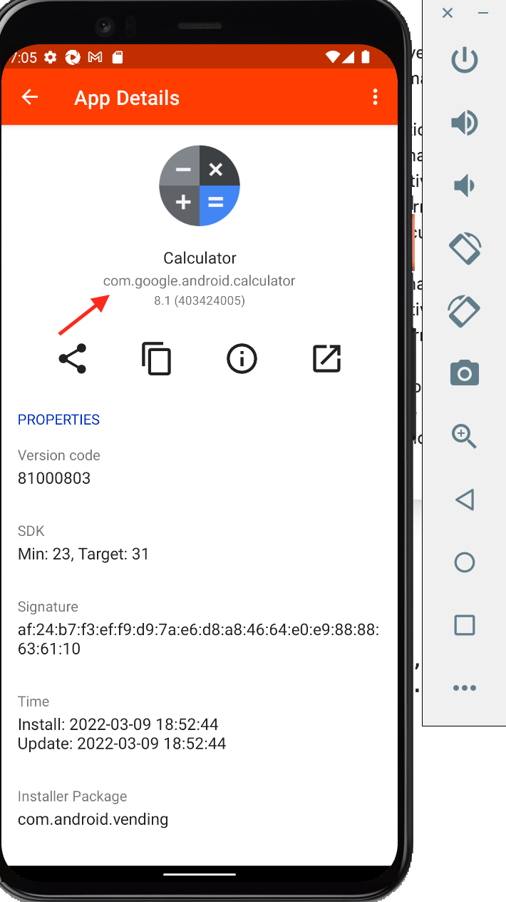
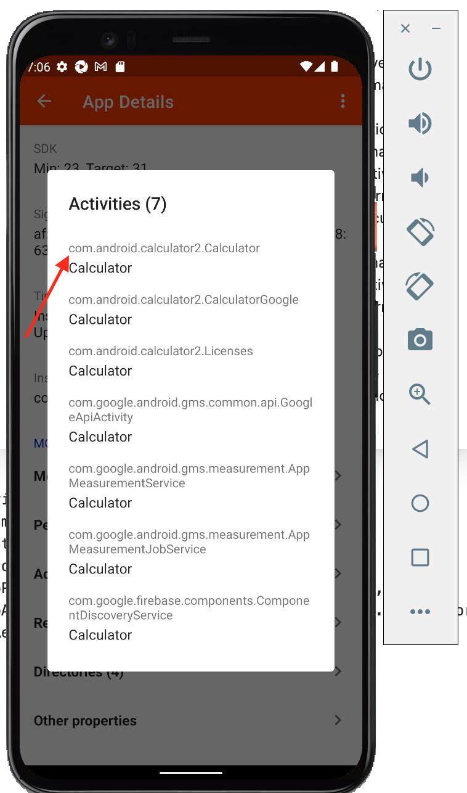
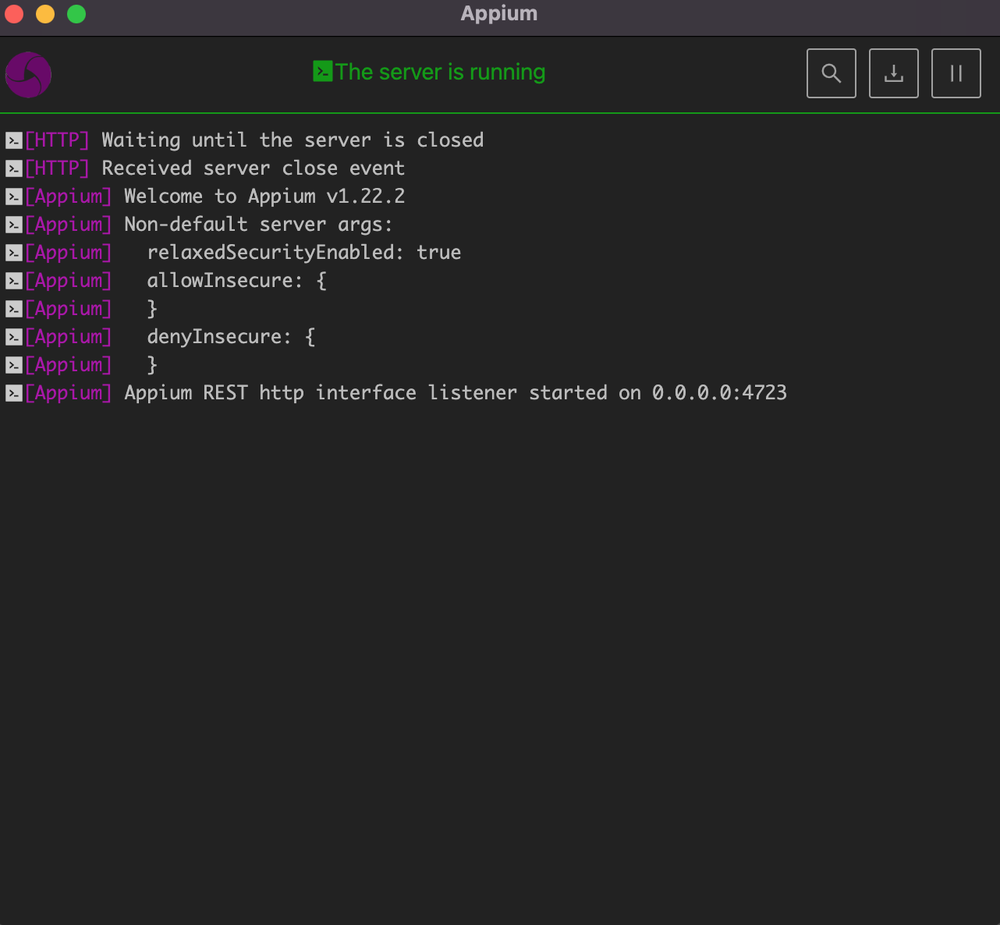
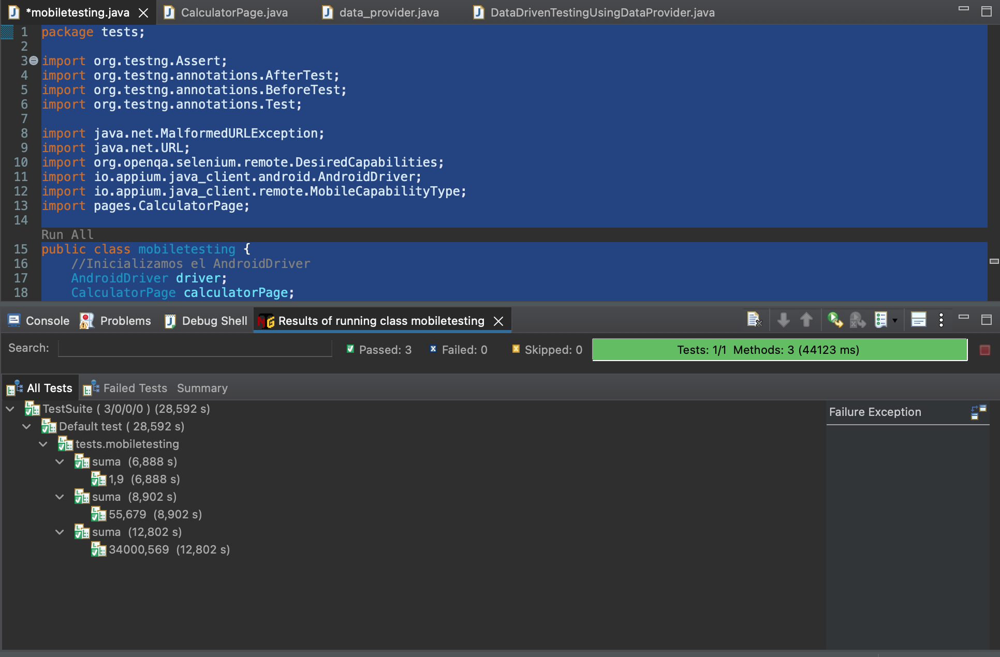

# Ejemplo-04 # - Ejecución del primer tests automatizado sobre el emulador de android

## Objetivo

- Modificar los scripts de pruebas de automatizaciones Web a script de pruebas que puedan ser ejecutados en plataformas móviles.

## Desarrollo


#### :round_pushpin: Configurar Capabilities

Lo primero que debemos realizar para poder iniciar con las automatizaciones en dispositivos moviles es obtener la informacion de los `Desired Capabilities` que debemos configurar en los scripts de pruebas.

Antes de ver cuales son las `capabilities` minimas que requerimos para hacer funcionar nuestros script de pruebas es necesario saber lo que existen 2 formas de localizar una app:

1. `Teniendo una aplicacion (.apk)`: si vamos el `prework`veremos un ejemplo de este caso, donde se explico como descargar la apk de la calculadora de android. Para este caso basta con configurar las siguientes `Desired Capabilities`:

    ```Json
    {
    "appium:deviceName": "emulator-5554",
    "platformName": "android",
    "appium:platformVersion": "12",
    "appium:automationName": "uiautomator2",
    "appium:app": "/Users/Downloads/Calculator.apk"
    }
    ```
    __Donde:__

    - `deviceName`: El tipo de dispositivo móvil o emulador a usar. Se obtiene al abrir la terminal, posicionarte en la ruta de ANDROID_HOME e ingresar `adb devices`
    - `platformName`: plataforma de sistema operativo móvil a usar (iOS, Android o FirefoxOS)
    - `platformVersion`: versión del SO del dispositivo.
    - `automationName`: motor de automatización a usar, depende del SO, para android puede ser `UIAutomator1` o `UIAutomator2` depende de la versión, `UIAutomator1`se utiliza en versiones mayores a Android 5 por ejemplo.
    - `app`: ubicacion donde se encuentra la `.apk`


2. `Bajando una aplicacion desde el play store` de los dispositivos moviles: abres el play store del dispositivo fisico o virtual y buscas y decargas la aplicación.

    ```Json
    {
    "appium:deviceName": "emulator-5554",
    "platformName": "android",
    "appium:platformVersion": "12",
    "appium:automationName": "uiautomator2",
    "appium:appPackage": "com.google.android.calculator",
    "appium:appActivity": "com.android.calculator2.Calculator"
    }
    ```

    __Donde:__

    - `appActivity`: Nombre de actividad para la actividad de Android que desea iniciar desde su paquete.
    - `appPackage`: Paquete Java de la aplicación de Android que desea ejecutar.

#### Pero ... ¿Como obtener la información del `appActivity`y `appPackage` de una aplicación?

1. Descargar en el dispositivo fisico o virtual la palicación `apk info` del play store.
2. Abrir la aplicación y buscar en la lista de aplicación la que queremos probar.
3. En la pantalla principal veremos el `appPackage`

     

4. Ir a la seccion de `activities` y veremos el nombre de la actividad.

     


__Pro-tip:__ En la [`Sesión 08:` Appium: Primeros pasos](./Sesion-08) veremos con mayor profundidad sobre los `Desired Capabilities`

#### :round_pushpin: Ejecución del primer tests automatizado sobre el emulador de android

Para nuestro primer script de prueba utilizaremos la aplicación de la `calculadora` nativa de google (se instalo manualmente en el prework), pero esta vez en que de instalarla, la descargaremos desde el play store y la utilizaremos por medio de los valores de `appActivity`y `appPackage`


```Json
    {
    "appium:deviceName": "emulator-5554",
    "platformName": "android",
    "appium:platformVersion": "12",
    "appium:automationName": "uiautomator2",
    "appium:appPackage": "com.google.android.calculator",
    "appium:appActivity": "com.android.calculator2.Calculator"
    }
```

1. Lo primero que debemos realizar cada vez que vamos a desarrollar y ejecutar scripts de pruebas automatizados con appium, es levantar el servidor, abriendo appium y seleccionando la opción de `start server`:

     


2. Posteriormente a esto vamos a crear una clase `mobiletesting`

```Java
package tests;

public class mobiletesting {

}

```

3. Agregamos la dependencia de appium en el archivo `pom.xml`

```xml
<project xmlns="http://maven.apache.org/POM/4.0.0" xmlns:xsi="http://www.w3.org/2001/XMLSchema-instance" xsi:schemaLocation="http://maven.apache.org/POM/4.0.0 https://maven.apache.org/xsd/maven-4.0.0.xsd">
	<modelVersion>4.0.0</modelVersion>
	<groupId>com.bedu.web_automation_course</groupId>
	<artifactId>BeduWebAutomationCourse</artifactId>
	<version>0.0.1-SNAPSHOT</version>

	<dependencies>
		<!-- https://mvnrepository.com/artifact/org.seleniumhq.selenium/selenium-java -->
		<dependency>
			<groupId>org.seleniumhq.selenium</groupId>
			<artifactId>selenium-java</artifactId>
			<version>4.1.2</version>
			<scope>test</scope>
		</dependency>

		<!-- https://mvnrepository.com/artifact/org.testng/testng -->
		<dependency>
			<groupId>org.testng</groupId>
			<artifactId>testng</artifactId>
			<version>7.4.0</version>
			<scope>test</scope>
		</dependency>

		<!-- https://mvnrepository.com/artifact/com.opencsv/opencsv -->
		<dependency>
			<groupId>com.opencsv</groupId>
			<artifactId>opencsv</artifactId>
			<version>5.6</version>
		</dependency>

		<!-- https://mvnrepository.com/artifact/mysql/mysql-connector-java -->
		<dependency>
			<groupId>mysql</groupId>
			<artifactId>mysql-connector-java</artifactId>
			<version>8.0.28</version>
		</dependency>

		<!-- https://mvnrepository.com/artifact/io.appium/java-client -->
		<dependency>
			<groupId>io.appium</groupId>
			<artifactId>java-client</artifactId>
			<version>8.0.0-beta2</version>
		</dependency>

	</dependencies>
</project>
```

4. Importamos las librerias que se requieren para ejecutar nuestros scripts:

```Java
import org.testng.annotations.AfterTest;
import org.testng.annotations.BeforeTest;
import org.testng.annotations.Test;

import java.net.MalformedURLException;
import java.net.URL;
import org.openqa.selenium.remote.DesiredCapabilities;
import io.appium.java_client.android.AndroidDriver;
import io.appium.java_client.remote.MobileCapabilityType;

```

__Donde:__
- `io.appium.java_client.android.AndroidDriver`: se utiliza para la implementación de AndroidDriver con appium 
> Documentación: https://javadoc.io/static/io.appium/java-client/8.0.0/io/appium/java_client/android/AndroidDriver.html

- `io.appium.java_client.remote.MobileCapabilityType`: lista las capabilities mas comunes.
> Documetación: https://javadoc.io/doc/io.appium/java-client/latest/io/appium/java_client/remote/MobileCapabilityType.html


5. Configuramos en el `@BeforeTest` el objeto `DesiredCapabilities()`

```Java
package tests;

import org.testng.annotations.AfterTest;
import org.testng.annotations.BeforeTest;
import org.testng.annotations.Test;

import java.net.MalformedURLException;
import java.net.URL;
import org.openqa.selenium.remote.DesiredCapabilities;
import io.appium.java_client.android.AndroidDriver;
import io.appium.java_client.remote.MobileCapabilityType;

public class mobiletesting {
    //Inicializamos el AndroidDriver
	static AndroidDriver driver;

	@BeforeTest
	public void beforeTest() throws MalformedURLException {
		
		//Configuramos los DesiredCapabilities
		DesiredCapabilities dc = new DesiredCapabilities();
		dc.setCapability(MobileCapabilityType.AUTOMATION_NAME, "uiautomator2");
		dc.setCapability(MobileCapabilityType.DEVICE_NAME, "emulator-5554");
		dc.setCapability(MobileCapabilityType.PLATFORM_NAME, "android");
		dc.setCapability(MobileCapabilityType.PLATFORM_VERSION, "12");
		dc.setCapability("appium:appPackage", "com.google.android.calculator");
		dc.setCapability("appium:appActivity", "com.android.calculator2.Calculator");
	}
	
	@Test
	public void test() {
	}

	@AfterTest
	public void afterTest() {
	}

}
```

6. Establecemos la conexión con appium server:

```Java
//Crea una nueva instancia basada en la URL y las capacidades del servidor de Appium.
driver = new AndroidDriver (new URL("http://127.0.0.1:4723/wd/hub"), dc);
```

7. Diseñamos el POM para la calculadora, creando la clase `CalculatorPage` con la siguiente información:

```Java
package pages;

import org.openqa.selenium.By;

import io.appium.java_client.android.AndroidDriver;

public class CalculatorPage {

	/**
	 * Page Object Model (POM) para aplicación de Calculadora
	 */

	protected AndroidDriver driver;

	// Creamos el método que recibirá el driver en esta clase
	public CalculatorPage(AndroidDriver driver){
		    this.driver = driver; 
		  }

	// Creamos el método que creara el localizador by para los numeros de la calculadora
	public By locateDigit(int digito){
		String locator = "com.google.android.calculator:id/digit_"+ digito;
		By digit = By.id(locator);
		return digit;
		
	}
	
	// Creamos el método que realizara click en los digitos de la calculadora
	public void clickDigit(int digit) throws InterruptedException {
        
        String number = String.valueOf(digit);
        char[] digits = number.toCharArray();

        for(int i = 0; i < digits.length; i++) {
    
        	driver.findElement(locateDigit(Character.getNumericValue(digits[i]))).click();
        }
		
	}
	
	// Creamos el método que realizara click en la suma
	public void clickSuma() throws InterruptedException {
		driver.findElement(By.id("com.google.android.calculator:id/op_add")).click();
	}
	
	
	// Creamos el método que obtiene el resultado
	public String getResult() throws InterruptedException {
		Thread.sleep(2000);
		String result = driver.findElement(By.id("com.google.android.calculator:id/result_preview")).getText();
		System.out.println("El resultado es = " + result);
		return result;
	}
	
	// Creamos el método que realizara click en la resta
	
	// Creamos el método que realizara click en la multiplicacion
	
	// Creamos el método que realizara click en la división
	
}
```
8. Creamos un dataprovider para las operaciones:
```Java
	@DataProvider(name = "dataprovider_calc")
	public Object[][] metodoDataProviderCalc() {
		return new Object[][] {
				{1,9},
				{55,679},
				{34000,569} };
	}
```

9. Importamos el objeto `CalculatorPage()`

```Java
CalculatorPage calculatorPage;
calculatorPage = new CalculatorPage(driver);
```

10. Agregamos un caso de prueba para la suma por ejemplo:

```Java
	@Test (priority = 1 ,dataProvider = "dataprovider_calc", dataProviderClass = data_provider.class)
	public void suma(int a, int b) throws InterruptedException {
		int suma = a + b;
		//Metodo para validar que la calculadora sume correctamente
		calculatorPage.clickClear();
		calculatorPage.clickDigit(a);
		calculatorPage.clickSuma();
		calculatorPage.clickDigit(b);
		int result = Integer.parseInt(calculatorPage.getResult());
		
		Assert.assertEquals(result, suma);
		
	}
```

11. Cerramos el driver.

```Java
	@AfterTest
	public void afterTest() {
		driver.quit();
	}
```

12. Finalmente la clase queda de la siguiente manera:

```Java
package tests;

import org.testng.Assert;
import org.testng.annotations.AfterTest;
import org.testng.annotations.BeforeTest;
import org.testng.annotations.Test;

import java.net.MalformedURLException;
import java.net.URL;
import org.openqa.selenium.remote.DesiredCapabilities;
import io.appium.java_client.android.AndroidDriver;
import io.appium.java_client.remote.MobileCapabilityType;
import pages.CalculatorPage;

public class mobiletesting {
	//Inicializamos el AndroidDriver
	AndroidDriver driver;
	CalculatorPage calculatorPage;

	@BeforeTest
	public void beforeTest() throws MalformedURLException {
		
		//Configuramos los DesiredCapabilities
		DesiredCapabilities dc = new DesiredCapabilities();
		dc.setCapability(MobileCapabilityType.AUTOMATION_NAME, "uiautomator2");
		dc.setCapability(MobileCapabilityType.DEVICE_NAME, "emulator-5554");
		dc.setCapability(MobileCapabilityType.PLATFORM_NAME, "android");
		dc.setCapability(MobileCapabilityType.PLATFORM_VERSION, "12");
		dc.setCapability("appium:appPackage", "com.google.android.calculator");
		dc.setCapability("appium:appActivity", "com.android.calculator2.Calculator");
		

		//Establecemos la conexion con el server de Appium
		driver = new AndroidDriver (new URL("http://127.0.0.1:4723/wd/hub"), dc);
		System.out.println("Application started");
		
		// 
		calculatorPage = new CalculatorPage(driver);

	
	}
	
	@Test (priority = 1 ,dataProvider = "dataprovider_calc", dataProviderClass = data_provider.class)
	public void suma(int a, int b) throws InterruptedException {
		int suma = a + b;
		//Metodo para validar que la calculadora sume correctamente
		calculatorPage.clickClear();
		calculatorPage.clickDigit(a);
		calculatorPage.clickSuma();
		calculatorPage.clickDigit(b);
		int result = Integer.parseInt(calculatorPage.getResult());
		
		Assert.assertEquals(result, suma);
		
	}

	
	@AfterTest
	public void afterTest() {
		driver.quit();
	}

}

```


Obtenemos los resultados de la ejecución:

 


