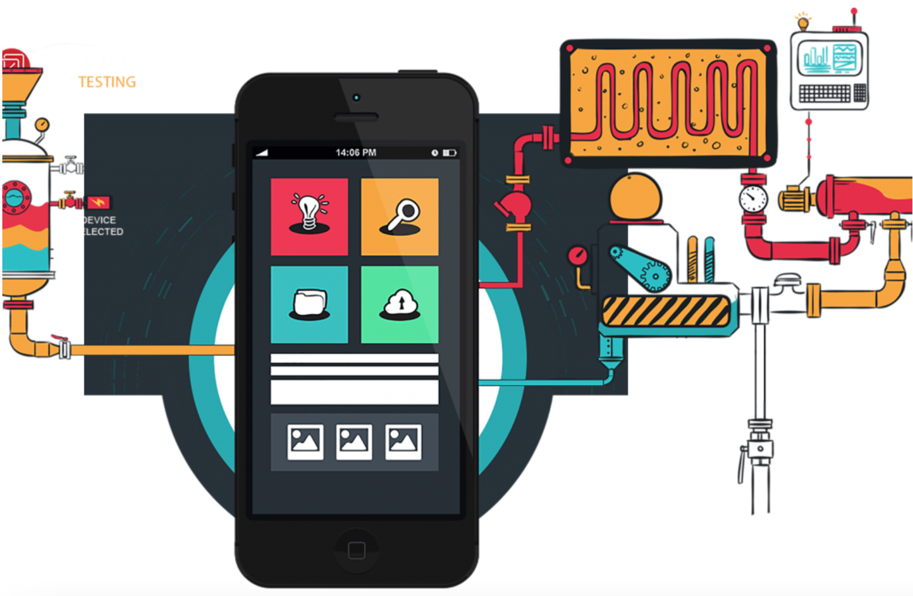
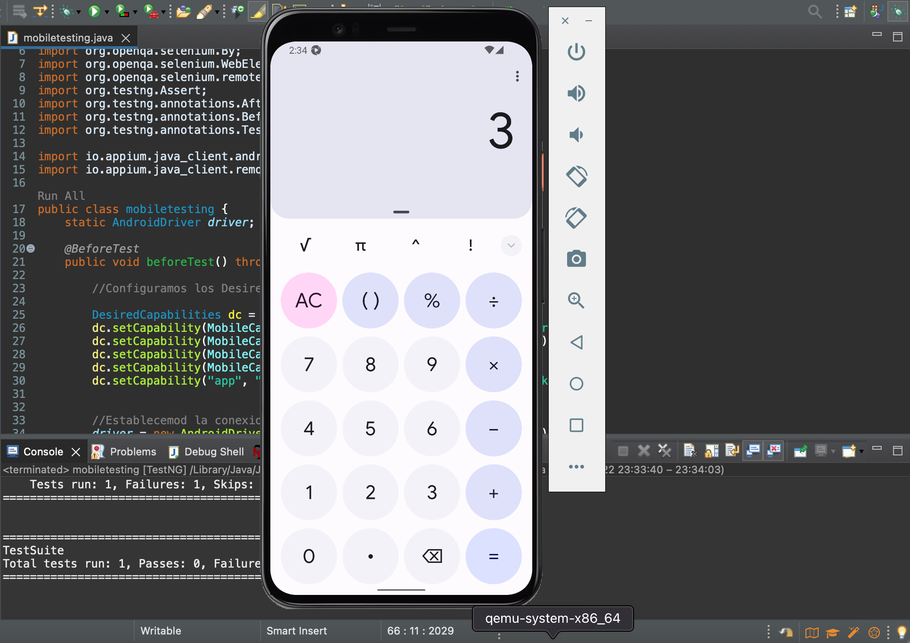

## Sesión 7: Appium - Automatización móvil 🤖

### 1. Objetivos :dart: 

- Analizar el concepto de Mobile Automation Testing y como es su implementación en la actualidad.
- Hacer uso de los conceptos básicos de la herramienta para automatización mobile Appium y su arquitectura.
- Realizar el proceso de instalación de Appium paras las pruebas en plataformas móviles.
- Modificar los scripts de pruebas de automatizaciones Web a script de pruebas que puedan ser ejecutados en plataformas móviles.

### 2. Contenido :blue_book:

En la última década, ha habido una proliferación de usuarios de teléfonos inteligentes. Hoy en día, las personas pasan más tiempo en los dispositivos móviles que en la televisión. Por lo tanto, desarrollar una excelente experiencia de aplicación móvil es esencial. Para garantizar que las aplicaciones funcionen sin problemas en Android e iOS, deben probarse exhaustivamente antes de lanzarse a las respectivas tiendas de aplicaciones.

`Appium` es el framework más popular que se utiliza para la prueba automatizada de aplicaciones móviles , permitiéndole a los desarrolladores `automatizar las pruebas de aplicaciones iOS y Android nativas o híbridas`. Sin embargo Appium no funciona solo, tiene que ejecutar los casos de prueba utilizando la `interfaz WebDriver`. Al igual que Selenium, Appium permite a los QA crear scripts de prueba en múltiples lenguajes de programación.

Appium es especialmente favorecido por ser un marco flexible y multiplataforma que los testers pueden usar para crear scripts de prueba `aplicables a múltiples plataformas (Windows, iOS y Android)`, usando la misma API. Esencialmente, los usuarios de Appium pueden reutilizar su código fuente tanto para Android como para iOS, lo que reduce el tiempo y el esfuerzo. entrando en pruebas de construcción.

---
#### <ins>Tema 1: Introducción al Mobile Automation Testing</ins> 

Los `dispositivos móviles` se han apoderado del mundo. Las personas no solo pasan cada vez más tiempo en sus teléfonos, esperan que todo sea accesible para ellos a través de sus teléfonos. Esto significa que cualquier persona (individuo u organización) que busque tener presencia en línea debe optimizar sus sitios web y aplicaciones para dispositivos móviles. En otras palabras, `todos los sitios web y aplicaciones deben someterse a pruebas móviles`.

Sin embargo, la explosión en el uso de dispositivos móviles significa que un sitio web debe adaptarse para mostrarse y funcionar perfectamente en miles de dispositivos: más de 9000 dispositivos distintos, para ser exactos. Para los desarrolladores y evaluadores, esto puede ser un gran desafío.

Para hacer frente a este desafío, es absolutamente necesario un conocimiento profundo de las `pruebas móviles`. 

En esta tema veremos los conceptos básicos de las pruebas móviles para sitios web y aplicaciones. 

 

- [**`EJEMPLO 1 - Introducción al Mobile Automation Testing`**](./Ejemplo-01)

---
#### <ins>Tema 2: Appium</ins> 

Appium es una herramienta de `código abierto` para automatizar aplicaciones nativas, web móviles e híbridas en plataformas móviles iOS, móviles Android y de escritorio Windows. 

Es importante destacar que Appium es `"multiplataforma"`, es decir, permite escribir pruebas contra múltiples plataformas (iOS, Android, Windows), utilizando la misma API. Esto permite la reutilización de código entre conjuntos de pruebas de iOS, Android y Windows.

 

- [**`EJEMPLO 2 - Appium`**](./Ejemplo-02)

---
#### <ins>Tema 3: Instalación de Appium & Emuladores.</ins> 

Sabiendo que es appium, procederemos a realizar su instalación. Adicionalmente Appium requiere de configuraciones de herramientas adicionales como:

- Variables de entorno (`JAVA_HOME` y `ANDROID_HOME`)
- Dispositivo Virtual de Android

Asi que en este tema veremos como configurar todos estas herramientas para poder hacer andar nuestro primer script automatizado de pruebas en plataformas moviles.

- [**`EJEMPLO 3 - Instalación de Appium & Emuladores.`**](./Ejemplo-03)

---
#### <ins>Tema 4: Ejecución del primer tests automatizado sobre el emulador de android</ins>

En este tema veremos como construir nuestro primer script de prueba automatizado utilizando appium y dispositivos virtuales con android studio.

 

- [**`EJEMPLO 4 - Ejecución del primer tests automatizado sobre el emulador de android`**](./Ejemplo-04)
- [**`RETO 1`**](./Reto-01)
- [**`RETO 2`**](./Reto-02)
---

### 3. Postwork :memo:

Encuentra las indicaciones y consejos para reflejar los avances de tu proyecto de este módulo.

- [**`POSTWORK SESIÓN 7`**](./Postwork/)

 

