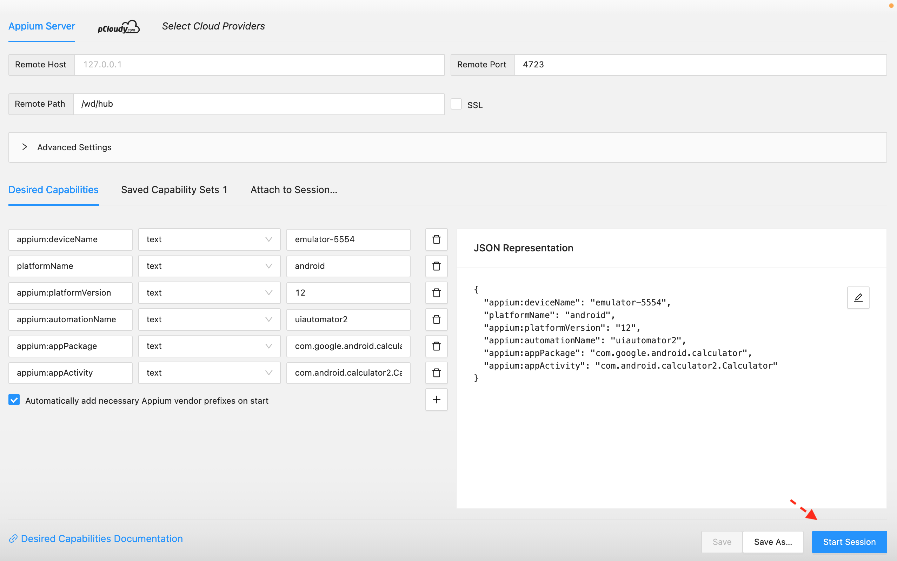
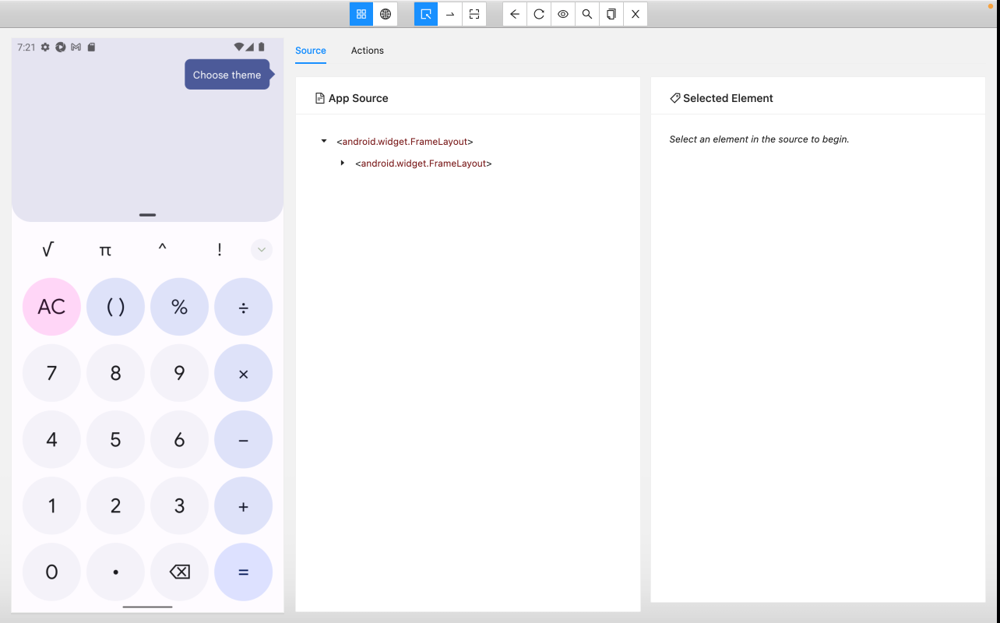

# Reto 1# - Desired Capabilities

## Objetivo

* Evaluar el conocimiento sobre los atributos requeridos para armar el objeto `Desired Capabilities` con la información de aplicaciones instaladas en los dispositivos virtuales.

## Desarrollo

1. Selecciona 3 aplicaciones móviles que se encuentren instaladas en el dispositivo virtual de android (AVD).
2. Diseña el objeto `Desired Capabilities` para las 3 aplicaciones. 

__Buena Practica:__ utiliza la aplicación `apk info`para obtener el `appPackage`y `appActivity`

3. Utiliza `Appium Inspector` para probar el `json` del `Desired Capabilities`. 

- Guarda el `json` en la seccion `Desired Capabilities`

     

- Haz click en `start session`para ver si funciona correctamente.

     


<details>
  <summary> Solución </summary>

```Json
    {
    "appium:deviceName": "emulator-5554",
    "platformName": "android",
    "appium:platformVersion": "12",
    "appium:automationName": "uiautomator2",
    "appium:appPackage": "com.google.android.calculator",
    "appium:appActivity": "com.android.calculator2.Calculator"
    }
```
</details>