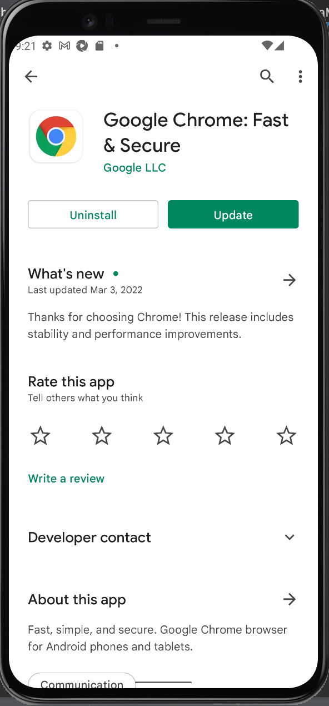
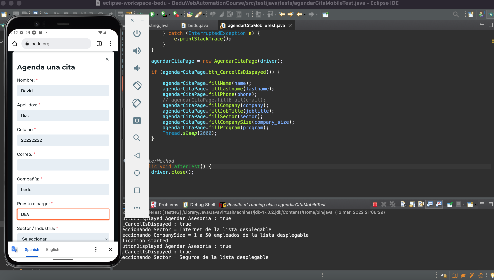
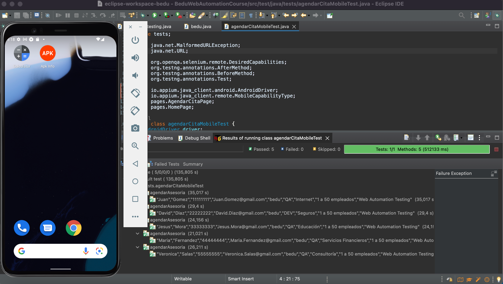

# Ejemplo-01 # - Automatizaciones Web Móviles con Android 

## Objetivo

- Desarrollar scripts de pruebas automatizados que puedan ser ejecutados en dispositivos móviles con Android por medio de la aplicación del navegador google chrome.

## Desarrollo

En sesiones anteriores hemos realizado automatizaciones de casos de pruebas que son ejecutados en navegadores web, ahora `¿Es posible ejecutar estos mismos casos de prueba en las páginas web pero en los dispositivos móviles?` La respuesta es __SÍ!__ :mechanical_arm:

Appium es la herramienta para esto.. Básicamente, puedes escribir una prueba normal de WebDriver y usar Appium como el servidor Selenium con un conjunto especial de capacidades deseadas. (Desired Capabilities)

Ahora bien, en este tema veremos cómo es posible ejecutar los scripts de pruebas que ya tenemos automatizados desde un emulador android.

Appium admite la automatización del navegador Chrome tanto en dispositivos Android reales como emulados.

Requisitos previos:

- Asegúrese de que `Chrome esté instalado en su dispositivo o emulador`, puedes descargarlo desde Play Store pero es muy probable que venga instalado con el Sistema Operativo.

 

- `Chromedriver estar instalado` (una versión predeterminada viene con Appium) y estar configurada para automatizar la versión específica de `Chrome` disponible en el dispositivo. Este punto es muy importante, ya que al igual que en las automatizaciones web, para los teléfonos móviles debe ser la misma versión chromedriver que la del navegador en el dispositivo para que pueda reconocerlo.


Luego, se deben utilizar las capacidades deseadas (desired capabilities) como estas para ejecutar su prueba en Chrome:

```Java
		//Configuramos los DesiredCapabilities		
		DesiredCapabilities dc = new DesiredCapabilities();

		// DesiredCapabilities Generales
		dc.setCapability(MobileCapabilityType.AUTOMATION_NAME, "uiautomator2");
		dc.setCapability(MobileCapabilityType.DEVICE_NAME, "emulator-5554");
		dc.setCapability(MobileCapabilityType.PLATFORM_NAME, "android");
		dc.setCapability(MobileCapabilityType.PLATFORM_VERSION, "12");
		dc.setCapability(MobileCapabilityType.ORIENTATION, "PORTRAIT");
		dc.setCapability(MobileCapabilityType.BROWSER_NAME, "Chrome");

```

El resto del proceso de automatizacion es reutilizable, es decir, se mantiene el script de prueba de la automatización web.

El siguiente script es un ejemplo de pruebas automatizadas sobre la pagina web de bedu desde el navegador de google chrome ejecutado en el dispositivo virtual: 


```Java
package tests;

import java.net.MalformedURLException;
import java.net.URL;

import org.openqa.selenium.remote.DesiredCapabilities;
import org.testng.annotations.AfterMethod;
import org.testng.annotations.BeforeMethod;
import org.testng.annotations.Test;

import io.appium.java_client.android.AndroidDriver;
import io.appium.java_client.remote.MobileCapabilityType;
import pages.AgendarCitaPage;
import pages.HomePage;

public class agendarCitaMobileTest {
	AndroidDriver driver;
	private HomePage homePage;
	private AgendarCitaPage agendarCitaPage;

	@BeforeMethod
	public void beforeTest() throws InterruptedException, MalformedURLException {
		//Configuramos los DesiredCapabilities		
		DesiredCapabilities dc = new DesiredCapabilities();

		// DesiredCapabilities Generales
		dc.setCapability(MobileCapabilityType.AUTOMATION_NAME, "uiautomator2");
		dc.setCapability(MobileCapabilityType.DEVICE_NAME, "emulator-5554");
		dc.setCapability(MobileCapabilityType.PLATFORM_NAME, "android");
		dc.setCapability(MobileCapabilityType.PLATFORM_VERSION, "12");
		dc.setCapability(MobileCapabilityType.ORIENTATION, "PORTRAIT");
		dc.setCapability(MobileCapabilityType.BROWSER_NAME, "Chrome");
		
		//Establecemos la conexion con el server de Appium
		driver = new AndroidDriver (new URL("http://127.0.0.1:4723/wd/hub"), dc);
		System.out.println("Application started");
		driver.get("https://bedu.org/");
	}


	@Test(dataProvider = "dataprovider", dataProviderClass = data_provider.class)
	public void agendarAsesoria(String name, String lastname, String phone, String email, String company,
			String jobtitle, String sector, String company_size, String program) throws InterruptedException {

		homePage = new HomePage(driver);
		// Validamos que el boton de agendar asesoria este disponible
		if (homePage.isButtonDisplayed()) {
			// Clck en boton de agendar asesoria
			try {
				homePage.clickButton();
			} catch (InterruptedException e) {
				e.printStackTrace();
			}
		}

		agendarCitaPage = new AgendarCitaPage(driver);

		if (agendarCitaPage.btn_CancelIsDispayed()) {

			agendarCitaPage.fillName(name);
			agendarCitaPage.fillLastname(lastname);
			agendarCitaPage.fillPhone(phone);
			// agendarCitaPage.fillEmail(email);
			agendarCitaPage.fillCompany(company);
			agendarCitaPage.fillJobTitle(jobtitle);
			agendarCitaPage.fillSector(sector);
			agendarCitaPage.fillCompanySize(company_size);
			agendarCitaPage.fillProgram(program);
			Thread.sleep(2000);
		}

	}

	@AfterMethod
	public void afterTest() {
		driver.close();
	}

}
```

 

 

