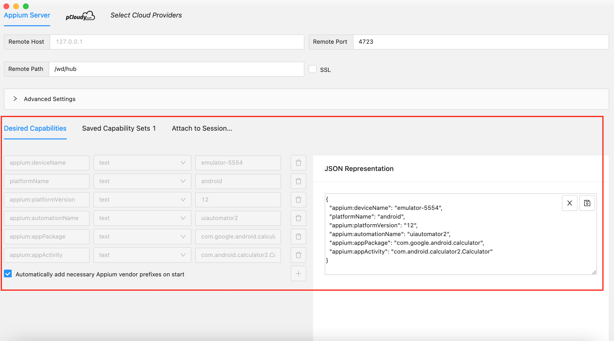
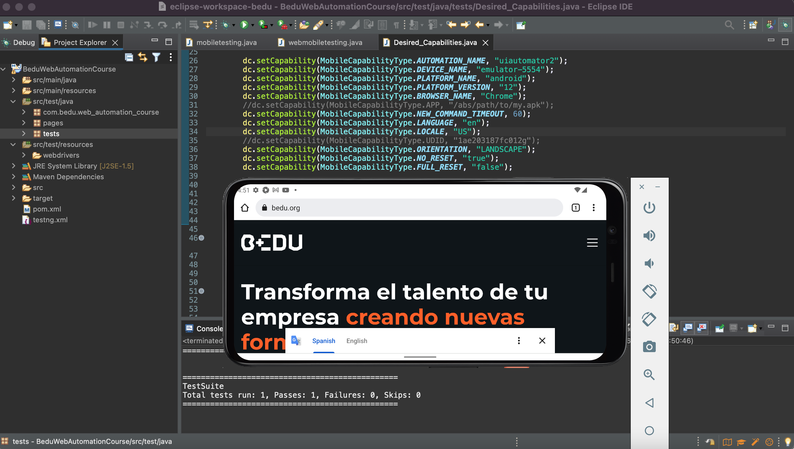
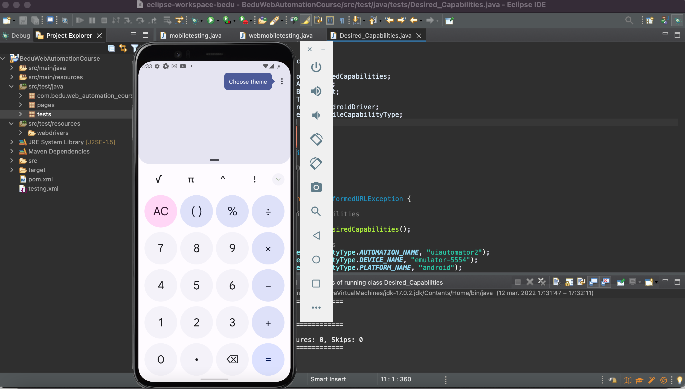

# Ejemplo-02 # - Desired Capabilities

## Objetivo

- Demostrar el funcionamiento de más propiedades del objeto Desired Capabilities

## Desarrollo

Como vimos en la sesión anterior las capacidades deseadas son `claves y valores codificados en un objeto JSON`, enviados por los clientes de Appium al servidor cuando se solicita una nueva sesión de automatización.

Estos le dicen a los `controladores (drivers)` de Appium todo tipo de cosas importantes sobre cómo desea que funcione su prueba. Cada cliente de Appium crea capacidades de una manera específica para el idioma del cliente, pero al final del día, `se envían a Appium como objetos JSON`.

Las capacidades deseadas se pueden programar:

- En la prueba de `WebDriver`: 

    ```Java
    import org.openqa.selenium.remote.DesiredCapabilities;
    DesiredCapabilities dCapabilities = new DesiredCapabilities();
    dCapabilities.setCapability(MobileCapabilityType.AUTOMATION_NAME, "uiautomator2");
    dCapabilities.setCapability(MobileCapabilityType.DEVICE_NAME, "emulator-5554");
    dCapabilities.setCapability(MobileCapabilityType.PLATFORM_NAME, "android");
    dCapabilities.setCapability(MobileCapabilityType.PLATFORM_VERSION, "12");
    dCapabilities.setCapability(MobileCapabilityType.BROWSER_NAME, "Chrome");

    ```

- Dentro de la `GUI del servidor Appium (a través de una sesión de Inspector)`

     

Existen muchas capacidades compatibles con Appium, las capacidades también `difieren según el driver`, aunque hay un conjunto estándar al que la mayoría de los drivers prestan atención. 

En este tema veremos las capacidades deseadas más utilizadas  `generales (comunes para todos los drivers)` y para `Android versiones de OS mayores 5 (UIAutomator2)`:

#### Capacidades Deseadas Generales para todos los drivers

| Capacidad Deseada | Descripción | Ejemplo de Implementación
| -------- | -------- |------------- |
| `automationName` | Qué motor de automatización usar | `dc.setCapability(MobileCapabilityType.AUTOMATION_NAME, "uiautomator2");` |
| `platformName` | Qué plataforma de sistema operativo móvil usar | `dc.setCapability(MobileCapabilityType.PLATFORM_NAME, "android");` |
| `platformVersion` | Versión del sistema operativo móvil | `dc.setCapability(MobileCapabilityType.PLATFORM_VERSION, "12");` |
| `deviceName` | El tipo de `dispositivo móvil` o `emulador` a usar (es el que se muestra al ejecuta el comando `adb devices` en la terminal) | `dc.setCapability(MobileCapabilityType.DEVICE_NAME, "emulator-5554");` |
| `app` | La ruta local absoluta o la URL http remota a un archivo `.ipa` (IOS), o un archivo `.apk` (Android).  Appium intentará instalar primero este binario de la aplicación en el dispositivo adecuado. `Pro-tip:` esta capacidad  no es necesaria `para Android` si especifica las capacidades `appPackage` y `appActivity` | `dc.setCapability(MobileCapabilityType.APP, "/abs/path/to/my.apk");` |
| `browserName` | Nombre del navegador web móvil para automatizar. Debería ser una cadena vacía si se automatiza una aplicación en su lugar | `dc.setCapability(MobileCapabilityType.BROWSER_NAME, "Chrome");`|
| `newCommandTimeout` | Cuánto tiempo (en segundos) Appium esperará un nuevo comando del cliente antes de asumir que el cliente salió y finalizó la sesión | `dc.setCapability(MobileCapabilityType.NEW_COMMAND_TIMEOUT, 60);` |
| `language` | Idioma a configurar para iOS (solo controlador `XCUITest`) y Android. | `dc.setCapability(MobileCapabilityType.LANGUAGE, "en");` |
| `locale` | Configuración regional para iOS (solo controlador `XCUITest`) y Android. Formato `fr_CA` para iOS. Formato `CA` (abreviatura del nombre del país) para Android (https://developer.android.com/reference/java/util/Locale) | `dc.setCapability(MobileCapabilityType.LOCALE, "US");` |
| `udid` | Identificador de dispositivo único del dispositivo físico conectado | `dc.setCapability(MobileCapabilityType.UDID, "1ae203187fc012g");` |
| `orientation` | Orientación del Dispositivo (Solo Simuladores/Emuladores) | `dc.setCapability(MobileCapabilityType.ORIENTATION, "PORTRAIT");`|
| `noReset` | No reestablece el estado de la aplicación antes de iniciar la sesión. En iOS no destruye ni apaga el `sim` después de la prueba. En ANDROID no detiene la aplicación, no borra los datos de la aplicación y no desinstala la aplicación | `dc.setCapability(MobileCapabilityType.NO_RESET, "true");` |
| `fullReset`| Realiza un reinicio completo, en iOS desinstala la aplicación antes y después de la prueba del dispositivo real, y destruye el simulador antes y después de la prueba de simulación. En Android detiene la aplicación, borra los datos de la aplicación y desistala la aplicación antes de que comience la sesión y después de la prueba | `dc.setCapability(MobileCapabilityType.FULL_RESET, "false");`|


Ahora veamos un ejemplo de la configuración en un script de prueba con la mayoria de estas capacidades deseadas:

```Java
package tests;

import java.net.MalformedURLException;
import java.net.URL;
import org.openqa.selenium.remote.DesiredCapabilities;
import org.testng.annotations.AfterTest;
import org.testng.annotations.BeforeTest;
import org.testng.annotations.Test;
import io.appium.java_client.android.AndroidDriver;
import io.appium.java_client.remote.MobileCapabilityType;


public class Desired_Capabilities {
	
	//Inicializamos el AndroidDriver
	AndroidDriver driver;
	
	@BeforeTest
	public void beforeTest() throws MalformedURLException {
		
		//Configuramos los DesiredCapabilities
		
		DesiredCapabilities dc = new DesiredCapabilities();
        // DesiredCapabilities Generales
		dc.setCapability(MobileCapabilityType.AUTOMATION_NAME, "uiautomator2");
		dc.setCapability(MobileCapabilityType.DEVICE_NAME, "emulator-5554");
		dc.setCapability(MobileCapabilityType.PLATFORM_NAME, "android");
		dc.setCapability(MobileCapabilityType.PLATFORM_VERSION, "12");
		dc.setCapability(MobileCapabilityType.BROWSER_NAME, "Chrome");
		//dc.setCapability(MobileCapabilityType.APP, "/abs/path/to/my.apk"); 
		dc.setCapability(MobileCapabilityType.NEW_COMMAND_TIMEOUT, 60);
		dc.setCapability(MobileCapabilityType.LANGUAGE, "en");
		dc.setCapability(MobileCapabilityType.LOCALE, "US");
		//dc.setCapability(MobileCapabilityType.UDID, "1ae203187fc012g");
		dc.setCapability(MobileCapabilityType.ORIENTATION, "LANDSCAPE");
		dc.setCapability(MobileCapabilityType.NO_RESET, "true");
		dc.setCapability(MobileCapabilityType.FULL_RESET, "false");

		//Establecemos la conexion con el server de Appium
		driver = new AndroidDriver (new URL("http://127.0.0.1:4723/wd/hub"), dc);
		System.out.println("Application started");
		driver.get("https://www.bedu.org/");
	}
	
	@Test ()
	public void test() {
	}
	
	
	@AfterTest
	public void afterTest() {
	}

}

```

 


#### Capacidades Deseadas para Android en versiones de OS mayores 5 (UIAutomator2)

| Capacidad Deseada | Descripción | Ejemplo de Implementación
| -------- | -------- |------------- |
| `appium:appPackage` | Paquete Java de la aplicación de Android que desea ejecutar | `dc.setCapability("appium:appPackage", "com.google.android.calculator");` |
| `appium:appActivity` | Nombre de actividad para la actividad de Android que desea iniciar desde su paquete | `dc.setCapability("appium:appActivity", "com.android.calculator2.Calculator");`|
| `appium:appWaitActivity` | Identificador de actividad de la aplicación principal. Si no se proporciona, UiAutomator2 intentará detectarlo automáticamente desde el paquete proporcionado por el capability app | `dc.setCapability("appium:appWaitActivity", "SplashActivity");`|
| `appium:appWaitPackage` | Identificador del paquete de aplicación que se va a iniciar. Si no se proporciona, UiAutomator2 intentará detectarlo automáticamente desde el paquete proporcionado por el capability app | `dc.setCapability("appium:appWaitPackage", "com.google.android.calculator");` |
| `appium:appWaitDuration` | Identificador del primer paquete que se invoca primero | `dc.setCapability("appium:appWaitDuration", "2000");` |
| `appium:autoGrantPermissions` | Si otorgar todos los permisos de aplicación solicitados automáticamente cuando se inicia una prueba (`true`). Por defecto es `false` | `dc.setCapability("appium:autoGrantPermissions", "false");` |
| `appium:enforceAppInstall` | Si se establece en `true`, la aplicación bajo prueba siempre se reinstala incluso si ya existe una versión más nueva en el dispositivo bajo prueba. Por defecto es `false` | `dc.setCapability("appium:enforceAppInstall", "false");` |
| `appium:skipUnlock` | Omitir la verificación de presencia en la pantalla de bloqueo (`true`). De forma predeterminada, el controlador `UiAutomator2` intenta detectar si la pantalla del dispositivo está bloqueada antes de iniciar la prueba y desbloquearla (que a veces puede ser inestable) | `dc.setCapability("appium:skipUnlock", "true");` |
| `appium:unlockType` | Posibles tipos de pantallas de bloqueo de Android para desbloquear | `dc.setCapability("appium:unlockType", "pin");` |

Ahora veamos un ejemplo de la configuración en un script de prueba con la mayoria de estas capacidades deseadas:

```Java

package tests;

import java.net.MalformedURLException;
import java.net.URL;
import org.openqa.selenium.remote.DesiredCapabilities;
import org.testng.annotations.AfterTest;
import org.testng.annotations.BeforeTest;
import org.testng.annotations.Test;
import io.appium.java_client.android.AndroidDriver;
import io.appium.java_client.remote.MobileCapabilityType;


public class Desired_Capabilities {
	
	//Inicializamos el AndroidDriver
	AndroidDriver driver;
	
	@BeforeTest
	public void beforeTest() throws MalformedURLException {
		
		//Configuramos los DesiredCapabilities
		
		DesiredCapabilities dc = new DesiredCapabilities();

		// DesiredCapabilities Generales
		dc.setCapability(MobileCapabilityType.AUTOMATION_NAME, "uiautomator2");
		dc.setCapability(MobileCapabilityType.DEVICE_NAME, "emulator-5554");
		dc.setCapability(MobileCapabilityType.PLATFORM_NAME, "android");
		dc.setCapability(MobileCapabilityType.PLATFORM_VERSION, "12");
		dc.setCapability(MobileCapabilityType.LANGUAGE, "en");
		dc.setCapability(MobileCapabilityType.LOCALE, "US");
		dc.setCapability(MobileCapabilityType.ORIENTATION, "PORTRAIT");
		dc.setCapability(MobileCapabilityType.NO_RESET, "true");
		dc.setCapability(MobileCapabilityType.FULL_RESET, "false");
		
		
		// DesiredCapabilities ANDROID
		dc.setCapability("appium:appPackage", "com.google.android.calculator");
		dc.setCapability("appium:appActivity", "com.android.calculator2.Calculator");
		dc.setCapability("autoGrantPermissions", "false");
		dc.setCapability("enforceAppInstall", "false");
		dc.setCapability("skipUnlock", "true");
		dc.setCapability("unlockType", "pin");
		


		//Establecemos la conexion con el server de Appium
		driver = new AndroidDriver (new URL("http://127.0.0.1:4723/wd/hub"), dc);
		System.out.println("Application started");
	}
	
	@Test ()
	public void test() {
	}
	
	
	@AfterTest
	public void afterTest() {
	}

}
```


 


