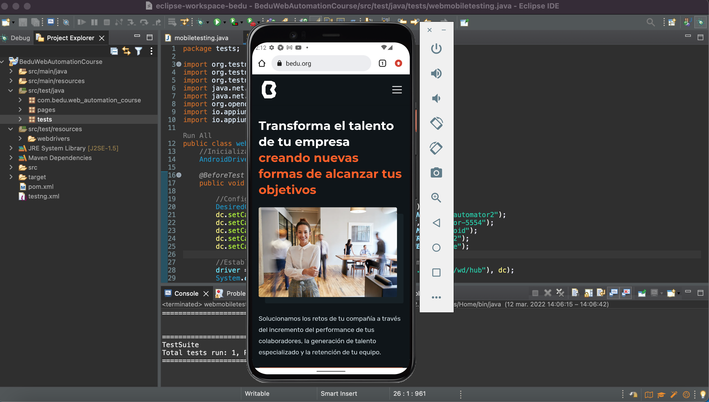
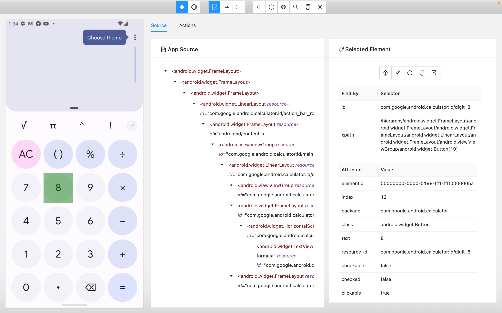

## Sesión 8 - Appium: Primeros pasos 🤖


<div style="text-align: justify;">

### 1. Objetivos :dart: 

- Desarrollar scripts de pruebas automatizados que puedan ser ejecutados en dispositivos móviles con Android por medio de la aplicación del navegador Google Chrome. 
- Demostrar el funcionamiento de más propiedades del objeto Desired Capabilities
- Aplicar los comandos más utilizados de Appium que pueden ser incorporados en los scripts de pruebas automatizados. 
- Comparar cómo se obtienen los localizadores en plataformas móviles vs los de plataformas web.
- Utilizar los objetos TouchAction/MultiAction para la automatización de gestos móviles. 


### 2. Contenido :blue_book:

En la sesión anterior aprendimos que es Appium, cual es su arquitectura y todas las configuraciones necesarias para ejecutar con éxito nuestro primer script de prueba automatizado en dispositivos móviles virtuales bajo la plataforma android. En esta sesión profundizaremos más sobre todas las herramientas que appium nos ofrece para poder interactuar con los dispositivos bien sea físicos o virtuales, veremos como están confirmados los drivers, profundizaremos sobre el objeto desired capabilities, veremos comandos y cómo utilizar los localizadores para finalmente aprender sobre uso de los objetos TouchAction/MultiAction utilizados para la automatización de gestos móviles.

---
#### <ins>Tema 1: Automatizaciones Web Móviles con Android </ins>

En sesiones anteriores hemos realizado automatizaciones de casos de pruebas que son ejecutados en navegadores web, ahora `¿Es posible ejecutar estos mismos casos de prueba en las páginas web pero en los dispositivos móviles?` La respuesta es __SÍ!__ :mechanical_arm:

Appium es la herramienta para esto.. Básicamente, puedes escribir una prueba normal de WebDriver y usar Appium como el servidor Selenium con un conjunto especial de capacidades deseadas. (Desired Capabilities)

En este tema veremos cómo es posible ejecutar los scripts de pruebas que ya tenemos automatizados desde un emulador android.

 

- [**`EJEMPLO 1 - Automatizaciones Web Móviles con Android`**](./Ejemplo-01)
- [**`RETO 1`**](./Reto-01)
---
#### <ins>Tema 2: Desired Capabilities</ins> 

Como vimos en la sesión anterior las capacidades deseadas son claves y valores codificados en un objeto JSON, enviados por los clientes de Appium al servidor cuando se solicita una nueva sesión de automatización.

En este tema  profundizaremos sobre el objeto desired capabilities.

```Java
    //DesiredCapabilities
    DesiredCapabilities dc = new DesiredCapabilities();
    dc.setCapability(MobileCapabilityType.AUTOMATION_NAME, "uiautomator2");
    dc.setCapability(MobileCapabilityType.DEVICE_NAME, "emulator-5554");
    dc.setCapability(MobileCapabilityType.PLATFORM_NAME, "android");
    dc.setCapability(MobileCapabilityType.PLATFORM_VERSION, "12");
    dc.setCapability(MobileCapabilityType.BROWSER_NAME, "Chrome");

```

- [**`EJEMPLO 2 - Desired Capabilities`**](./Ejemplo-02)
- [**`RETO 2`**](./Reto-02)

---
#### <ins>Tema 3: Comandos</ins> 

Appium ofrece múltiples comandos para interactuar con los dispositivos móviles, en este tema veremos los más importantes.


- [**`EJEMPLO 3 - Comandos`**](./Ejemplo-03)
- [**`RETO 3`**](./Reto-03)

---
#### <ins>Tema 4: Localizadores</ins> 

En este tema veremos las estrategias de localización de Appium.

 

- [**`EJEMPLO 4 - Localizadores`**](./Ejemplo-04)

---
#### <ins>Tema 5: Automatización de Gestos Móviles</ins> 

En cuanto a la automatización de gestos móviles, si bien la especificación `Selenium WebDriver` es compatible con ciertos tipos de interacción móvil, sus parámetros no siempre se pueden asignar fácilmente a la funcionalidad que proporciona la automatización del dispositivo, con ese fin, Appium implementa la nueva API `TouchAction/MultiAction` que veremos en este tema.

 

- [**`EJEMPLO 5 - Automatización de Gestos Móviles`**](./Ejemplo-05)

---
### 3. Postwork :memo:

Encuentra las indicaciones y consejos para reflejar los avances de tu proyecto de este módulo.

- [**`POSTWORK SESIÓN 8`**](./Postwork/)

<br/>


</div>

